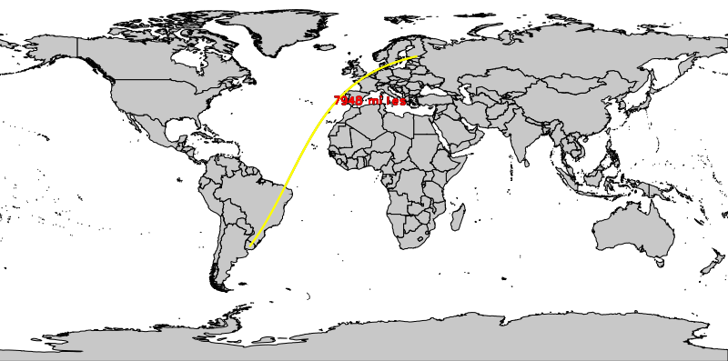

## DESCRIPTION

*d.geodesic* displays a geodesic line in the active frame on the user's
graphics monitor. This is also known as the great circle line and traces
the shortest distance between two user-specified points on the curved
surface of a longitude/latitude data set. The two coordinate locations
named must fall within the boundaries of the user's current geographic
region.

## OPTIONS

By default black line color and red text color will be used.

By indicating the starting and ending coordinates of the geodesic, the
line and its length (by default in meters) are displayed to the
graphical output. If the text color is set to *none*, the great circle
distance is not displayed.

## EXAMPLE

A geodesic line if shown over the political map of the world
(demolocation dataset):

```sh
g.region vector=country_boundaries -p
d.mon wx0
d.vect country_boundaries type=area
# show additionally a 20 degree grid
d.grid 20

d.geodesic coordinates=55:58W,33:18S,26:43E,60:37N \
  line_color=yellow text_color=red units=kilometers
```

  
*Geodesic line (great circle line)*

## NOTES

This program works only with longitude/latitude coordinate system.

## SEE ALSO

*[d.rhumbline](d.rhumbline.md), [d.grid](d.grid.md),
[m.measure](m.measure.md)*

## AUTHOR

Michael Shapiro, U.S. Army Construction Engineering Research Laboratory
