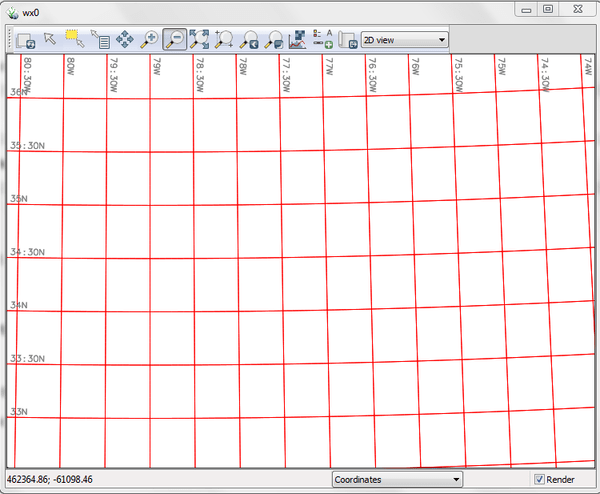

## DESCRIPTION

*d.grid* overlays a grid of user-defined size and color in the active
display frame on the graphics monitor. The grid can be created as a
standard rectangular grid or a geographic grid.

If the user provides a **-g** flag a geographic (projected) grid will be
drawn. With the **-g** flag the **size** argument accepts both decimal
degrees and colon separated ddd:mm:ss coordinates (eg. `00:30:00` for
half of a degree). A geographic grid cannot be drawn for a
*latitude/longitude* or *XY* projection.

Colors may be standard named GRASS colors (red, green, aqua, etc.) or a
numerical R:G:B triplet, where component values range from 0-255. Grid
color can be set with option **color**. Options **text_color** and
**bgcolor** set the color of the text and its background.

The grid drawing may be turned off by using the **-n** flag.  
The border drawing may be turned off by using the **-b** flag.  
The coordinate text may be turned off by using the **-t** flag.  

To draw grid lines at different intervals, e.g. at high latitudes, you
can run the module twice, once with **direction**=*east-west* at one
interval **size**, and again with **direction**=*north-south* at another
interval **size**.

## EXAMPLES

To draw a red geographic grid with 30 minute grid spacing, run one of
the following commands:

```sh
d.grid -g size=00:30:00 color=red
```

or

```sh
d.grid -g size=0.5 color=255:0:0
```

  
*Figure: Showing a geographic grid in red line color*

To draw a blue standard rectangular grid at a 500 (meter) spacing run
the following:

```sh
d.grid size=500 color=blue
```

  
*Figure: Showing a rectangular grid in blue line color*

## SEE ALSO

*[d.barscale](d.barscale.md), [d.legend](d.legend.md),
[d.geodesic](d.geodesic.md), [d.rhumbline](d.rhumbline.md),
[d.erase](d.erase.md), [d.frame](d.frame.md), [d.rast](d.rast.md),
[v.mkgrid](v.mkgrid.md)*

## AUTHORS

James Westervelt, U.S. Army Construction Engineering Research
Laboratory  
Geogrid support: Bob Covill  
Border support: Markus Neteler  
Text and RGB support: Hamish Bowman  
Background color implemented as part of GSoC 2016 by Adam Laza, CTU in
Prague
