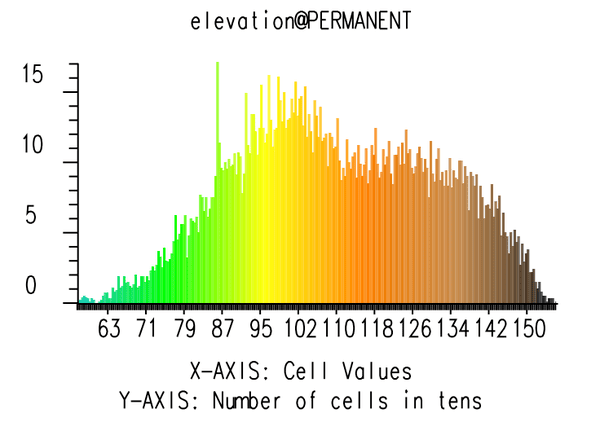

## DESCRIPTION

*d.histogram* displays the category-value distribution for a
user-specified raster map layer, in the form of a bar chart or a pie
chart. The display will be displayed in the active display frame on the
graphics monitor, using the colors in the raster map layer\'s color
table. The program determines the raster map\'s category value
distribution by counting cells.

## NOTES

*d.histogram* respects the current geographic region settings and the
current MASK (if one exists).

*d.histogram* uses the colors in the map\'s color look-up table (i.e.,
the map\'s *colr* or *colr2* file).

## EXAMPLES

Running the command below will generate the bar graph shown in the
figure:

::: code
    g.region raster=elevation -p
    d.mon wx0
    d.histogram map=elevation
:::

::: {align="center" style="margin: 10px"}
{border="0"}\
*Figure: Bar graph histogram for elevation map*
:::

Running the command below will generate the pie graph shown in the
figure:

::: code
    g.region raster=landuse96_28m -p
    d.histogram map=landuse96_28m style=pie
:::

::: {align="center" style="margin: 10px"}
{border="0"}\
*Figure: Pie graph histogram for landuse map*
:::

## SEE ALSO

*[d.colortable](d.colortable.html), [d.frame](d.frame.html),
[d.graph](d.graph.html), [d.linegraph](d.linegraph.html),
[d.mon](d.mon.html), [d.polar](d.polar.html), [g.region](g.region.html),
[r.stats](r.stats.html)*

## AUTHOR

Dave Johnson\
DBA Systems, Inc.\
10560 Arrowhead Drive\
Fairfax, Virginia 22030
