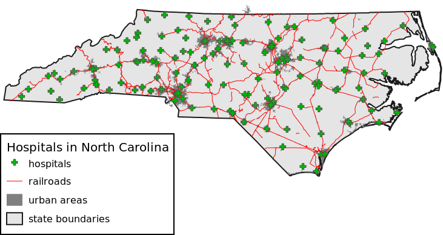

## DESCRIPTION

*d.legend.vect* draws vector legend of currently displayed vector maps.

Parameter **at** defines the screen position of upper-left legend
corner. Parameter **columns** defines the number of legend columns. User
can specify a title of the legend using parameter **title**. The font of
the title can be changed with **title_font**, **title_fontsize**. Flag
**-b** is used to draw background of specified color (**bgcolor**),
border color and border width (**border_color** and **border_width**).
Parameter **symbol_size** defines the size of line and area symbols. The
size of point symbols is based on currently set symbology of vector maps
using *[d.vect](d.vect.md)* or *[d.vect.thematic](d.vect.thematic.md)*.

Module *d.vect.legend* supports subtitles (see section Notes). Their
font and font size can be set using parameters **sub_font** and
**sub_fontsize**.

### Changing legend symbols and labels

Symbols for vector areas and lines, and labels for individual vector
labels can be changed in the symbology setting of each vector map in
*[d.vect](d.vect.md)* or *[d.vect.thematic](d.vect.thematic.md)* module
(in Legend tab). Use its parameters **icon_area** and **icon_line** to
pick from available symbols. By using parameter **legend_label** of
*d.vect* module, users can change the default label, which is the map
name.

### Modifying the order of legend entries and omitting certain vector maps from legend

Modules *[d.vect](d.vect.md)* and
*[d.vect.thematic](d.vect.thematic.md)* have a flag **-s** which removes
the particular vector or thematic vector from vector legend.

The order of entries is defined by the order in Layer Manager (if used
in GRASS GIS GUI). If that's not desired, one can export the legend file
into a text file using parameter **output**, change the order of entries
(see section Notes for format description) and then upload the modified
file with parameter **input**. Parameter **output** defines path to the
file where the internal legend file will be saved to, **input** defines
the input file which the vector legend will be based on (input file must
have correct format).

## NOTES

Module *d.legend.vect* draws vector legend based on legend file defined
in shell environment variable GRASS_LEGEND_FILE. This file is
automatically created and updated whenever *[d.vect](d.vect.md)* command
is used. User can create custom legend file and then use *export
GRASS_LEGEND_FILE=path/to/file* in shell. GRASS GUI and MONITORS create
the legend file automatically. By default the legend file is stored in
grassdata/project/mapset/.tmp/user directory (in case of d.mon deeper in
/monitor_name directory).  

Legend file has this format:

```sh
label|symbol_name|size|color_type|feature_color|fill_color|line_width|geometry_type|feature_count
```

Color type can be 'lf' or 'ps'. Based on color type color columns are
interpreted as line color and fill colors (lf), or primary and secondary
colors (ps). Module d.vect always uses 'lf' and d.vect.thematic 'ps'.
Here is an example of legend file with subtitles:

```sh
Infrastructure||||||||
major roads|legend/line|5|lf|black|200:200:200|2|line|355
bridges|extra/bridge|15|lf|black|black|1|point|10938
Hydrology||||||||
streams|legend/line_crooked|5|lf|30:144:255|200:200:200|3|line|8554
water bodies|legend/area_curved|5|lf|none|30:144:255|1|area|27764
```


## EXAMPLES

Open cairo monitor to render to file:

```sh
g.region vector=nc_state
d.mon cairo
d.vect map=nc_state color=26:26:26 fill_color=229:229:229 width=2 legend_label="state boundaries"
d.vect map=urbanarea color=none fill_color=127:127:127 width=1 legend_label="urban areas"
d.vect map=railroads color=red width=1
d.vect map=hospitals color=77:77:77 fill_color=0:187:0 width=1 icon=basic/cross3 size=10
d.legend.vect -b at=2,40 title="Hospitals in North Carolina" symbol_size=26 fontsize=16 title_fontsize=20
```

  

## SEE ALSO

*[d.vect](d.vect.md), [d.vect.thematic](d.vect.thematic.md),
[d.legend](d.legend.md)*

Check also Python module from AddOns:
*[d.vect.thematic2](https://grass.osgeo.org/grass8/manuals/addons/d.vect.thematic2.html)*

## AUTHORS

Adam Laza, during GSoC 2016 Mentors: Anna Petrasova, Vaclav Petras,
Martin Landa
