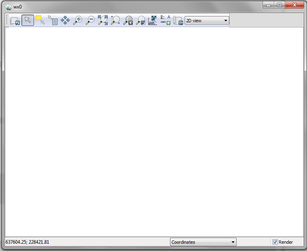

## DESCRIPTION

*d.mon* allows the user to start, select, list, release, and stop
available graphics monitors.

### Starting a monitor

In order to display on-screen GRASS graphics, the user must **start**
and **select** a graphics monitor. By default, the **start** command
actually runs two commands, to both start and select whatever monitor is
named by the user. The user can get a list of running monitors by
setting the **-l** flag on the command line. Note that some monitor
[drivers](displaydrivers.html) use environment
*[variables](variables.html)* or the specific *[driver
documentation](variables.html#list-of-selected-grass-environment-variables-for-rendering)*.

When a monitor is *started*, it is therefore also (automatically)
*selected* for output, unless the **-s** flag is set by the user; the
user can also explicitly **select** a monitor that has been started.

The desired monitor should be started once and need not be restarted
unless it is stopped for some reason. A monitor may continue to run for
any length of time, even when no GRASS session is being run.

### Stopping a monitor

A graphics monitor has two different types of status: monitor program
*not running*, and monitor *running*. A monitor that has been started
and/or selected will be listed as running; a monitor that has been
stopped (or not started) will be listed as not running. The **-l** flag
will list all currently running monitors.

### Selecting a monitor

When the user *starts* a monitor, it is also (automatically) *selected*
for graphics output unless the user sets the **-s** flag. In order to
use (direct graphics output to) a monitor, the user must *select* that
monitor for use, either by simply starting the monitor without the
**-s** flag or by explicitly selecting the monitor for output. Only
running monitors can be selected for graphics output.

The user can run multiple graphics monitors by simply starting each of
the graphics monitors the user wishes to direct output to.

### Releasing (unselecting) a monitor

Currently *selected* a monitor can be released by **-r** flag.

## NOTES

*d.mon* is designed for interactive use. If non-interactive use is
needed (e.g., in a script) set `GRASS_RENDER_IMMEDIATE=png` (or
`=cairo`) and use the related environment [variables](variables.html) to
control output size etc.

## EXAMPLES

### wx0 monitor

To start the interactive *[wxGUI map
display](wxGUI.html#map-display-window)*, run

::: code
    d.mon start=wx0
:::

::: {style="margin: 10px" align="center"}
{border="0"}\
*Figure: The initialization of display monitor wx0*
:::

All subsequently displayed data will be rendered on monitor `wx0`.

::: code
    g.region raster=elevation -p
    d.rast map=elevation
:::

::: {style="margin: 10px" align="center"}
{border="0"}\
*Figure: The display wx0 showing an elevation raster map*
:::

### CAIRO file renderer monitor

A CAIRO monitor can be started (and selected) by

::: code
    d.mon start=cairo output=out.pdf
:::

From this moment on all displayed data will be rendered into file
`output.pdf`.

### List running monitors

To list the currently running monitors, use

::: code
    d.mon -l

    List of running monitors:
    wx0
    cairo
:::

### Show currently selected monitor

To identify the currently selected monitor, use

::: code
    d.mon -p

    cairo
:::

### Switching between monitors

To switch back to interactive display mode, here to an earlier started
and still running wxGUI monitor, use

::: code
    d.mon select=wx0
:::

### Stopping a monitor

To close the wxGUI monitor, run

::: code
    d.mon stop=wx0
:::

## SEE ALSO

*[d.erase](d.erase.html), [d.redraw](d.redraw.html),
[d.rast](d.rast.html), [d.vect](d.vect.html), [d.frame](d.frame.html)*

See also [list of variables for
rendering](variables.html#list-of-selected-grass-environment-variables-for-rendering),
[display drivers](displaydrivers.html)

## AUTHOR

Martin Landa, OSGeoREL, Czech Technical University in Prague, Czech
Republic
