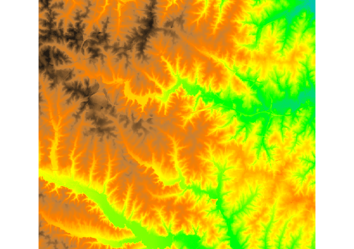
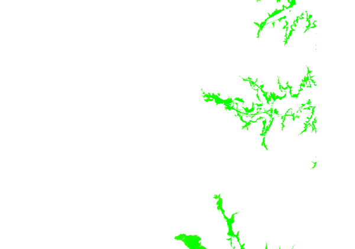
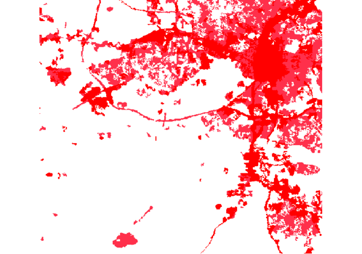

## DESCRIPTION

*d.rast* displays the specified raster map in the active display frame
on the graphics monitor.

## EXAMPLE

Display raster map "elevation":

```sh
d.rast map=elevation
```

  
*Figure: elevation raster map visualization*

Display raster map "elevation" but only the raster cells with values
between 75 and 80 meters:

```sh
d.rast map=elevation values=75-80
```

  
*Figure: elevation raster map showing values between 75 and 80 meters*

Display raster map "landuse96_28m" but only categories 1 and 2:

```sh
d.rast landuse96_28m values=1,2
```

  
*Figure: landuse raster map showing categories 1 and 2*

## SEE ALSO

*[d.rast.arrow](d.rast.arrow.md), [d.rast.num](d.rast.num.md),
[d.rast.leg](d.rast.leg.md), [d.legend](d.legend.md), [d.mon](d.mon.md),
[d.erase](d.erase.md), [d.vect](d.vect.md)*

*[wxGUI](wxGUI.md)*

## AUTHOR

James Westervelt, U.S. Army Construction Engineering Research Laboratory
