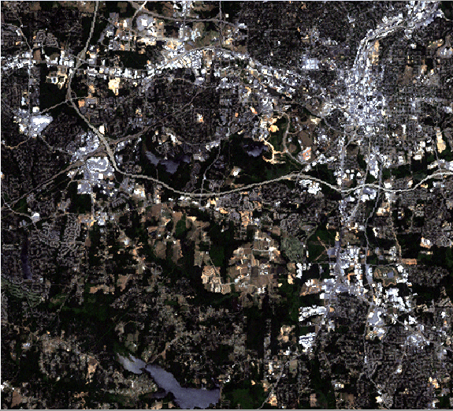

## DESCRIPTION

*d.rgb* displays three user-specified raster maps as red, green, and
blue overlays in the active graphics frame.

*RGB* stands for **red**, **green**, and **blue**. *d.rgb* visually
combines three raster maps to form a color image. For each map, the
corresponding component from the layer's color table is used (e.g. for
the red layer, the red component is used, and so on). In general, the
input raster maps should use a grey-scale color table.

## NOTES

*d.rgb* does not attempt to quantize the combined image into a fixed
number of colors. Nor does it have an option to generate a composite
layer (see *r.composite* for that). The image and raster maps will not
display properly if the graphics device does not have a reasonable
sampling of the RGB color-space.

If color quality of satellite image color composites seems to appear
poor, run *[i.colors.enhance](i.colors.enhance.md)* on the selected
satellite channels.

An alternative is the assignment of grey color tables to each band with
*[r.colors](r.colors.md)*:

```sh
r.info -r image.1

min=0
max=255

r.colors map=image.1 color=grey

r.colors map=image.2 rast=image.1
r.colors map=image.3 rast=image.1
```

To write out the color composite to a combined R/G/B raster maps, use
*[r.composite](r.composite.md)*.

## EXAMPLE

Visual color composite of a LANDSAT scene (North Carolina sample
dataset):

```sh
g.region raster=lsat7_2002_10 -p
d.rgb blue=lsat7_2002_10 green=lsat7_2002_20 red=lsat7_2002_30
```

  
*Figure: Visual color composite of a LANDSAT scene (North Carolina
sample dataset)*

## SEE ALSO

*[d.colortable](d.colortable.md), [d.his](d.his.md),
[r.blend](r.blend.md), [r.mapcalc](r.mapcalc.md),
[r.colors](r.colors.md), [r.composite](r.composite.md)*

## AUTHOR

Glynn Clements
