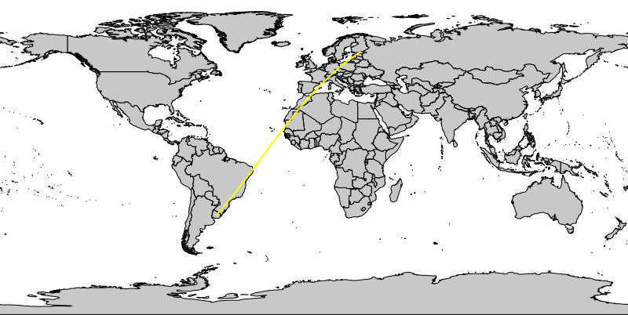

## DESCRIPTION

A rhumbline (loxodrome) is a line following a constant angle of the
compass (i.e., a line of constant direction). It crosses all meridians
at the same angle, i.e. a path of constant bearing. *d.rhumbline*
displays the rhumbline joining any two user-specified points in the
active frame on the user's graphics monitor. The named coordinate
locations must fall within the boundaries of the user's current
geographic region.

The user has to specify the starting and ending longitude/latitude
coordinates of the rhumbline and (optionally) the color in which the
rhumbline will be displayed; in this case, the program will run
non-interactively.

## EXAMPLE

A geodesic line if shown over the political map of the world
(demolocation dataset):

```sh
g.region vector=country_boundaries -p
d.mon wx0
d.vect country_boundaries type=area
d.rhumbline coordinates=55:58W,33:18S,26:43E,60:37N \
  line_color=yellow
# show additionally 10 degree grid
d.grid 10
```

  
*Rhumbline (loxodrome)*

## NOTES

This program works only with longitude/latitude coordinate system.

## SEE ALSO

*[d.geodesic](d.geodesic.md), [d.grid](d.grid.md),
[m.measure](m.measure.md)*

## AUTHOR

Michael Shapiro, U.S. Army Construction Engineering Research Laboratory
