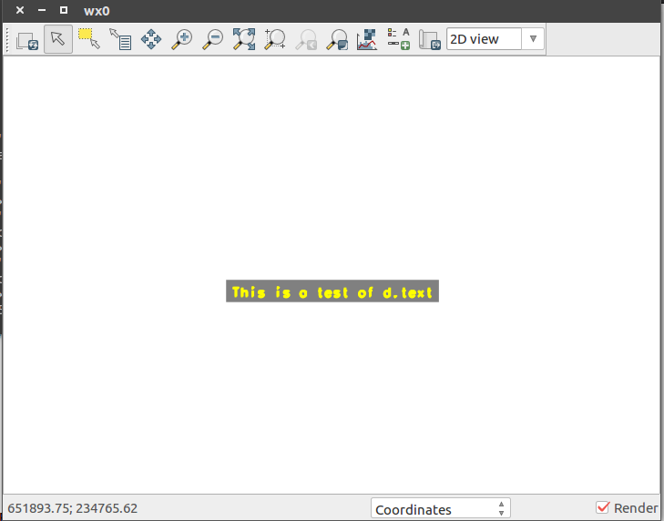

## DESCRIPTION

*d.text* draws text in the active display frame on the graphics monitor.
Text can be provided through standard input or redirected from a file
(using the UNIX redirection mechanism). In addition to the options
provided on the command line, colors, text size, font type, rotation
angle, and boldness can be adjusted with commands in the standard input
(i.e., if the user invokes *d.text* without options on the command line,
and then assigns values to these options on lines within the standard
input).

### Commands

**.C** *color*  
(where *color* is one of the available colors) causes text appearing on
subsequent lines to be drawn in that color.

**.G** *color*  
(where *color* is one of the available colors) causes the background of
text appearing on subsequent lines to be drawn in that color.

**.S** *size*  
(where *size* is a percentage within the range 0 to 100) adjusts text
size. Note that a size of 10 would allow 10 lines to be drawn in the
active display frame, 5 would allow the drawing of 20 lines, and 50
would allow the drawing of 2 lines.

**.F** *font*  
(where *font* is one of the fonts known by the GRASS program
*[d.font](d.font.md)*) manipulates the font type. Available fonts are
listed in the GRASS manual entry for *[d.font](d.font.md)*. The default
font type used (if unspecified by the user) is *romans*.

**.R** *rotation*  
(where *rotation* is an angle in degrees, counter-clockwise) to rotate
the text.

**.B 1**  
stipulates that following text be printed in **bold**. This command
means *bold on*.

**.B 0**  
turns *bold off* of all text appearing on lines beneath it. (*Bold off*
is used by default, if unspecified by the user.)

## EXAMPLE

The following command will print the short phrase "This is a test of
d.text" in the active display frame using the color yellow, in bold, and
using 4/100'ths (4%) of the active frame's vertical space per line:

```sh
d.text text="This is a test of d.text" color=yellow bgcolor=gray size=4
```

  
*Displayed Text*

## NOTES

Note that the GRASS command *[d.title](d.title.md)* creates map TITLEs
in a format suitable for input to *d.text*.

*d.text* needs escape sequences that can be used within lines to change
colors, boldness, and perhaps size.

## SEE ALSO

*[d.font](d.font.md), [d.title](d.title.md), [d.labels](d.labels.md)*

## AUTHORS

James Westervelt, U.S. Army Construction Engineering Research Laboratory

Updates by Huidae Cho
