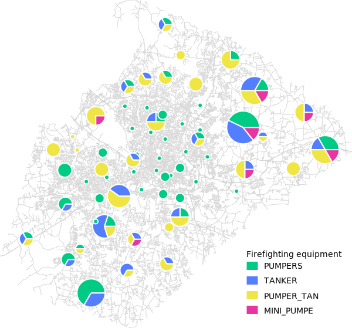

## DESCRIPTION

*d.vect.chart* displays charts for GRASS vector data in the active frame
on the graphics monitor.

## NOTES

The charts are positioned as follows:

- vector points: on point position,
- vector lines: on line centers,
- vector areas: on area centroids.

Bar charts are placed with their lower edge starting from the
y-coordinate of the feature being symbolized, and centered with respect
to the x-coordinate. The **-c** flag can be used to center the bar chart
in both x and y directions.

The 'sizecol' parameter is proportionate to the radius.

The optional **max_ref** parameter accepts a list of values that
represent the maximum value for each column listed in the values for the
parameter **columns**. These values are used to create a framed bar plot
if **chart_type** is *bar* (See Example 2).

## EXAMPLES

### Example 1

Pie-charts showing the proportion of different types of firefighting equipment
available at fire stations (North Carolina sample dataset).
The types of equipment are listed in different columns of the firestations
attribute table. The sum of these columns can be used for the size of a pie chart,
reflecting the total equipment inventory.
Example adapted from [Making Thematic Maps tutorial](https://grass-tutorials.osgeo.org/content/tutorials/thematic_maps/thematic_maps.html#creating-a-legend-for-a-thematic-charts-map).

```sh
# open a graphical display
d.mon wx0

# draw streets
d.vect -s map=streets_wake color=#d6d6d6

# draw pie-charts and specify legend title
d.vect.chart -c map=firestations
    columns=PUMPERS,TANKER,PUMPER_TAN,MINI_PUMPE \
    size_column="PUMPERS+TANKER+PUMPER_TAN+MINI_PUMPE" \
    scale=8 outline_color=white \
    colors="#00cb85,#537eff,#efe645,#e935a1" \
    legend_title="Firefighting equipment"

# and finally draw legend
d.legend.vect at=70,25
```

  
*Proportion of different types of firefighting equipment*

### Example 2

Pie-charts of monthly winter precipitation (North Carolina sample
dataset):

```sh
g.region vector=nc_state -p
d.vect nc_state
d.vect.chart precip_30ynormals chart_type=pie columns=nov,dec,jan,feb -l

# show pie chart as 3D
d.erase
d.vect nc_state
d.vect.chart precip_30ynormals chart_type=pie columns=nov,dec,jan,feb -l -3
```

  
2D pie-chart of monthly winter precipitation in North Carolina

  
3D pie-chart of monthly winter precipitation in North Carolina

### Example 3

Bar-chart of different census map values:

```sh
d.vect.chart map=vectmap columns=cens51,cens61,cens71,cens81 chart_type=bar
```

### Example 4

Creation of framed bar charts of an erodibiliy index from the Spearfish
sample dataset:

```sh
g.region raster=erode.index -p
r.to.vect -s input=erode.index output=erode_index type=area
v.extract input=erode_index output=erode_index_ctrds type=centroid
d.rast aspect
d.vect.chart map=erode_index_ctrds chart_type=bar columns=cat \
             size=10 max_ref=12 scale=0.05 colors=yellow
d.vect erode_index_ctrds icon=basic/circle fcol=black col=black size=5
```

  
Bar charts of an erodibiliy index (spatial subset)

## SEE ALSO

*[d.erase](d.erase.md), [d.vect](d.vect.md), [d.legend.vect](d.legend.vect.md),
[d.vect.thematic](d.vect.thematic.md), [d.what.vect](d.what.vect.md),
[d.rast](d.rast.md)*

## AUTHOR

Radim Blazek, ITC-Irst, Trento, Italy
