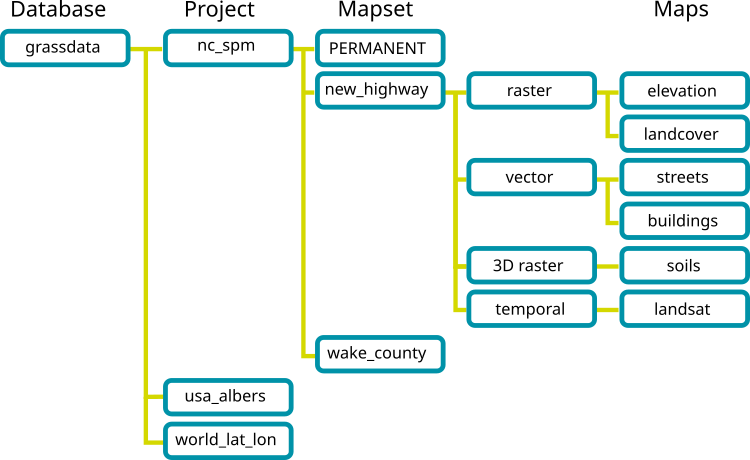

# GRASS GIS Database

A GRASS GIS Database is simply a set of directories and files with
certain structure which GRASS GIS works efficiently with. Project is a
directory with data related to one geographic location or a project. All
data within one project has the same coordinate reference system. A
project contains mapsets and each mapset contains data related to a
specific task, user or a smaller project. Within each project, a
mandatory PERMANENT mapset exists which can contain commonly used data
within one GRASS project such as base maps. The PERMANENT mapset also
contains metadata related to the project such as the coordinate
reference system. When GRASS GIS is started it connects to a database,
project and mapset specified by the user.

  
*Fig. 1: GRASS GIS Database structure as visible to the user*

## GRASS GIS Database Directory

All data for GRASS GIS must be in GRASS GIS Database which is a
directory (visible on the disk) containing subdirectories which are
GRASS projects. User can have one or more of Databases on the disk.
Typically users have one directory called `grassdata` in their home
directory. In multi-user environment users often have a `grassdata`
directory mounted as a network directory (network file system). For
teams, a centralized GRASS DATABASE would be defined in a shared network
file system (e.g. NFS).

GRASS GIS Databases can be safely copied or moved as any other
directories. Don't be confused with (relational) databases which are
used in GRASS GIS to hold attribute data and might be part of the GRASS
GIS Database. From user point of view, GRASS GIS Database with all its
data in it is similar to, e.g. PostGIS, database, as it stores all
information inside in a specific format and is accessible by specific
tools. GRASS GIS Databases is in GRASS GIS often called GISDBASE or
DATABASE.

## GRASS Projects

A project is further organized into mapsets which are subdirectories of
the project directory. All data in one project have the same coordinate
reference system (projection, datum). Each project contains a mapset
called PERMANENT. Typically, a project contains all data related to one
real-world project or a geographic area (geographic location or region).
Alternatively, a project can simply contain data in a given coordinate
reference system.

GRASS projects can be safely copied or moved as any other directories.
Compressed projects are usually what GRASS users exchange between each
other when they want to share a lot of data. For example, GRASS GIS
sample data are provided as projects.

Note that a GRASS project used to be called *location* and this name has
not been completely removed from code and documentation yet.

Users and programmers familiar with relational databases such as
PostgreSQL can view projects as individual databases inside a storage
area (the GRASS GIS Database). Mapsets in a project are like namespaces
or schemas inside a database.

## GRASS Mapsets

Mapsets contains the actual data, mostly geospatial data, referred to as
maps in GRASS GIS. Mapsets are a tool for organizing maps in a
transparent way as well as a tool for isolating different tasks to
prevent data loss.

GRASS GIS is always connected to one particular mapset. GRASS GIS
modules can create, modify, change, or delete a data only in the current
mapset. By default, only the data from the current mapset and PERMANENT
mapset are visible. Using [*g.mapsets*](g.mapsets.md) module or in GUI
other mapsets can be made visible and seamlessly accessible. All data
are available for reading when mapset is specified explicitly, for
example to access map `streets` in mapset `new_highway` user can use
`streets@new_highway`. For maps which are in the current or PERMAENT
mapsets or mapsets sets as visible (accessible), there is no need to use
`@mapset` syntax.

Mapsets are used to store maps related to one project, smaller project,
specific task, issue or subregions. In a multi-user environment, where
team members work together on a single project, individual mapsets
support simultaneous access of several users to the maps stored within
the same project. Besides access to their own mapset, each user can also
read maps in PERMANENT Mapsent and in other users' mapsets when set.
However, each user can modify or remove only the maps in his or her own
mapset.

Besides the geospatial data, mapset holds additional data such as color
tables (managed e.g. by [*r.colors*](r.colors.md)) and the current
computational region's extent and resolution stored in a file called
`WIND` and managed by [*g.region*](g.region.md).

Mapsets can be copied and moved as directories only when it is clear
that their coordinate reference systems (as reported by
[*g.proj*](g.proj.md)) match. In case of data coming with different
coordinate reference systems, it is recommended to use
[*r.proj*](r.proj.md) or [*v.proj*](v.proj.md) to reproject the data.
The files and directories should not be moved or modified directly, but
only using GRASS GIS tools.

## The role of the PERMANENT Mapset

When creating a new project, GRASS GIS automatically creates a special
mapset called PERMANENT where the core data for the project are stored.

Since the maps in PERMANENT mapset are visible from all the other
mapsets, it can be used to store the base maps (base cartography), data
common to all projects or needed for different analyses done is separate
mapsets.

In multi-user environment, data in the PERMANENT mapset can only be
added, modified or removed by the owner of the PERMANENT mapset;
however, they can be accessed, analyzed, and copied into their own
mapset by the other users. The PERMANENT mapset is useful for providing
general spatial data (e.g. an elevation model), accessible but
write-protected to all users who are working with the same GRASS project
as the database owner. To manipulate or add data to PERMANENT, the owner
can start GRASS GIS and choose the relevant project and the PERMANENT
mapset.

The PERMANENT mapset also contains the `DEFAULT_WIND` file which holds
the default computational region's extent and resolution values for the
project (which all mapsets will inherit when they are created). Users
have the option of switching back to the default region at any time.

## Importing, exporting and linking data

GRASS GIS works only with data which are imported into a GRASS Database,
so all data needs to be imported, e.g. by [*r.in.gdal*](r.in.gdal.md) or
highly convenient [*r.import*](r.import.md), before the actual analysis.
Data in GRASS Datable can be exported using for example
[*r.in.gdal*](r.in.gdal.md) in case of raster maps.

For cases when import is not desirable, an option to link external data
exists. The coordinate reference system of the linked data must match
the project's coordinate reference system otherwise the external data
cannot be linked. (Linking data in different projection is not allowed
as it would require on-the-fly reprojection which could cause
inconsistencies in the data.

For example, module [*r.external*](r.external.md) links external raster
data, so that the data are accessible in GRASS Database as standard
raster maps. Similarly for newly created maps,
[*r.external.out*](r.external.out.md) setups a format and directory
where the actual data will be stored, however in GRASS Database the data
will be created as standard maps.

## Starting GRASS GIS

After launching GRASS GIS for the first time, the GUI opens in a default
project `world_latlong_wgs84`. From there a new project can be created.

  

GRASS GIS can be also started with a given database, project and mapset
from the command line. For example, the following will start in a given
mapset with only command line interface:

```sh
# Linux, Mac, *BSD, ...:
grass --text ~/grassdata/nc_spm_08_grass7/user1

# Windows
grass --text D:\grassdata\nc_spm_08_grass7\user1
```

And the following will create the given project with coordinate
reference system given by the EPSG code and it will start the default
interface (GUI or command line):

```sh
# Linux, Mac, *BSD, ...:
grass -c EPSG:5514:3 ~/grassdata/myproject

# Windows
grass -c EPSG:5514:3 D:\grassdata\myproject
```

See [*grass*](grass.md) command manual for more details.

## Creating a New Project with the Project Wizard

The [GUI](wxGUI.md) provides a graphical *Project Wizard* which lets you
easily create a new project for your own data. You will be guided
through a series of dialogues to browse and select predefined
projections or to define custom projections.

The most convenient way of using the *Project Wizard* is creating new
project based on a georeferenced file, such as Shapefile or GeoTIFF, or
by selecting the corresponding EPSG code of the coordinate reference
system. In case of using georeferenced file, you are asked whether the
data itself should be imported into the new project. The default region
is then set to match imported map.

If data were already imported, you can add them into the Layer Manager
now and display them. More data can be imported into the project, e.g.
using import options in the *File* menu in *Layer Manager* or
[*r.import*](r.import.md).

## See also

*[GRASS GIS Reference Manual](index.md)  
[GRASS GIS startup program manual page](grass.md)  
[Importing data on GRASS
Wiki](https://grasswiki.osgeo.org/wiki/Importing_data)  
[r.import](r.import.md), [v.import](v.import.md),
[r.external](r.external.md), [v.external](v.external.md),
[r.proj](r.proj.md), [v.proj](v.proj.md),*
