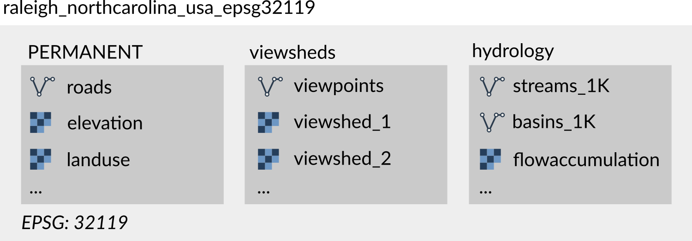
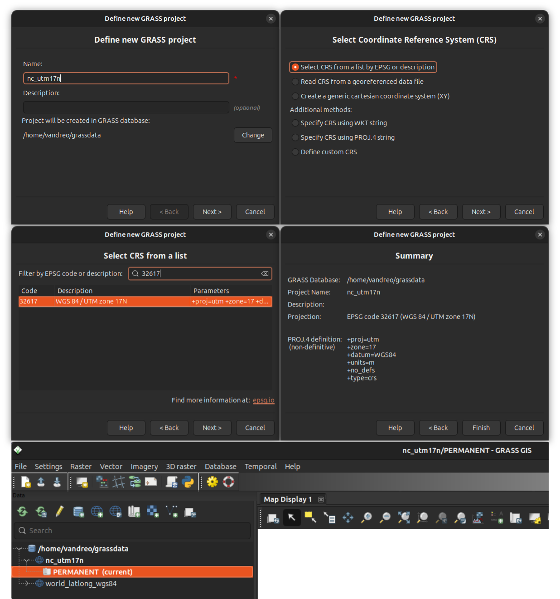

# GRASS projects

GRASS organizes geospatial work into GRASS projects and mapsets.
Each project uses a single coordinate reference system (CRS),
and all data within that project must match it. Inside a project are *mapsets*,
which act as subprojects where data and analyses are organized.
Mapsets can represent different research tasks, study areas,
or the work of individual collaborators.

## Projects

A GRASS project is the main organizational unit for geospatial data.
Each project has a single coordinate reference system (CRS), and all data
within it must use that CRS. This ensures that spatial analyses are consistent and
prevents errors that arise when data from different projections are combined.

A GRASS project organizes geospatial data into one or more mapsets,
which serve as the working environments for analysis.
All geospatial operations in GRASS take place within a mapset.
At minimum, every project includes the PERMANENT mapset, which may store core
baseline data. Additional mapsets can be created for individual tasks,
study areas, or collaborators.

  
*Figure: Project raleigh_northcarolina_usa_epsg32119 uses CRS with EPSG code 32119
and contains three mapsets: PERMANENT, viewsheds, and hydrology*

A GRASS project is stored as a directory on disk.
Many prefer to keep multiple projects organized in a single directory,
commonly referred to as *GRASS database* and named *grassdata*.
Others store them in separate directories
organized according to their research projects.
GRASS projects can be safely copied, moved, or compressed
(zipped) for sharing or backup, making it easy to transfer an entire project
to another location or collaborator.

GRASS projects can also be created as temporary, for example when using GRASS
from within another computational environment like R or Python.
Temporary projects exist only for the duration of the session and are deleted
when the session ends.

!!! grass-tip "Project used to be called location"
    In earlier versions of GRASS, projects were referred to as *locations*.
    You may still find that term in some older documentation or tutorials,
    but it is deprecated.

## Creating GRASS projects

When creating a GRASS project, the first step is choosing an appropriate
coordinate reference system (CRS). The CRS should be selected based on the
geographic area of your analysis. Different CRSs are optimized for different
regions and purposes—some preserve angles, others areas or distances—so
choosing the right one ensures accurate results.
For example, a UTM zone is often suitable for a local scale analysis, but it
may be inappropriate for areas that span multiple UTM zones, as distortions
will increase at the edges.

When creating a project, you can select a CRS using an EPSG code,
derive it from an existing georeferenced file (e.g. a GeoTiff or a GeoPackage),
define a custom CRS, or use a generic cartesian system
for simulations or non-georeferenced data.

!!! grass-tip "Setting a default region"
    The [computational region](g.region.md) defines the spatial extent and
    resolution for raster operations in GRASS.
    When creating a new project, it is a good idea to set a default computational
    region in the PERMANENT mapset, especially when you expect to work with
    raster data and multiple mapsets.
    The default region is managed in the PERMANENT mapset and applied
    automatically to any new mapsets created within the project.

### Creating a GRASS project from different sources

GRASS projects can be created from several types of information:

- Select a CRS using its EPSG code. Search for codes e.g. at [spatialreference.org/explorer.html](https://spatialreference.org/explorer.html)

- Use a georeferenced raster or vector file (e.g. GeoTiff or GeoPackage)
  to define the project's CRS automatically.

- Create a generic cartesian system (X, Y) for simulations
  or non-georeferenced data.

- Specify CRS using a WKT or a PROJ.4 string.

- Define a CRS manually by specifying its parameters.

Selecting a CRS from a list of EPSG codes or reading it from a georeferenced
data file are often the most practical and convenient options.

### Creating a GRASS project in different environments

Projects can be created in various ways depending on the environment:

- GRASS Python API: Allows creating a project programmatically with the function
  [`create_project`](https://grass.osgeo.org/grass-stable/manuals/libpython/script.html#script.core.create_project).
    This example creates a project named *my_project* with a specific EPSG code:

    ```python
    import grass.script as gs

    gs.create_project("my_project", epsg="3358")
    ```

- GRASS [g.proj](g.proj.md) tool:
    This tool called from within GRASS session creates a project using
    the different sources of CRS information specified above.
    This example creates a project named *my_project* using CRS
    information from a GeoPackage file *roads.gpkg*:

    ```sh
    g.proj georef=roads.gpkg project=my_project
    ```

- The [grass](grass.md) command: The grass command can be used to create a
  project from different sources of CRS information. This example creates an
  XY project named *my_project*:

    ```sh
    grass -c XY my_project
    ```

    Alternatively, you can create a temporary project:

    ```sh
    grass --tmp-project XY
    ```

- GRASS GUI Project Wizard: Guides you step-by-step to set the CRS and
  optionally import a georeferenced file.

    

## Importing and linking data

Data can be brought into a GRASS project either by importing into GRASS-native
format or by linking external sources.
Importing converts data into GRASS format and reprojects it if necessary
to match the project’s CRS. Imported data are fully managed by GRASS
and remain accessible even if the original source files are moved or deleted.
Importing is recommended in most cases.

Key GRASS tools for importing raster and vector data include [r.import](r.import.md)
and [v.import](v.import.md). These tools automatically reproject data if needed
and use GDAL library, enabling import of data from a wide range of sources.
There are other import tools for specific file formats, such as
[r.in.pdal](r.in.pdal.md) for lidar data and [r.unpack](r.unpack.md)
and [v.unpack](v.unpack.md) for GRASS native rasters and vectors.

Linking ([r.external](r.external.md) and [v.external](v.external.md))
makes external data accessible in GRASS without creating a copy.
This is useful when working with very large datasets or when only a
subset of the data is needed, although it may slow down computations
and has other limitations.

## Mapsets

A mapset is a subdirectory within a GRASS project where geospatial analyses
are performed. All mapsets use their project's CRS.
Organizing data into mapsets allows isolation of tasks and supports workflows
where multiple processes or users work on the same project concurrently,
such as in high-performance computing (HPC) or shared network environments.

Each GRASS project automatically includes one mapset named PERMANENT.
The PERMANENT mapset can be used to store baseline data needed across mapsets.
Additional mapsets can be created for individual subprojects, subregions, or users.
Each mapset contains the actual geospatial data (GRASS uses the term "maps"),
as well as their metadata such as color tables. It also stores mapset-level information
such as the current computational region and raster mask.
Temporary mapsets can also be created for one-off workflows from command line,
Python or R, existing only for the task execution.

GRASS tools operate only in the current mapset, while data from other mapsets
can be accessed by explicitly providing map's *fully qualified name*,
i.e., map name followed by an '@' sign and the name of the mapset (mapname@mapset).

!!! grass-tip "Note"
    Unlike GRASS projects, mapsets typically *should not be copied or moved
    outside of their project directory*. Doing so can corrupt data consistency
    unless you are certain of what you are doing.

### Creating a mapset

Mapsets can be created in various ways depending on the environment:

- GRASS [g.mapset](g.mapset.md) tool:
    Create a new mapset in the current project and set it as the current mapset:

    ```sh
    g.mapset -c newmapset
    ```

- The [grass](grass.md) command: The grass command can be used to create a mapset,
  either temporary for a session or persistent on disk. This example creates
  a new mapset in an existing project and starts a GRASS session in that mapset:

    ```sh
    grass -c /path/to/my_project/new_mapset
    ```

    Alternatively, you can create a temporary mapset in the current project:

    ```sh
    grass --tmp-mapset /path/to/my_project
    ```

- GRASS GUI: In menu *Settings > GRASS working environment > Create new mapset*.
  Or create a new mapset by right-clicking on a project in the [Data Catalog](wxGUI.datacatalog.md).
  The new mapset will be created and set as the current mapset.

!!! grass-tip "Setting computational region"
    The computational region defines the spatial extent and resolution for
    raster operations in GRASS. Each mapset has its own computational region,
    which persists until it is changed by the user with [g.region](g.region.md).
    When a new mapset is created, it initially uses a default region stored
    in the PERMANENT mapset. If no default region is defined in PERMANENT,
    the computational region must be set before any meaningful raster computations
    can be performed.

### Referring to maps from other mapsets

When you use a map in GRASS, you can either refer to it by its bare name
(e.g., `elevation`) or by its fully qualified name with a mapset (e.g., `elevation@PERMANENT`).

If you write `elevation@PERMANENT`, GRASS looks in that specified mapset
and nowhere else. If you write only `elevation`, GRASS looks for the map of
that name in the current mapset first.
If it doesn’t find it there, GRASS continues searching in the other mapsets
listed in the *mapset search path*.
By default, the search path always includes the current mapset
(first, highest priority) and the PERMANENT mapset so the baseline
data are always available.

You can change which mapsets are included in the search path with [g.mapsets](g.mapsets.md).
The search path settings are saved in your current mapset for future sessions.

### Examples of using projects and mapsets

**Site suitability analysis for solar plants:**
    A data scientist selects an appropriate CRS for the study area and creates
    a GRASS project to store base datasets. The PERMANENT mapset contains
    a statewide elevation model and land cover map.
    For each candidate site, the researcher creates a new mapset,
    sets the appropriate computational region, and runs solar radiation computations.
    The results are kept separate in their mapsets while the base datasets
    remain intact in PERMANENT.

**Urban growth scenarios:**
    A planner is testing several scenarios for urban growth. After creating
    a GRASS project, importing data into the PERMANENT mapset and setting default
    region, the planner creates multiple mapsets within the same GRASS project,
    one per scenario, all using the same computational region and baseline land
    use data in PERMANENT. This makes it easy to compare outcomes without
    mixing results.

**Educational setting:**
    Each student downloads a copy of a sample dataset containing a GRASS project
    with a PERMANENT mapset that stores the base datasets (e.g., elevation and
    land cover for a study area). For each assignment, the student creates
    a new mapset, keeping their work for different tasks separate and organized.

**High-performance computing (HPC):**
    On a research cluster, the PERMANENT mapset stores a continental digital
    elevation model and has a default region set. Individual users create mapsets
    that access this data, but their analyses are separated and use different
    computational regions. This setup keeps the national dataset safe while allowing
    large-scale analyses in parallel.

**Data pipeline:**
    A data engineer needs to combine several raw datasets, run analyses,
    and generate summary statistics. They create a temporary GRASS project,
    set computational region, perform the workflow, and once it is closed
    the project is deleted automatically, leaving no clutter behind.
