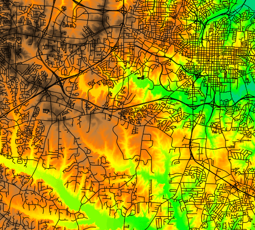
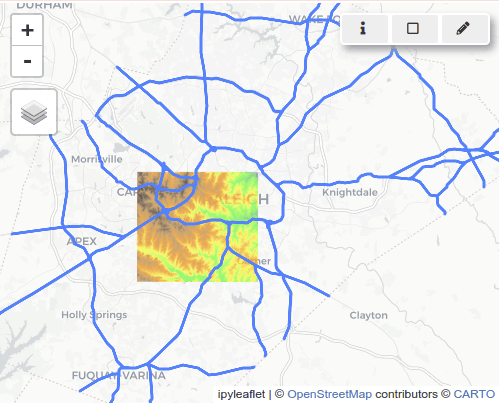
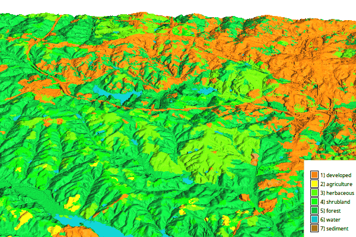
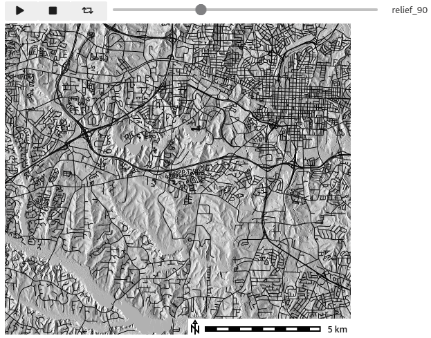
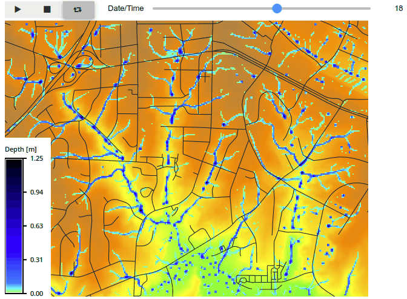

---
authors:
    - Corey T. White
    - GRASS Development Team
---

# Jupyter notebooks introduction

The `grass.jupyter` Python package provides a [Jupyter](https://jupyter.org/)
notebook interface to GRASS. It includes modules for creating map figures,
interactive web maps, visualizing data series and time series, and generating
3D visualizations.

If you don't have a project yet, create a new one first:

```python
import grass.script as gs

gs.create_project("path/to/my_project", epsg=3358)
```

To get started with `grass.jupyter`, import the package,
and start a GRASS session with the `gj.init` function:

```python
import grass.jupyter as gj

session = gj.init("path/to/my_project")
```

Now you can import raster or vector data with [r.import](r.import.md)
and [v.import](v.import.md).
The following examples will use the [North Carolina dataset](https://grass.osgeo.org/download/data/#NorthCarolinaDataset).

!!! grass-tip "Importing packages"
    <!-- markdownlint-disable-next-line MD046 -->
    To import the grass.script and grass.jupyter packages, you need to tell
    Python where the GRASS Python package is unless you are running a notebook
    in a GRASS session.
    <!-- markdownlint-disable-next-line MD046 -->
    ```python
    import sys
    sys.path.append(
        subprocess.check_output(["grass", "--config", "python_path"], text=True).strip()
    )
    ```

!!! grass-tip "Mapsets"
    If not specified otherwise in the `gj.init` function, the session will
    start in the default
    mapset (subproject) of a project. If you need later to switch to a
    different mapset, you can use the `gj.switch_mapset` function.

## Map

The `gj.Map` class in `grass.jupyter` provides a way to create static maps in Jupyter.
Here we create a map of elevation overlayed with streets:

```python
# Create a new map
m = gj.Map()

# Add a raster map to the map object
m.d_rast(map="elevation")

# Add a vector map to the map object
m.d_vect(map="streets", color="black")

# Display the map
m.show()
```



!!! grass-tip "Order Matters"
    <!-- markdownlint-disable-next-line MD046 -->
    Map features are added to the map in the order they are called. For example,
    if you add a raster map and then a vector map, the vector map will be drawn
    on top of the raster map.

In addition to displaying raster and vector maps, the `gj.Map` can access many
of the [display tools](display.md) in GRASS. For a complete list of cartographic
features you can refer to the [Cartography](topic_cartography.md) topic page.

For example, let's add a legend, barscale, and shaded relief to the map:

```python

# Compute shaded relief
gs.run_command("r.relief", input="elevation", output="relief")

# Create a new map
m = gj.Map()

# Add a shaded relief map
m.d_shade(color="elevation", shade="relief")

# Add a raster legend
m.d_legend(
    raster="elevation",
    at=(1, 50, 1, 8),
    title="Elevation (m)",
    border_color="none",
    flags="bt"
)

# Add a scale bar to the map
m.d_barscale(at=(55, 5), flags="n")

# Display the map
m.show()
```

!!! grass-tip "Map Size and Extent"
    See [detailed documentation](https://grass.osgeo.org/grass-stable/manuals/libpython/grass.jupyter.html#module-grass.jupyter.map)
    for changing the map size and geographic extent.

## Interactive map

The `gj.InteractiveMap` class provides a way to create interactive
web maps in Jupyter. Interactive maps are created using the
[ipyleaflet](https://ipyleaflet.readthedocs.io/en/latest/)
or [folium](https://python-visualization.github.io/folium/) libraries.
The default is [ipyleaflet](https://ipyleaflet.readthedocs.io/en/latest/),
which gives you more interactivity and control over the map. Here we create
an interactive map of the elevation raster and the roadsmajor
vector map:

```python
# Create an interactive map
m = gj.InteractiveMap()
m.add_raster("elevation", opacity=0.7)
m.add_vector("roadsmajor")
m.show()
```



The map gives you the ability to query the map, zoom in and out, and pan around,
set the computational region, and create simple vector data by digitizing.
To change the default basemap, see [documentation](https://grass.osgeo.org/grass-stable/manuals/libpython/grass.jupyter.html#module-grass.jupyter.interactivemap).

## 3D map

The `gj.Map3D` class creates 3D visualizations as static images.

```python
elevation_3dmap = gj.Map3D()
elevation_3dmap.render(
    elevation_map="elevation",
    color_map="landuse",
    position=[0.5, 1],
    perspective=10,
    height=5000,
    resolution_fine=1,
    zexag=5
)
elevation_3dmap.overlay.d_legend(raster="landuse",
                                 at=(0, 30, 87, 100),
                                 flags="b",
                                 border_color="none")
elevation_3dmap.show()
```



The parameters of the `render()` function are the same as parameters of the
[m.nviz.image](m.nviz.image.md) tool, which is used in the background.

## Series map

The `gj.SeriesMap` class animates a series of maps, allowing users to slide between
maps and play a continuous loop.

```python
# Create a series of relief maps with different angles
directions = [0, 90, 180, 270]
for azimuth in directions:
    gs.run_command("r.relief",
                   input="elevation",
                   output=f"relief_{azimuth}",
                   azimuth=azimuth)
m = gj.SeriesMap()
m.add_rasters(f"relief_{azimuth}" for azimuth in directions)
m.d_vect(map="roads")
m.d_barscale(at=(80, 10))
m.show()
# Save the map as animated gif
m.save("series_map.gif")
```



## Time series map

The `gj.TimeSeriesMap` class provides a way to visualize
GRASS' [space time datasets](temporalintro.md) in Jupyter. Here we create a time
series map of overland water flow:

```python
# Zoom in to the study area
gs.run_command("g.region", n=226040, s=223780, e=639170, w=636190)
# Compute topography dx and dy derivatives
gs.run_command("r.slope.aspect",
               elevation="elevation",
               dx="dx",
               dy="dy")
# Compute overland flow
gs.run_command("r.sim.water",
               flags="t",
               elevation="elevation",
               dx="dx",
               dy="dy",
               depth="depth",
               niterations=30)

# Create a time series
gs.run_command("t.create",
               output="depth",
               temporaltype="relative",
               title="Overland flow depth",
               description="Overland flow depth")
# Register the time series
maps = gs.list_strings(type="raster", pattern="depth*")
gs.run_command("t.register", input="depth", maps=maps)

# Create a time series map
flow_map = gj.TimeSeriesMap()

# Add the base map
flow_map.d_rast(map="elevation")
# Add the time series data
flow_map.add_raster_series("depth", values="0.025-1.25")
# Overlay the vector map
flow_map.d_vect(map="streets")

# Add map features
flow_map.d_legend(raster="depth.30",
                  title="Depth [m]",
                  flags="bt",
                  border_color="none",
                  at=(1, 50, 0, 5))

# Display the map
flow_map.show()
```



## Python library documentation

For complete documentation on the `grass.jupyter` package, see the
[grass.jupyter](https://grass.osgeo.org/grass-stable/manuals/libpython/grass.jupyter.html)
library documentation page.

For complete documentation on the `grass.script` package, see the
[grass.script](https://grass.osgeo.org/grass-stable/manuals/libpython/script_intro.html)
library documentation page.

## Tutorials

- [Get started with GRASS in Jupyter Notebooks on Windows](https://grass-tutorials.osgeo.org/content/tutorials/get_started/JupyterOnWindows_OSGeo4W_Tutorial.html)
- [Get started with GRASS & Python in Jupyter Notebooks (Unix/Linux)](https://grass-tutorials.osgeo.org/content/tutorials/get_started/fast_track_grass_and_python.html)
- [Get started with GRASS in Google Colab](https://grass-tutorials.osgeo.org/content/tutorials/get_started/grass_gis_in_google_colab.html)
- Run `grass.jupyter` tutorial on Binder: [](https://mybinder.org/v2/gh/OSGeo/grass/main?labpath=doc%2Fexamples%2Fnotebooks%2Fjupyter_tutorial.ipynb)
