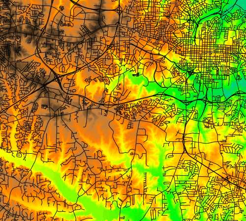
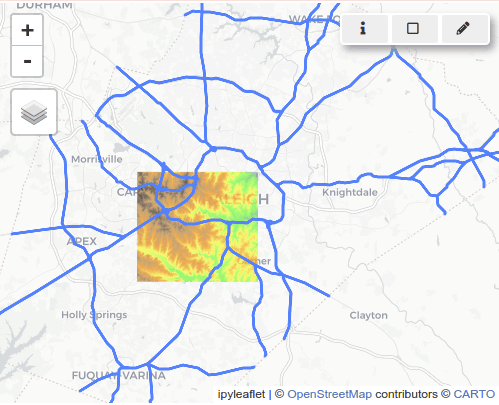
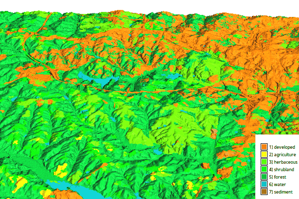
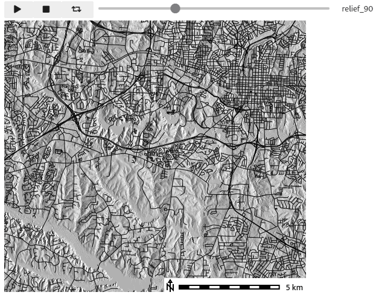
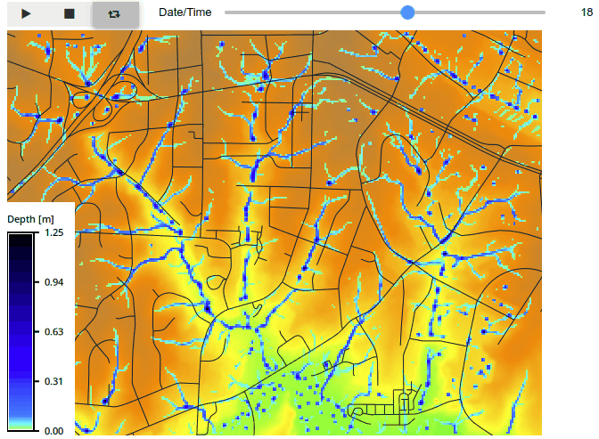
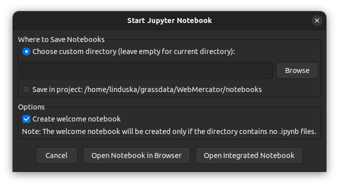
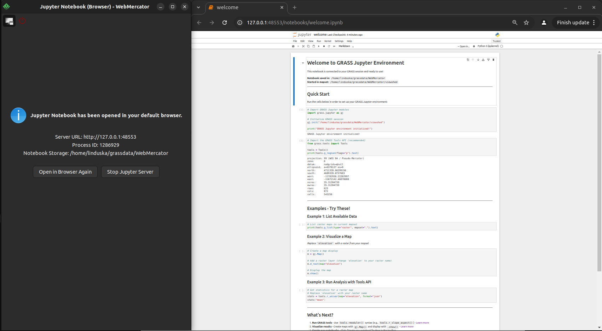
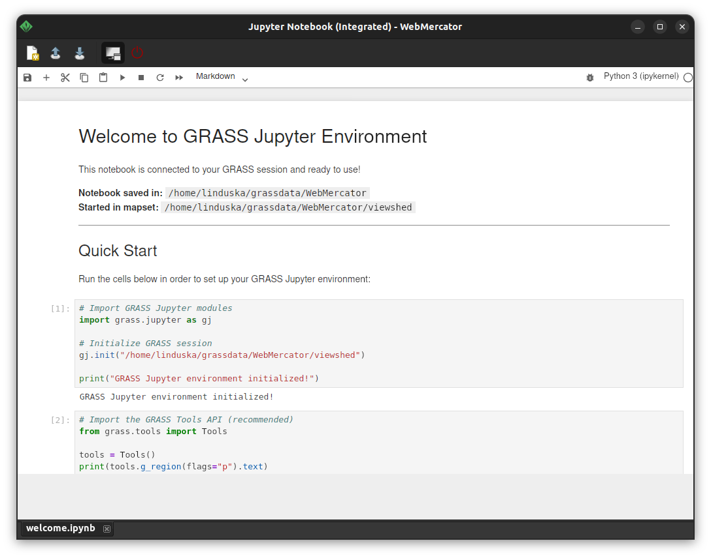

---
authors:
    - Corey T. White
    - GRASS Development Team
---

# Jupyter notebooks introduction

The `grass.jupyter` Python package provides a [Jupyter](https://jupyter.org/)
notebook interface to GRASS. It includes modules for creating map figures,
interactive web maps, visualizing data series and time series, and generating
3D visualizations.

If you don't have a project yet, create a new one first:

```python
import grass.script as gs

gs.create_project("path/to/my_project", epsg="3358")
```

To get started with `grass.jupyter`, import the package,
and start a GRASS session with the `gj.init` function:

```python
import grass.jupyter as gj

session = gj.init("path/to/my_project")
```

Now you can import raster or vector data with [r.import](r.import.md)
and [v.import](v.import.md).
The following examples will use the [North Carolina dataset](https://grass.osgeo.org/download/data/#NorthCarolinaDataset).

<!-- markdownlint-disable MD046 -->
!!! grass-tip "Importing packages"

    To import the grass.script and grass.jupyter packages, you need to tell
    Python where the GRASS Python package is unless you are running a notebook
    in a GRASS session.

    ```python
    import sys
    import subprocess

    sys.path.append(
        subprocess.check_output(["grass", "--config", "python_path"], text=True).strip()
    )
    ```
<!-- markdown-restore -->

!!! grass-tip "Mapsets"
    If not specified otherwise in the `gj.init` function, the session will
    start in the default
    mapset (subproject) of a project. If you need later to switch to a
    different mapset, you can use the `gj.switch_mapset` function.

## Map

The `gj.Map` class in `grass.jupyter` provides a way to create static maps in Jupyter.
Here we create a map of elevation overlayed with streets:

```python
# Create a new map
m = gj.Map()

# Add a raster map to the map object
m.d_rast(map="elevation")

# Add a vector map to the map object
m.d_vect(map="streets", color="black")

# Display the map
m.show()
```



!!! grass-tip "Order Matters"
    <!-- markdownlint-disable-next-line MD046 -->
    Map features are added to the map in the order they are called. For example,
    if you add a raster map and then a vector map, the vector map will be drawn
    on top of the raster map.

In addition to displaying raster and vector maps, the `gj.Map` can access many
of the [display tools](display.md) in GRASS. For a complete list of cartographic
features you can refer to the [Cartography](topic_cartography.md) topic page.

For example, let's add a legend, barscale, and shaded relief to the map:

```python
from grass.tools import Tools

# Create an object to access tools
tools = Tools()

# Compute shaded relief
tools.r_relief(input="elevation", output="relief")

# Create a new map
m = gj.Map()

# Add a shaded relief map
m.d_shade(color="elevation", shade="relief")

# Add a raster legend
m.d_legend(
    raster="elevation",
    at=(1, 50, 1, 8),
    title="Elevation (m)",
    border_color="none",
    flags="bt"
)

# Add a scale bar to the map
m.d_barscale(at=(55, 5), flags="n")

# Display the map
m.show()
```

!!! grass-tip "Map Size and Extent"
    See [detailed documentation](https://grass.osgeo.org/grass-stable/manuals/libpython/grass.jupyter.html#module-grass.jupyter.map)
    for changing the map size and geographic extent.

## Interactive map

The `gj.InteractiveMap` class provides a way to create interactive
web maps in Jupyter. Interactive maps are created using the
[ipyleaflet](https://ipyleaflet.readthedocs.io/en/latest/)
or [folium](https://python-visualization.github.io/folium/) libraries.
The default is [ipyleaflet](https://ipyleaflet.readthedocs.io/en/latest/),
which gives you more interactivity and control over the map. Here we create
an interactive map of the elevation raster and the roadsmajor
vector map:

```python
# Create an interactive map
m = gj.InteractiveMap()
m.add_raster("elevation", opacity=0.7)
m.add_vector("roadsmajor")
m.show()
```



The map gives you the ability to query the map, zoom in and out, and pan around,
set the computational region, and create simple vector data by digitizing.
To change the default basemap, see [documentation](https://grass.osgeo.org/grass-stable/manuals/libpython/grass.jupyter.html#module-grass.jupyter.interactivemap).

## 3D map

The `gj.Map3D` class creates 3D visualizations as static images.

```python
elevation_3dmap = gj.Map3D()
elevation_3dmap.render(
    elevation_map="elevation",
    color_map="landuse",
    position=[0.5, 1],
    perspective=10,
    height=5000,
    resolution_fine=1,
    zexag=5
)
elevation_3dmap.overlay.d_legend(raster="landuse",
                                 at=(0, 30, 87, 100),
                                 flags="b",
                                 border_color="none")
elevation_3dmap.show()
```



The parameters of the `render()` function are the same as parameters of the
[m.nviz.image](m.nviz.image.md) tool, which is used in the background.

## Series map

The `gj.SeriesMap` class animates a series of maps, allowing users to slide between
maps and play a continuous loop.

```python
# Create a series of relief maps with different angles
directions = [0, 90, 180, 270]
for azimuth in directions:
    tools.r_relief(
        input="elevation",
        output=f"relief_{azimuth}",
        azimuth=azimuth)
m = gj.SeriesMap()
m.add_rasters(f"relief_{azimuth}" for azimuth in directions)
m.d_vect(map="roads")
m.d_barscale(at=(80, 10))
m.show()
# Save the map as animated gif
m.save("series_map.gif")
```



## Time series map

The `gj.TimeSeriesMap` class provides a way to visualize
GRASS' [space time datasets](temporalintro.md) in Jupyter. Here we create a time
series map of overland water flow:

```python
# Zoom in to the study area
tools.g_region(n=226040, s=223780, e=639170, w=636190)
# Compute topography dx and dy derivatives
tools.r_slope_aspect(elevation="elevation", dx="dx", dy="dy")
# Compute overland flow
tools.r_sim_water(
    flags="t",
    elevation="elevation",
    dx="dx",
    dy="dy",
    depth="depth",
    duration=30)

# Create a time series
tools.t_create(
    output="depth",
    temporaltype="relative",
    title="Overland flow depth",
    description="Overland flow depth")
# Register the time series
maps = [
    item["fullname"]
    for item in tools.g_list(type="raster", pattern="depth*", format="json")
]
tools.t_register(input="depth", maps=maps)

# Create a time series map
flow_map = gj.TimeSeriesMap()

# Add the base map
flow_map.d_rast(map="elevation")
# Add the time series data
flow_map.add_raster_series("depth", values="0.025-1.25")
# Overlay the vector map
flow_map.d_vect(map="streets")

# Add map features
flow_map.d_legend(raster="depth.30",
                  title="Depth [m]",
                  flags="bt",
                  border_color="none",
                  at=(1, 50, 0, 5))

# Display the map
flow_map.show()
```



## Python library documentation

For complete documentation on the `grass.jupyter` package, see the
[grass.jupyter](https://grass.osgeo.org/grass-stable/manuals/libpython/grass.jupyter.html)
library documentation page.

For complete documentation on the `grass.tools` package, see the
[grass.tools](https://grass.osgeo.org/grass-stable/manuals/libpython/grass.tools.html)
library documentation page.

For complete documentation on the `grass.script` package, see the
[grass.script](https://grass.osgeo.org/grass-stable/manuals/libpython/grass.script.html)
library documentation page.

## Using Jupyter Notebooks from GUI

Starting with GRASS version 8.5, the GUI provides integrated support for launching
and managing Jupyter Notebooks directly from the interface.
This allows you to seamlessly combine interactive Python notebooks
with your GRASS workflow.

### Getting Started

To launch Jupyter from GRASS GUI, go to **File → Jupyter Notebook** or
click the Jupyter button in the Tools toolbar at the top of the GRASS window.
A startup dialog will appear where you can configure your notebook environment:



#### Configuration Options

- **Where to Save Notebooks:** Select where your Jupyter notebooks will be stored.
  You can choose an existing directory, create a new one, or leave the field empty
  to use your current directory. Notebooks can be saved anywhere,
  including inside your current GRASS project.

- **Create Welcome Notebook:** Check this option to automatically create
  a `welcome.ipynb` template notebook with GRASS-specific examples and
  quick-start code. Recommended for new users.

### Display Modes

After configuring the storage, choose how to interact with Jupyter notebooks:

#### Browser Mode



In Browser Mode, Jupyter opens in your system's default web browser. This mode provides:

- Full Jupyter Lab/Notebook interface with all features
- File browser and notebook management
- Terminal access and extensions support
- A control panel in GRASS GUI showing server URL, PID, and storage location
- Quick access to reopen the browser or stop the server

#### Integrated Mode



In Integrated Mode, Jupyter notebooks are embedded directly in the GRASS GUI window
using the wx.html2 library. This mode offers:

- Jupyter interface embedded as a native GRASS GUI tab
- Seamless integration with other GRASS tools and panels
- Import/export notebooks, and create new notebooks from the toolbar
- External links (documentation, tutorials) open in your system browser

### Toolbar Actions

The integrated mode toolbar provides quick access to common operations:

- **Create:** Create a new notebook with prepared GRASS module imports and session
initialization
- **Import:** Import existing .ipynb files into your notebook storage
- **Export:** Export the current notebook to a different location
- **Undock:** Open the notebook in a separate window (also available in
the browser mode)
- **Stop:** Stop the Jupyter server and close the notebook (also available in
the browser mode)

### Multiple Notebook Sessions

You can launch multiple Jupyter sessions with different storage locations.
Each session appears as a separate tab in the GRASS GUI, with the storage
location shown in the tab name. Hover over a tab to see the full storage path.

### Server Management

GRASS automatically manages Jupyter server instances:

- Each notebook storage location runs on a separate Jupyter server
- Servers are automatically stopped when GRASS exits
- Multiple notebooks from the same storage share one server instance
- Server information (URL, PID) is displayed in the interface

### Tips

- The `welcome.ipynb` template includes examples of using
  the GRASS Tools API, importing data, creating maps, and visualization

- You can switch between browser and integrated modes by closing one and
  relaunching Jupyter with the same storage location

- Tab tooltips show the full storage path—useful when working with
  multiple storage locations

## Tutorials

- [Get started with GRASS in Jupyter Notebooks on Windows](https://grass-tutorials.osgeo.org/content/tutorials/get_started/JupyterOnWindows_OSGeo4W_Tutorial.html)
- [Get started with GRASS & Python in Jupyter Notebooks (Unix/Linux)](https://grass-tutorials.osgeo.org/content/tutorials/get_started/fast_track_grass_and_python.html)
- [Get started with GRASS in Google Colab](https://grass-tutorials.osgeo.org/content/tutorials/get_started/grass_gis_in_google_colab.html)
- Run `grass.jupyter` tutorial on Binder: [](https://mybinder.org/v2/gh/OSGeo/grass/main?labpath=doc%2Fexamples%2Fnotebooks%2Fjupyter_tutorial.ipynb)
