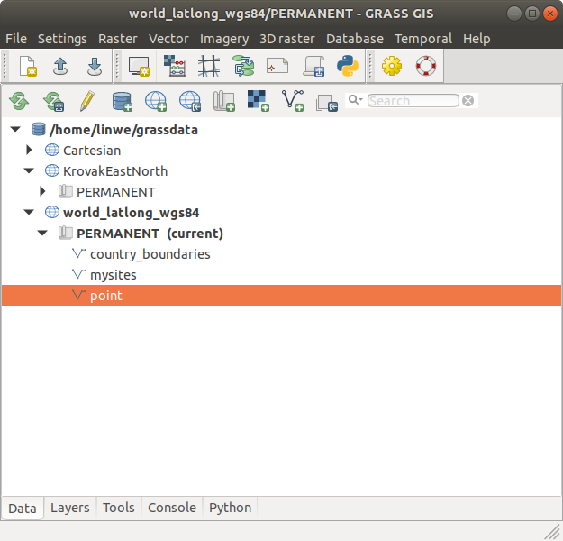

# wxGUI

## DESCRIPTION

**wxGUI** is a native *Graphical User Interface* (GUI) for GRASS GIS.
Its main features include displaying geographical data in 2D and 3D,
calling GRASS GIS modules, and interacting with data.

### Overview

The GUI is composed of *three* main components:

- The **Layer Manager** includes map layer management, integrated
  command-line prompt, and command output window tab.
- The **Map Display Window** integrates basic tools for zooming,
  panning, data querying, and map elements (north arrows, barscale,
  etc.). Each display window is associated with its own set of map
  layers in the layer manager. The user may start multiple map displays
  during a session. The map layers for each display are grouped under
  different tabs in the Layer Manager.
- [Module dialogs](wxGUI.modules.md) enable running GRASS modules that
  can be searched and launched via Tools tab.

### Layer Manager Window

The *Layer Manager* provides an interactive graphical interface for
creating and managing GRASS displays. There is a toolbar to manage
displayed map layers, a layer tree frame in which map layers for display
are organized, a command output window tab, and interactive command line
prompt. On Linux and Windows platforms, the layer manager also has a
menu bar with a set of pull-down menus for all GRASS GIS functions
(analysis, file I/O, GIS configuration and management); on a Mac, the
GRASS functions menu is at the top of the screen.

  
*Figure: Layer Manager screenshot on Ubuntu*

The top left button of the toolbar opens a new *Map Display Window*.
Each map display has a unique set of layers to display and region
settings. Other toolbar buttons add layers of different types for
display in the selected map display window. There are additional buttons
for saving or opening workspace file, and others.

Map layers are listed in the window frame below the toolbar. Layers can
include raster and vector maps, vector labels, and commands (where any
GRASS command can be written). Layers are displayed as arranged in the
layer tree: the bottom layer is displayed first and the top layer is
displayed last, as if the layers were a series of stacked overlays.

The check box to the left of each layer makes it active or inactive for
display. Only active layers are displayed/redisplayed when the display
button is pressed. Layers can be organized into groups; entire groups
can be activated or deactivated for display. Layer tree composition can
be saved to a workspace file and opened in subsequent sessions,
restoring all layers and their display options.

A right mouse click on a layer or left clicking the button to the right
of the layer opens a dropdown menu with options to remove or rename the
layer (not the actual map), change its display properties (d.rast and
d.vect options such as color, symbol, etc.), show its metadata (r.info,
v.info) or attributes, if applicable.

A left mouse double click on a layer opens GUI for its display options
These options are those for the d.\* command for each layer type
(d.rast, d.vect, or d.grid, for example).

#### Layer Manager Toolbar

  *Start new map display*:
Opens a new map display and creates empty layer tree tab in Layer
Manager.

  *Create new workspace*:
Removes all layers from the layer tree and creates a new, empty tree
where new layers can be added.

  *Open existing workspace file*:
Opens an previously saved workspace file, containing a set of display
layers and their option settings.

  *Save current workspace to file*:
Saves current set of layers and their options to a workspace file.

  *Load map layers into workspace*:
Loads selected raster or vector maps into current layer tree.

  *Add raster map layer*:
Adds raster map to layer tree, see *[d.rast](d.rast.md)*.

  *Add various raster map layers
(RGB, HIS, shaded relief...)*:
Opens a dropdown menu that allows user to select to:

-   *Add 3D raster map layer*:
Adds 3D raster map to layer tree.

-   *Add RGB raster layer*:
Combines and displays three raster maps defined as red, green, and blue
channels to create an RGB color map, see *[d.rgb](d.rgb.md)*.

-   *Add HIS raster layer*:
Combines and displays two or three raster maps defined as hue,
intensity, and (optionally) saturation channels to create a color map,
see *[d.his](d.his.md)*.

-   *Add shaded relief raster map layer*:
Adds shaded relief raster map layer, see *[r.relief](r.relief.md)* and
*[d.shade](d.shade.md)*.

-   *Add raster arrows layer*:
Adds map of raster cells with directional arrows drawn. Arrow direction
and length are determined by separate aspect/directional map and
(optional) slope/intensity map, see *[d.rast.arrow](d.rast.arrow.md)*.

-   *Add raster numbers layer*:
Adds map of raster cells with numbers representing the cell values, see
*[d.rast.num](d.rast.num.md)*.

  *Add vector map layer*:
Adds a vector map layer, see *[d.vect](d.vect.md)*.

  *Add various vector map layers
(thematic, chart...)*:
Opens a dropdown menu that allows user to select to:

-   *Add thematic area
(choropleth) map layer (for all vector types)*:
Adds layer for thematic display values from a numeric attribute column
associated with a vector map. Options include: thematic display type
(graduated colors or point sizes), methods for creating display
intervals, SQL query of attribute column to limit vector objects to
display, control of point icon types and sizes, control of thematic
color schemes, creation of legend for thematic map, and saving the
results of thematic mapping to a ps.map instructions file for later
printing, see *[d.vect.thematic](d.vect.thematic.md)*.

-   *Add thematic chart layer
(for vector points)*:
Adds layer in which pie or bar charts can be automatically created at
vector point locations. Charts display values from selected columns in
the associated attribute table. Options include: chart type, layer and
attributes to chart, chart colors, and chart size (fixed or based on
attribute column), see *[d.vect.chart](d.vect.chart.md)*.

  *Add group*:
Adds an empty group. Layers can then be added to the group.

  *Add grid or vector labels overlay*:
Opens a dropdown menu that allows user to select to:

-   *Add overlay grids and lines*:
Adds layer to display regular grid see *[d.grid](d.grid.md)*

-   *Add labels layer for vector
objects (from existing labels file)*:
Add a layer of text from a labels file for vector objects created with
the *[v.label](v.label.md)* module. A labels file can also be created
with a text editor, see *[d.labels](d.labels.md)*.

-   *Add geodesic line layer*:
Add layer to display geodesic line for latitude/longitude projects only,
see *[d.geodesic](d.geodesic.md)*

-   *Add rhumbline layer*:
Add layer to display rhumblines (for latitude/longitude projects only),
see *[d.rhumbline](d.rhumbline.md)*.

-   *Add command layer*:
Adds a layer in which a GRASS GIS command or command list can be
entered. For a command list use the semi-colon (";") symbol as a
separator. For example:

  ```sh
  d.rast soils;d.rast -o roads;d.vect streams col=blue
  ```

  Note that when an option of the command contains spaces, you need to
"escape" them with the backslash ('\\') character, for example:

  ```sh
  d.text text=Population\ density
  ```

  *Delete selected layer*:
Removes selected map layer or map layer group from layer tree.

  *Edit vector maps*:
Opens *[vector digitizer](wxGUI.vdigit.md)* to allow editing selected
vector map.

  *Show attribute table*:
Opens *[attribute table manager](wxGUI.dbmgr.md)* for selected vector
map.

  *Import raster or vector data*:

-   *Import raster data*:
Import selected raster data into GRASS using *[r.in.gdal](r.in.gdal.md)*
and load them into current layer tree.

-   *Link external raster data*:
Link selected external raster data as GRASS raster maps (using
*[r.external](r.external.md)*) and load them into current layer tree.

-   *Set raster output format*:
Define external format for newly created raster maps (see
*[r.external.out](r.external.out.md)* for details)

-   *Import vector data*:
Import selected vector data into GRASS using *[v.in.ogr](v.in.ogr.md)*
and load them into current layer tree.

-   *Link external vector data*:
Link selected external vector data as GRASS vector maps (using
*[v.external](v.external.md)*) and load them into current layer tree.

-   *Set vector output format*:
Define external format for newly created vector maps (see
*[v.external.out](v.external.out.md)* for details)

  *Raster Map Calculator*:
Launches Raster Calculator GUI front-end for
*[r.mapcalc](r.mapcalc.md)*.

  *Graphical Modeler*:
Launches *[graphical modeler](wxGUI.gmodeler.md)* to create models and
run them.

  *Georectifier Tool*:
Launches *[GCP Manager](wxGUI.gcp.md)* to create, edit, and manage
Ground Control Points.

  *Cartographic Composer*:
Launches *[Cartographic Composer](wxGUI.psmap.md)* to create
interactively hardcopy map outputs.

  *Show GUI settings*:
Opens dialog to change GUI settings.

  *Show help*:
Opens GRASS manual.

### Map Display Window

The map display window includes toolbar that can be docked and undocked
from the window, a map canvas where a map composition of one or more
layers is displayed, and a statusbar with information about the
geographic region of the maps displayed.

  
*Figure: Map Display screenshot on Ubuntu*

Each Map Display Window has a unique layer tree (in the layer manager)
and geographic *region* setting. At the top of the window is a toolbar
with buttons to manage the map in the display (render, erase, zoom and
pan), for query and and analysis (distance measurement, profile, and
histogram creation), to overlay map elements onto the display (scale,
north arrow, legend, and custom text), and to export or print the
display.

In the statusbar, the user can choose to display the geographic
coordinates under the cursor, current geographical region extent,
computational region (including graphical visualization in map display),
map display geometry (number of rows, columns, resolution) and map
scale. Checking the *render* button in the statusbar will cause the map
display to update automatically any time a map is added to, removed
from, or changed in its layer tree.

It is important to note that zooming in any display will have *no*
effect on the 'computational region' setting (set with
*[g.region](g.region.md)*). Only by selecting the 'Set current region to
match display' item in the zoom menu (in the map display toolbar) will
the current display extents be copied to the computational region
extents.

#### Map Display Toolbar

  *Re-render display*:
Re-renders all active map layers regardless of whether they have changed
or not, see *[d.redraw](d.redraw.md)*.

  *Erase display*:
Erases the currently selected map display to a white background, see
*[d.erase](d.erase.md)*.

  *Pointer*:
Select arrow cursor for map display.

  *Select features from vector map*:
Interactively select features from given vector map. Selection can be
stored to a new vector map, see *[v.what](v.what.md)* and
*[v.extract](v.extract.md)*.

  *Query raster/vector maps*:
Query selected raster, RGB raster (all three map channels will be
queried), or vector map(s) using the mouse. Map(s) must be selected
before query. Vector charts and thematic vector maps cannot be queried.
The results of the query will be displayed in a dialog. See
*[r.what](r.what.md), [v.what](v.what.md)*.

  *Pan*:
Interactive selection of a new center of view in the active display
monitor. Drag the pan cursor while pressing the left mouse button to
pan. Panning changes the location of the region displayed but not the
size of the area displayed or the resolution. Panning does *not* affect
the computational region for other GIS processes, see
*[g.region](g.region.md)*.

  *Zoom in*:
Interactive zooming with the mouse in the active display monitor.
Drawing a box or just click with the mouse (left button) and zoom-in
cursor causes the display to zoom in so that the area defined by the box
fills the display. The map resolution is not changed. Clicking with the
zoom-in cursor causes the display to zoom in by 30%, centered on the
point where the mouse is clicked. Zooming resets the display region
extents (both size and location of area displayed). It does *not* affect
the computational region for other GIS processes, see
*[g.region](g.region.md)*.

  *Zoom out*:
Interactive zooming with the mouse in the active display monitor.
Drawing a box or just click with the mouse (left button) and zoom-out
cursor causes the display to zoom in so that the area displayed shrinks
to fill the area defined by the box. The map resolution is not changed.
Clicking with the zoom-out cursor causes the display to zoom out by 30%,
centered on the point where the mouse is clicked. Zooming resets the
display region extents (both size and location of area displayed). It
does *not* affect the computational region for other GIS processes, see
*[g.region](g.region.md)*.

  *Zoom to selected map(s)*:
Set zoom extent based on selected raster or vector maps. Zooming resets
the display region extents (both size and location of area displayed).
It does *not* affect the computational region for other GIS processes,
see *[g.region](g.region.md)*.

  *Zoom to computational region extent*:
Set zoom extent based on the current computational region extent, see
*[g.region](g.region.md)*.

  *Return to previous zoom*:
Returns to the previous zoom extent. Up to 10 levels of zoom back are
maintained, see *[g.region](g.region.md)*.

  *Various zoom options*:
Opens a dropdown menu that allows user to:

- *Zoom to default region*
- *Zoom to saved region*. Zooms to previously saved named region.
- *Set computational region extent from display.* The computational
  region (the mapset's `WIND` file) is set to match the current display
  extent (does not change the resolution), see
  *[g.region](g.region.md)*.
- *Set computational region extent interactively.* The computational
  region is set simply by drawing a box with the left mouse button on
  Map Display.
- *Set computational region from named region*. This option doesn't
  affect display zoom.
- *Save display geometry to named region*
- *Save computational region to named region*

  *Analyze menu*:
Opens a dropdown menu with:

-   *Measure distance*:
Interactive measurement of lengths defined with the mouse. The length of
each segment and the cumulative length of all segments measuered is
displayed in the command output window frame. Lengths are measured in
the current measurement unit. Double-click to switch off measuring.

-   *Measure area*:
Interactive measurement of area defined with the mouse. Area is measured
in the current measurement unit. Double-click to switch off measuring.

-   *Profile surface map*:
Interactively create profile of a raster map. Profile transect is drawn
with the mouse in map display. The profile may be of the displayed map
or a different map. Up to three maps can be profiled simultaneously.

- 
*Create bivariate scatterplot of raster maps*:
Interactively create bivariate scatterplot of raster maps.

- 
*Create histogram of raster map*:
Displays histogram of selected raster map or image in new window.

-   *Create histogram with d.histogram*:
Displays histogram of selected raster map or image in new window, see
*[d.histogram](d.histogram.md)*.

-   *Vector network analysis tool*:
See tool's [manual page](wxGUI.vnet.md).

  *Add overlay*:
opens a dropdown menu that allows user to

-   *Add raster map legend*:
Adds layer to display with legend of selected raster map, see
*[d.legend](d.legend.md)*.

-   *Add scalebar*:
Adds layer to display a scalebar. Options include scalebar placement
(using screen coordinates or a mouse), scalebar format, and scalebar
colors, see *[d.barscale](d.barscale.md)*.

-   *Add north arrow*:
Adds layer to display a north arrow. Options include north arrow
placement (using screen coordinates or a mouse), north arrow style and
color, see *[d.northarrow](d.northarrow.md)*.

-   *Add text layer*:
Adds layer to display a line of text using default GRASS font (selected
with *[d.font](d.font.md)*). Options include: text placement (screen
coordinates); and text size, bolding, and color, see
*[d.text](d.text.md)*.

  *Save display to graphic file*:
Save the visible image in map display to different raster graphic
formats.

  *Print map*:
Prints map on system native printer or PostScript device; saves visible
map display (including PostScript text and labels) to PDF or EPS file.

*Map display mode*:
Opens a dropdown menu for selecting different display mode

- *2D view*:
Normal GIS display. All active layers are composited and displayed in 2D
mode.

- *3D view*:
Experimental replacement for NVIZ. Displays all active layers in 3D
perspective using OpenGL. A new control panel opens to manage the 3D
view. 3D view can be zoomed, panned, rotated, and tilted. The vertical
exaggeration of rasters and 3D vectors can be set. Various color and
lighten settings are possible. Not yet functional for Windows platforms

- *Vector digitizer*:
Puts display into vector digitizing mode and opens a new digitizing
toolbar. The user can digitize a new vector map or edit an existing map.

- *Raster digitizer*:
Puts display into raster digitizing mode and opens a new digitizing
toolbar. The user can digitize a new raster map or edit an existing map.

### Keyboard short-cuts

#### Layer Manager

Ctrl+Tab:
Switch 'Layers' and 'Console' tab

Ctrl+Q:
Quit

Ctrl+R:
Render map in all map displays

##### Workspace

Ctrl+N:
Create new workspace

Ctrl+O:
Load workspace from file

Ctrl+S:
Close workspace

##### Layers

Ctrl+Shift+L:
Add multiple raster or vector map layers to current map display

Ctrl+Shift+R:
Add raster map layer to current map display

Ctrl+Shift+V:
Add vector map layer to current map display

Ctrl+W:
Close current map display

##### Console

Tab:
Show command tooltips

Esc:
Hide command tooltips

Ctrl+Space:
Show auto-complete suggestions

Up/Down:
List command history

Enter:
Run command

Ctrl++:
Increase font size (numerical keyboard plus key)

Ctrl+-:
Decrease font size (numerical keyboard minus key)

Ctrl+mouse wheel:
Increase or decrease font size

#### Map Display

F11:
Fullscreen mode (toggle on/off)

Ctrl+W:
Close map display

Ctrl+R:
Render map (re-renders map)

F5:
Render map (re-renders map)

F6:
Enable/disable auto-rendering map (re-renders map)

### Starting the GUI from command line

By default, the GUI is always started, but if only the command line
(shell) is running, the GUI can be also started manually using:

```sh
g.gui
```

If the wxGUI is not the default user interface, it can defined as
default by typing at the GRASS GIS command line:

```sh
g.gui -d wxpython
```

Alternatively, it may be defined in the main configuration file
(`$HOME/.grass8/rc` on GNU/Linux and macOS,
`%APPDATA%\Roaming\GRASS8\rc` on MS Windows) using the `GUI` variable
set to `wxpython` (`GUI: wxpython`) or by the environmental variable
`GRASS_GUI`. To start with a previously saved workspace file:

```sh
g.gui workspace=file.gxw
```

The user can also start GRASS from the shell command line with the wxGUI
specifying the `--gui` switch:

```sh
grass --gui
```

The GUI can be quit by selecting the 'File \> Quit GRASS GIS' menu item
which gives options to close only GUI or to quit GRASS GIS entirely if
GRASS GIS is running with a command line (a shell in a terminal
application). Exiting the shell (typically by the `exit` command) ends
the GRASS session including any running GUIs.

### Background information

**wxGUI** is a native *Graphical User Interface* (GUI) for GRASS GIS
written in [Python](https://www.python.org) using
[wxPython](https://www.wxpython.org) library.

## SEE ALSO

*[wxGUI components](wxGUI.components.md), [wxGUI module
dialogs](wxGUI.modules.md), [wxGUI toolboxes (menu
customization)](wxGUI.toolboxes.md)*

See also wxGUI [wiki](https://grasswiki.osgeo.org/wiki/WxGUI) page
(especially various [video
tutorials](https://grasswiki.osgeo.org/wiki/WxGUI#Video_tutorials)), and
[Quick wxGUI
Tutorial](https://grasswiki.osgeo.org/wiki/Quick_wxGUI_tutorial).

## AUTHORS

Martin Landa, FBK-irst (2007-2008), Trento, Italy, and Czech Technical
University in Prague, Czech Republic  
Michael Barton, Arizona State University, USA  
Daniel Calvelo Aros  
Jachym Cepicky  
Markus Metz, Germany  
Anna Kratochvilova, OSGeoREL, Czech Technical University in Prague,
Czech Republic  
Vaclav Petras, OSGeoREL, Czech Technical University in Prague, Czech
Republic  
Stepan Turek, OSGeoREL, Czech Technical University in Prague, Czech
Republic  
Tereza Fiedlerova, OSGeoREL, Czech Technical University in Prague, Czech
Republic  
Matej Krejci, OSGeoREL, Czech Technical University in Prague, Czech
Republic  
  
Icons created by [Robert Szczepanek](http://robert.szczepanek.pl),
Poland ([Git repository](https://github.com/Cracert/GIS-icons))
