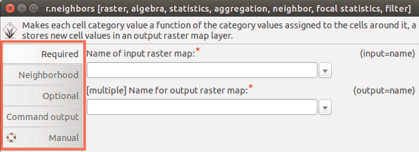
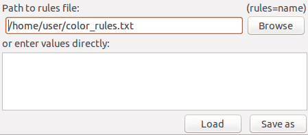

# wxGUI Module dialogs

## DESCRIPTION

GRASS GIS functionality is organized into modules, which are standalone
programs with defined interface. Their graphical user interface (GUI) is
a dialog with several tabs which organize module parameters into groups.

Each parameter can have different type of input fields, for example text
entry or drop-down list. Flags are represented as checkboxes. The
parameter (or flag) name is visible on the right side of each input
field so that it is simple to understand how the module dialog relates
to the command representation which is used in the manuals and
tutorials. The commands can be used to call the module in the command
line, Shell scripts or, with a slight modification, in a Python script.


### Tabs

Module parameters and flags are organized in tabs. Their names can
depend on a module, however every module has *Command output* tab where
the progress can be observed, and the module output including text
results or warnings are printed. The last *Manual* tab contains
description of module's parameters and examples. The same information
can be found in the online manual as well.

The style of the tabs can be changed through *GUI settings* -
*Appearance* - *Module dialog style*. Note that the style appearance
depends on the platform and some styles might be more suitable for
different platforms.


  
*Figure: Example of style "left" and "top" on Ubuntu.*

### Flags

Module flags are represented as checkboxes with description. There are
three special flags - *overwrite*, *verbose* and *quiet*. Flags
*verbose* and *quiet* set the level of verbosity of the module (how
detailed the messages should be).


Modules which output a new map or a new file have the flag *overwrite*
which must be used when the specified output map or file is already
present. If the map or file of the specified name already exist and
*overwrite* flag is not used, an error message appears:

```sh
r.slope.aspect elevation=elevation slope=slope
ERROR: option <slope>: <slope> exists. To overwrite, use the --overwrite flag
```

If using the command instead of GUI, these flags are unlike other flags
prefixed with double dash:

```sh
r.slope.aspect elevation=elevation slope=slope --overwrite --quiet
```

### Current working directory

Certain modules require a file as input or output. Either the full path
to the file needs to be specified or a path relative to the current
working directory is enough, for example only the name of the file.
**Current working directory** is a directory where GRASS would look for
or output files to if the full path is not specified. By default working
directory is user's home folder. It can be changed in wxGUI menu
*Settings* - *GRASS working environment* - *Change working directory*,
or by typing `cd` and pressing Enter in the wxGUI Command console. If
the working directory is changed to a directory where the input files
are, then it is enough to specify just the name of the file instead of
the full path.

This applies to external files such as text files or GeoTiff files. This
does not apply to raster maps, vector maps and other geospatial data
stored in GRASS database which do not need any path to be specified.

### Special widgets

For raster, vector or 3D raster input, there is a special widget which
after clicking on the arrow to the right pops up a list of existing maps
from different mapsets. Selecting a map from the popup list will add it
to the entry field. In case multiple maps can be specified (denoted by
*\[multiple\]* label), selecting a map from the popup list will append
the map names with comma in between.


If the input file is supposed to be a text file (for example color rules
in r.colors), it is possible to type the text in the provided box
directly instead of creating a new file in a text editor and saving it.
A temporary file is created in this case. By pressing the *Save as*
button, the content of the box is then saved into user specified file,
so that user's workflow can be reproduced later. With *Load* button we
can display the content of selected file and edit it directly in the
box.




Figure: In the first image, user specified a full path to a file. In the
second image, user typed color rules conveniently into the box below,
however the rules will not be stored permanently.

## NOTES

Dialogs are generated automatically based on module interface defined
using [g.parser](g.parser.md). Command line interface can be obtained
when running the module with a *--help* flag. The options and flags are
the same as in the module GUI.

```sh
r.neighbors --help

Description:
 Makes each cell category value a function of the category
values assigned to the cells around it, and stores new cell
values in an output raster map layer.
Keywords:
 raster, algebra, statistics, aggregation, neighbor, focal
statistics, filter
Usage:
 r.neighbors [-ac] input=name [selection=name]
output=name[,name,...]
   [method=string[,string,...]] [size=value] [title=phrase]
[weight=name]
   [gauss=value] [quantile=value[,value,...]] [--overwrite]
[--help]
   [--verbose] [--quiet] [--ui]
Flags:
  -a   Do not align output with the input
  -c   Use circular neighborhood
 --o   Allow output files to overwrite existing files
 --h   Print usage summary
 --v   Verbose module output
 --q   Quiet module output
 --ui  Force launching GUI dialog
Parameters:
      input   Name of input raster map
  selection   Name of an input raster map to select the
cells which should be processed
     output   Name for output raster map
     method   Neighborhood operation
              options:
average,median,mode,minimum,maximum,range,stddev,sum,
count,variance,diversity,interspersion,quart1,quart3,
                       perc90,quantile
              default: average
       size   Neighborhood size
              default: 3
      title   Title for output raster map
     weight   Text file containing weights
      gauss   Sigma (in cells) for Gaussian filter
   quantile   Quantile to calculate for method=quantile
              options: 0.0-1.0
```

## SEE ALSO

*[wxGUI](wxGUI.md), [wxGUI components](wxGUI.components.md)*

## AUTHORS

GRASS Development Team  
manual by Anna Petrasova, OSGeoREL, Faculty of Civil Engineering, Czech
Technical University in Prague  
Vaclav Petras, OSGeoREL, Faculty of Civil Engineering, Czech Technical
University in Prague
