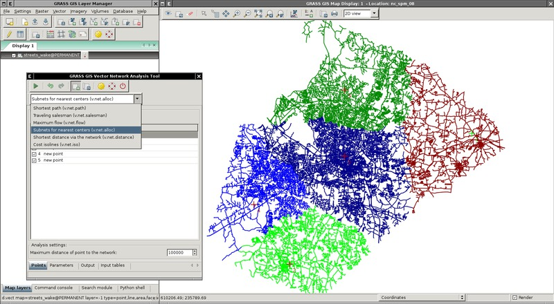

# wxGUI Vector Network Analysis Tool

## DESCRIPTION

**Vector Network Analysis Tool** is graphical front-end for `v.net*`
modules. It allows perform network analysis directly in
*[wxGUI](wxGUI.md)* without need to use command line. The tool can be
launched from Layer Manager menu *Vector → Network analysis → Vector
network analysis tool* or from Map Display toolbar *Analyse map → Vector
network analysis tool* .

  
*Subsets for nearest centers ([v.net.alloc](v.net.alloc.md))*

Vector Network Analysis Tool currently allows you to:

- perform these network analyses:
  - Shortest path (*[v.net.path](v.net.path.md)*)
  - Salesman (*[v.net.salesman](v.net.salesman.md)*)
  - Flow (*[v.net.flow](v.net.flow.md)*)
  - Allocate subnets for nearest centers
    (*[v.net.alloc](v.net.alloc.md)*)
  - Steiner tree for the network and given terminals
    (*[v.net.distance](v.net.distance.md)*)
  - Splits net by cost isolines (*[v.net.iso](v.net.iso.md)*)
- show and set all data needed for the analysis (points, attribute
  tables, compute costs)
- show analysis results (maps and it's attribute tables)
- snapping to nodes
- browse previous analysis results

## NOTES

The tool is split into tabs. Every tab represents some functionality:

**Parameters** tab  
It is used for setting vector map and it's layer on which analysis will
be done. Also it is possible to set columns with cost values from
attribute table connected to particular layer.

**Points** tab  
It manages points, which are used for analysis.

**Output** tab  
There is a output console, which shows information about running
analysis.

**Input tables** tab  
When existing vector map and it's existing layers are set in
*Parameters* tab, this tab is dynamically added. It shows attribute
tables of node and arc layers, which were chosen for analysis. It is
also possible to compute cost values in this tab. This can be done by
right mouse button click on column label. Then from pop-up menu choose
*Add column*, where new column for cost values can be created. After
that by right mouse button click on the added column label can be chosen
item *Field calculator*. This tool computes cost values.

**Result tables** tab  
The result of vector network analysis is always a vector map. Some
vector network analysis results can also include attribute tables. If
such a table is connected to the result map, this tab is shown and with
it you can browse the data.

## KNOWN ISSUES

When some change is done in layer tree of Map Display, temporary vector
map representing result of analysis is not rendered (use *Show result*
button in toolbar to render it again).

## SEE ALSO

*[wxGUI](wxGUI.md), [wxGUI components](wxGUI.components.md)*

See list of [vector network modules](topic_network.md).

See also the user
[wiki](https://grasswiki.osgeo.org/wiki/WxGUI_Vector_Network_Analysis_Tool)
page including [video
tutorial](https://grasswiki.osgeo.org/wiki/WxGUI-Vector-Network-Analysis-Tool#Video-tutorial).

## AUTHOR

Stepan Turek, [Google Summer of Code
2012](https://grasswiki.osgeo.org/wiki/GRASS_GSoC_2012_WxGUI_front_end_for_vector_analysis_modules)
(mentor: Martin Landa)
