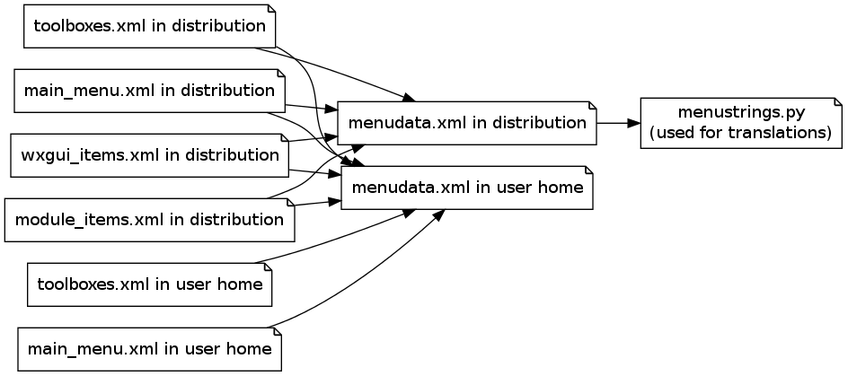

Files overview
==============

Files related to toolboxes
--------------------------

GRASS source code contains these XML files:

*   ``gui/wxpython/xml/main_menu.xml``

*   ``gui/wxpython/xml/toolboxes.xml``

*   ``gui/wxpython/xml/wxgui_items.xml``

GRASS distribution contains these XML files:

*   ``etc/gui/wxpython/xml/main_menu.xml``

*   ``etc/gui/wxpython/xml/toolboxes.xml``

*   ``etc/gui/wxpython/xml/wxgui_items.xml``

*   ``etc/gui/wxpython/xml/module_items.xml``
    (generated during compilation)

*   ``etc/gui/wxpython/xml/menudata.xml``
    (generated during compilation)

GRASS directory (
``".grass7"``
) in user home directory (i.e.,
``"$HOME"``
on Unix) contains these XML files:

*   ``toolboxes/main_menu.xml``
    (created by user)

*   ``toolboxes/toolboxes.xml``
    (created by user)

*   ``toolboxes/menudata.xml``
    (generated on wxGUI startup)

Other files
-----------

GRASS source code contains these XML files:

*   ``gui/wxpython/xml/menudata_gmodeler.xml``

*   ``gui/wxpython/xml/menudata_psmap.xml``

In GRASS distribution these XML files are in the
``etc/gui/wxpython/xml``
directory.

|toolboxes_flowchart.png|

