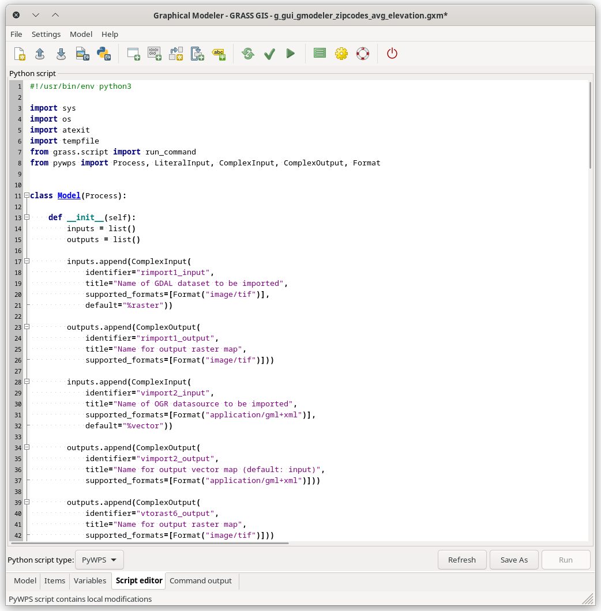

# wxGUI Graphical Modeler

## DESCRIPTION

The **Graphical Modeler** is a *[wxGUI](wxGUI.md)* component which
allows the user to create, edit, and manage simple and complex models
using an easy-to-use interface. When performing analytical operations in
GRASS GIS, the operations are not isolated, but part of a chain of
operations. Using the Graphical Modeler, a chain of processes (i.e.
GRASS GIS modules) can be wrapped into one process (i.e. model).
Subsequently it is easier to execute the model later on even with
slightly different inputs or parameters.  
Models represent a programming technique used in GRASS GIS to
concatenate single steps together to accomplish a task. It is
advantageous when the user see boxes and ovals that are connected by
lines and represent some tasks rather than seeing lines of coded text.
The Graphical Modeler can be used as a custom tool that automates a
process. Created models can simplify or shorten a task which can be run
many times and it can also be easily shared with others. Important to
note is that models cannot perform specified tasks that one cannot also
manually perform with GRASS GIS. It is recommended to first to develop
the process manually, note down the steps (e.g. by using the *Copy*
button in module dialogs) and later replicate them in model.

The Graphical Modeler allows you to:

- define data items (raster, vector, 3D raster maps)
- define actions (GRASS commands)
- define relations between data and action items
- define loops (e.g. map series) and conditions (if-else statements)
- define model variables
- parameterize GRASS commands
- define intermediate data
- validate and run model
- save model properties to a file (*GRASS Model File\|\*.gxm*)
- export model to Python script
- export model to Python script in the form of a PyWPS process
- export model to an actinia process
- export model to image file

### Main dialog

The Graphical Modeler can be launched from the Layer Manager menu
`File -> Graphical modeler` or from the main toolbar
. It's also available as stand-alone
module *g.gui.gmodeler*.

The main Graphical Modeler menu contains options which enable the user
to fully control the model. Directly under the main menu one can find
toolbar with buttons (see figure below). There are options including (1)
Create new model, (2) Load model from file, (3) Save current model to
file, (4) Export model to image, (5) Export model to a
(Python/PyWPS/actinia) script, (6) Add command (GRASS module) to model,
(7) Add data to model, (8) Manually define relation between data and
commands, (9) Add loop/series to model, (10) Add comment to model, (11)
Redraw model canvas, (12) Validate model, (13) Run model, (14) Manage
model variables, (15) Model settings, (16) Show manual, (17) Quit
Graphical Modeler.

  
*Figure: Components of Graphical Modeler menu toolbar.*

There is also a lower menu bar in the Graphical modeler dialog where one
can manage model items, visualize commands, add or manage model
variables, define default values and descriptions. The Script editor
dialog window allows seeing and exporting workflows as basic Python
scripts, as PyWPS scripts, or as actinia processes. The rightmost tab of
the bottom menu is automatically triggered when the model is activated
and shows all the steps of running GRASS modeler modules; in the case
some errors occur in the calculation process, they are are written at
that place.

  
*Figure: Lower Graphical Modeler menu toolbar.*

### Components of models

The workflow is usually established from four types of diagrams. Input
and derived model data are usually represented with oval diagrams. This
type of model elements stores path to specific data on the user's disk.
It is possible to insert vector data, raster data, database tables, etc.
The type of data is clearly distinguishable in the model by its color.
Different model elements are shown in the figures below.

- \(A\) raster data:
  
- \(B\) relation:
  
- \(C\) GRASS module:
  
- \(D\) loop:
  
- \(E\) database table:
  
- \(F\) 3D raster data:
  
- \(G\) vector data:
  
- \(H\) disabled GRASS module:
  
- \(I\) comment:
  

  
*Figure: A model to perform unsupervised classification using MLC
([i.maxlik](i.maxlik.md)) and SMAP ([i.smap](i.smap.md)).*

Another example:

  
*Figure: A model to perform estimation of average annual soil loss
caused by sheet and rill erosion using The Universal Soil Loss
Equation.*

Example as part of landslide prediction process:

  
*Figure: A model to create parametric maps used by geologists to predict
landslides in the area of interest.*

## EXAMPLE

In this example the `zipcodes_wake` vector data and the
`elev_state_500m` raster data from the North Carolina sample dataset
(original
[raster](https://grass.osgeo.org/sampledata/north_carolina/nc_rast_geotiff.zip)
and
[vector](https://grass.osgeo.org/sampledata/north_carolina/nc_shape.zip)
data) are used to calculate average elevation for every zone. The
important part of the process is the Graphical Modeler, namely its
possibilities of process automation.

### The workflow shown as a series of commands

In the command console the procedure looks as follows:

```sh
# input data import
r.import input=elev_state_500m.tif output=elevation
v.import input=zipcodes_wake.shp output=zipcodes_wake
# computation region settings
g.region vector=zipcodes_wake
# raster statistics (average values), upload to vector map table calculation
v.rast.stats -c map=zipcodes_wake raster=elevation column_prefix=rst method=average
# univariate statistics on selected table column for zipcode map calculation
v.db.univar map=zipcodes_wake column=rst_average
# conversion from vector to raster layer (due to result presentation)
v.to.rast input=zipcodes_wake output=zipcodes_avg use=attr attribute_column=rst_average
# display settings
r.colors -e map=zipcodes_avg color=bgyr
d.mon start=wx0 bgcolor=white
d.barscale style=arrow_ends color=black bgcolor=white fontsize=10
d.rast map=zipcodes_avg bgcolor=white
d.vect map=zipcodes_wake type=boundary color=black
d.northarrow style=1a at=85.0,15.0 color=black fill_color=black width=0 fontsize=10
d.legend raster=zipcodes_avg lines=50 thin=5 labelnum=5 color=black fontsize=10
```

### Defining the workflow in the Graphical Modeler

To start performing above steps as an automatic process with the
Graphical Modeler press the  icon or type
*g.gui.gmodeler*. The simplest way of inserting elements is by adding
the complete GRASS command to the Command field in the GRASS command
dialog (see figure below). With full text search one can do faster
module hunting. Next, the label and the command can be added. In case
that only a module name is inserted, after pressing the *Enter* button,
the module dialog window is displayed and it is possible to set all of
the usual module options (parameters and flags).

  
*Figure: Dialog for adding GRASS commands to model.*

### Managing model parameters

All used modules can be parameterized in the model. That causes
launching the dialog with input options for model after the model is
run. In this example, input layers (`zipcodes_wake` vector map and
`elev_state_500m` raster map) are parameterized. Parameterized elements
show their diagram border slightly thicker than those of unparameterized
elements.

  
*Figure: Model parameter settings.*

The final model, the list of all model items, and the Script editor
window with *Save* and *Run* option are shown in the figures below.

  
*Figure: A model to perform average statistics for zipcode zones.*


  
*Figure: Items with Script editor window.*

For convenience, this model for the Graphical Modeler is also available
for download [here](g_gui_gmodeler_zipcodes_avg_elevation.gxm).

The model is run by clicking the *Run* button .
When all inputs are set, the results can be displayed as shown in the
next Figure:


  
*Figure: Average elevation for ZIP codes using North Carolina sample
dataset as an automatic calculation performed by Graphical Modeler.*

### Managing model properties

When the user wants to run the model again with the same data or the
same names, it is necessary to use `--overwrite` option. It will cause
maps with identical names to be overwritten. Instead of setting it for
every module separately it is handy to change the Model Property
settings globally. This dialog includes also metadata settings, where
model name, model description and author(s) of the model can be
specified.

  
*Figure: Model properties.*

### Defining variables

Another useful trick is the possibility to set variables. Their content
can be used as a substitute for other items. Value of variables can be
values such as raster or vector data, integer, float, string value or
they may constitute some region, mapset, file or direction data type.
Then it is not necessary to set any parameters for input data. The
dialog with variable settings is automatically displayed after the model
is run. So, instead of model parameters (e.g. `r.import` a `v.import`,
see the Figure *[Run model dialog](g_gui_gmodeler_avg_run.png)* above)
there are `Variables`.

  
*Figure: Model with variable inputs.*

The key point is the usage of `%` before the substituting variable and
settings in the `Variables` dialog. For example, in the case of a model
variable `raster` that points to an input file path and which value is
required to be used as one of inputs for a particular model, it should
be specified in the `Variables` dialog with its respective name
(`raster`), data type, default value and description. Then it should be
set in the module dialog as input called `%raster`.

  
*Figure: Example of raster file variable settings.*

  
*Figure: Example of raster file variable usage.*

### Saving the model file

Finally, the model settings can be stored as a GRASS GIS Model file with
`*.gxm` extension. The advantage is that it can be shared as a reusable
workflow that may be run also by other users with different data.

For example, this model can later be used to calculate the average
precipitation for every administrative region in Slovakia using the
`precip` raster data from [Slovakia precipitation
dataset](https://grass.osgeo.org/sampledata/slovakia3d_grass7.tar.gz)
and administration boundaries of Slovakia from [Slovak
Geoportal](https://www.geoportal.sk/sk/zbgis_smd/na-stiahnutie/) (only
with a few clicks).

### Handling intermediate data

There can be some data in a model that did not exist before the process
and that it is not worth it to maintain after the process executes. They
can be described as being `Intermediate` by single clicking using the
right mouse button, see figure below. All such data should be deleted
following model completion. The boundary of intermediate component is
dotted line.

  
*Figure: Usage and definition of intermediate data in model.*

### Using the Script editor

By using the Script editor in the Graphical Modeler, the user can add
Python code and then run it with *Run* button or just save it as a
Python script `*.py`. The result is shown in the Figure below:


  
*Figure: Script editor in the wxGUI Graphical Modeler.*

The second option in the *Script type* combobox exports a PyWPS script
instead of a basic Python one. A PyWPS process based on the model will
be generated then; for the PyWPS script, the *Run* button is disabled as
users are expected to include this script in their web processing
service and not to run it on itself.

  
*Figure: Script editor in the wxGUI Graphical Modeler - set to PyWPS.*

The third option in the *Script type* combobox exports an actinia
process chain (non-parameterized model) or an actinia template
(parameterized model). An actinia JSON based on the model will be
generated then; as for the PyWPS script, the *Run* button is disabled as
users are expected to include this JSON in their web processing service
and not to run it on itself.

  
*Figure: Script editor in the wxGUI Graphical Modeler - set to actinia.*

By default GRASS script package API is used
(`grass.script.core.run_command()`). This can be changed in the
settings. Alternatively also PyGRASS API is supported
(`grass.pygrass.modules.Module`).

### Defining loops

In the example below the [MODIS
MOD13Q1](https://e4ftl01.cr.usgs.gov/MOLT/MOD13Q1.006/) (NDVI) satellite
data products are used in a loop. The original data are stored as coded
integer values that need to be multiplied by the value `0.0001` to
represent real *ndvi values*. Moreover, GRASS GIS provides a predefined
color table called `ndvi` to represent *ndvi data*. In this case it is
not necessary to work with every image separately.  
The Graphical Modeler is an appropriate tool to process data in an
effective way using loop and variables (`%map` for a particular MODIS
image in mapset and `%ndvi` for original data name suffix). After the
loop component is added to model, it is necessary to define series of
maps with required settings of map type, mapset, etc.

  
*Figure: MODIS data representation in GRASS GIS after Graphical Modeler
usage.*

When the model is supplemented by all of modules, these modules should
be ticked in the boxes of loop dialog. The final model and its results
are shown below.

  
*Figure: Model with loop.*


  
*Figure: MODIS data representation in GRASS GIS after Graphical Modeler
usage.*

The steps to enter in the command console of the Graphical Modeler would
be as follows:

```sh
# note that the white space usage differs from the standard command line usage

# rename original image with preselected suffix
g.rename raster = %map,%map.%ndvi
# convert integer values
r.mapcalc expression = %map = %map.%ndvi * 0.0001
# set color table appropriate for nvdi data
r.colors = map = %map color = ndvi
```

## SEE ALSO

*[wxGUI](wxGUI.md), [wxGUI components](wxGUI.components.md)*

See also selected user models available from [GRASS Addons
repository](https://grass.osgeo.org/grass8/manuals/addons/).

See also the
[wiki](https://grasswiki.osgeo.org/wiki/WxGUI_Graphical_Modeler) page
(especially various [video
tutorials](https://grasswiki.osgeo.org/wiki/WxGUI_Graphical_Modeler#Video_tutorials)).

## AUTHORS

Martin Landa, GeoForAll Lab, Czech Technical University in Prague, Czech
Republic  
PyWPS support by Ondrej Pesek, GeoForAll Lab, Czech Technical University
in Prague, Czech Republic  
Various manual improvements by Ludmila Furkevicova, Slovak University of
Technology in Bratislava, Slovak Republic
