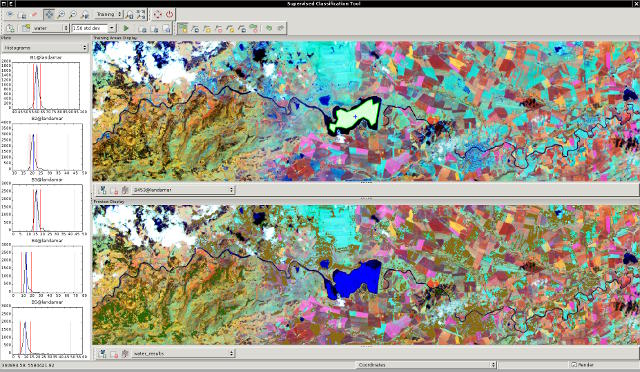

# wxGUI Supervised Classification Tool

## DESCRIPTION

**Supervised Classification Tool** (wxIClass) is a *[wxGUI](wxGUI.md)*
component which allows the user to create training areas and generate
spectral signatures. The resulting signature file can be used as input
for *[i.maxlik](i.maxlik.md)* or as a seed signature file for
*[i.cluster](i.cluster.md)*. *WxIClass* can be launched from the Layer
Manager menu *Imagery → Classify image → Interactive input for
supervised classification* or via command line as *g.gui.iclass*.

*wxIClass* currently allows you to:

- create training areas (using customized *[vector
  digitizer](wxGUI.vdigit.md)*)
- show histograms for each band and class (category)
- show coincidence plots for each band
- show raster cells that match training areas (within the number of
  standard deviations specified)
- specify color of class
- write signature file
- import vector map
- export vector map with attribute table

*wxIClass* performs the first pass in the GRASS two-pass supervised
image classification process; the GRASS module *[i.maxlik](i.maxlik.md)*
executes the second pass. Both programs must be run to generate a
classified map in GRASS raster format.

*wxIClass* is an interactive program that allows the user to create
multiple training areas for multiple classes and calculate the spectral
signatures based on the cells that are within the training areas. During
this process the user will be shown histograms for each image band. The
user can also display the cells of the image bands which fall within a
user-specified number of standard deviations from the means in the
spectral signature. By doing this, the user can see how much of the
image is likely to be put into the class associated with the signature.

*wxIClass* can also import training areas defined in a vector layer. In
that case the program expects the vector layer to have the following
columns defined:

- cat: category value
- class: a string with the class name
- color: a color defined using format "RRR:GGG:BBB"

The spectral signatures are composed of region means and covariance
matrices. These region means and covariance matrices are used in the
second pass (*[i.maxlik](i.maxlik.md)*) to classify the image.

Alternatively, the spectral signatures generated by *wxIClass* can be
used for seed means for the clusters in *[i.cluster](i.cluster.md)*.

## SEE ALSO

*[wxGUI](wxGUI.md), [wxGUI components](wxGUI.components.md),
[Interactive Scatter Plot Tool](wxGUI.iscatt.md)*

See also user [wiki](https://grasswiki.osgeo.org/wiki/WxIClass) page and
[development](https://trac.osgeo.org/grass/wiki/wxGUIDevelopment/wxIClass)
page.

## AUTHORS

Anna Kratochvilova, [Czech Technical University in
Prague](https://www.cvut.cz), Czech Republic  
Vaclav Petras, [Czech Technical University in
Prague](https://www.cvut.cz), Czech Republic
