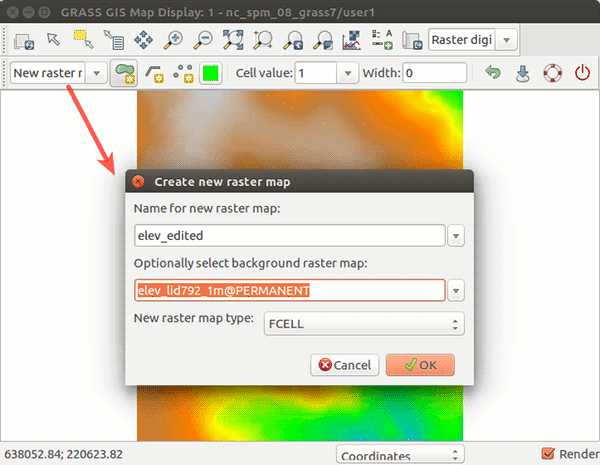
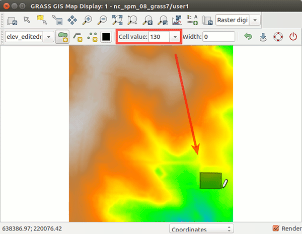
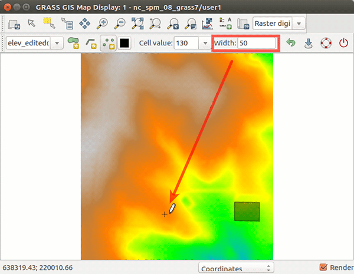
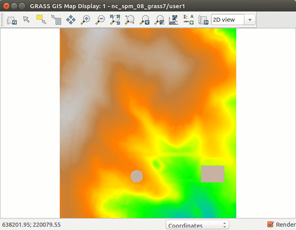
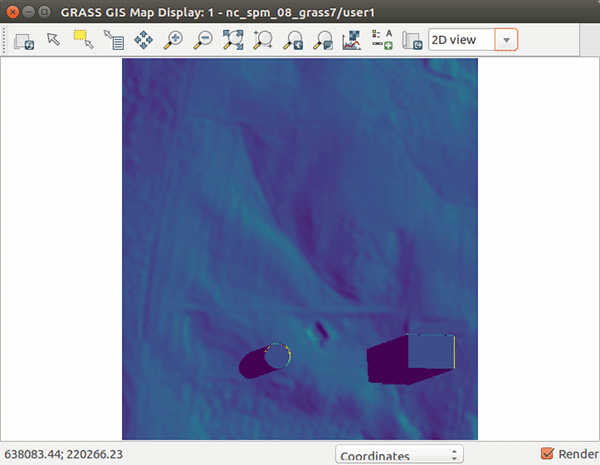

# wxGUI Raster Digitizer

## DESCRIPTION

**Raster Digitizer** is a simple tool to quickly draw lines, areas, and
circles and save these features in a raster map. It is accessible from
the Map Display toolbar (from the combo box on the right).

*Raster Digitizer* currently allows you to:

- draw polygons, lines and points
- set category value of the feature you are drawing
- set feature width (width of currently digitized line or diameter of a
  digitized point in map units)
- create a new raster from scratch or from an already existing raster
- undo edits and save edits before leaving the digitizer

The typical workflow includes these steps:

1. Set computational region as needed.
2. Switch to Raster Digitizer and select a map to create. Select either
    a new raster or create a new raster from existing raster, also
    select raster type (CELL, FCELL, DCELL)
3. Specify category value and width *before* drawing a feature
4. Specify digitizing tool (area, line, point)
5. Start digitizing and when you want to finish area or line, *use
    right click*
6. Change color of temporary overlay depending on your needs
7. Set different category and repeat
8. At any point you can use *Undo* or *Save*
9. If existing raster is used for the new raster, digitized areas will
    respect the color table, but you can always set different color
    table.

## NOTES

Raster Digitizer respects computational region including the currently
set resolution.

## EXAMPLES

In the following figures we start with elev_lid792_1m raster map in
North carolina sample dataset and digitize two buildings, one
rectangular and one with circular footprint. Both buildings have the
roof level at 130 m. We set the width when digitizing the point to 50
meters which results in the building having 50 m in diameter. When we
are done with digitizing, we save the result and explore cast shadows of
the buildings with [r.sun](r.sun.md) module:

```sh
g.region raster=elev_lid792_1m
# now create elev_edited raster by digitizing and save
r.slope.aspect elevation=elev_edited slope=slope aspect=aspect
r.sun elevation=elev_edited aspect=aspect slope=slope beam_rad=beam day=172 time=6
```





  
*Figure: Steps to digitize new buildings on elev_lid792_1m raster map.*

## SEE ALSO

*[wxGUI](wxGUI.md), [wxGUI components](wxGUI.components.md),
[r.in.poly](r.in.poly.md) (backend of digitizer),
[g.gui.vdigit](g.gui.vdigit.md)*

## AUTHORS

Anna Petrasova, NCSU GeoForALL Laboratory  
Tomas Zigo (standalone module)
