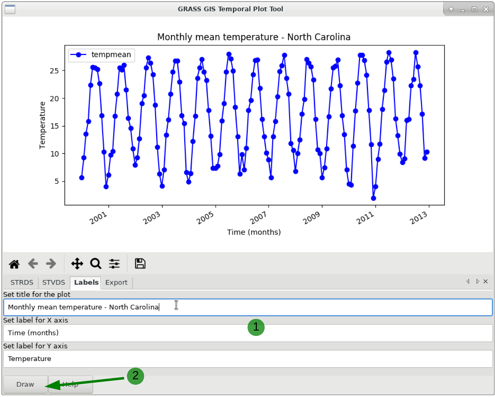

# wxGUI Temporal Plot Tool

## DESCRIPTION

The **Temporal Plot Tool** is a *[wxGUI](wxGUI.md)* component that
queries and plots the values of a point, defined by a coordinate pair,
in one or more temporal datasets (strds, stvds, str3ds).

Supported features:

- temporal datasets with interval/point and absolute/relative time,

- show simple linear regression model line with calculated formula
  `y = a + b*x`  (y is dependent variable, a is intercept, b is slope,
  x is explanatory variable) and `r-squared` (parameter of goodness-of-fit
  measure for linear regression model)

- pop-up annotations with values information,

- query and plot multiple points via the command line,

- zoom and pan,

- change labels to x and y axes,

- add title to the plot, and

- export the time series values to a CSV file (x axis data has date time
  string format, if you want to use for calculating simple regression
  model in the [R environment](https://www.r-project.org/),
  [LibreOffice](https://www.libreoffice.org/) etc., you will obtain a
  different calculated formula

  ```sh
  y = a + b*x
  ```

  because these software packages use a reference date other than the
  UNIX Epoch time (00:00:00 UTC on 1 January 1970)).

  
*Figure: Temporal Plot Tool*

To optionally add a title to the temporal plot and/or change the x and y
axes labels, first type the desired text and then click *Draw* as showed
below.

  
*Figure: Add title and labels to a time series plot*

To export the time series data to a text file (date and data values),
type a name for the file and click *Draw* again. Optionally, set the
check-box to print headers, as well.

[g.gui.tplot export time series as csv file](g_gui_tplot_export_csv.png)  
*Figure: Export time series values to a text file*

## NOTES

*g.gui.tplot* requires the Python plotting library
[Matplotlib](https://matplotlib.org/).

## SEE ALSO

*[Temporal data processing](temporal.md), [wxGUI](wxGUI.md), [wxGUI
components](wxGUI.components.md)*

## AUTHOR

Luca Delucchi, [Fondazione Edmund Mach](http://www.gis.cri.fmach.it),
Italy
