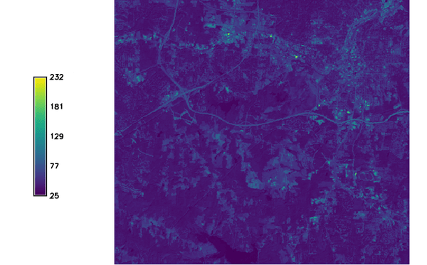
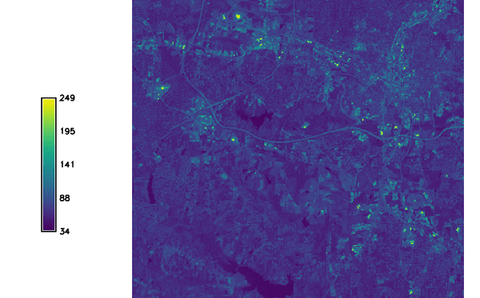

## DESCRIPTION

*i.albedo* calculates the albedo, that is the Shortwave surface
reflectance in the range of 0.3-3 micro-meters. It takes as input
individual bands of surface reflectance originating from MODIS, AVHRR,
Landsat, Sentinel-2 or Aster satellite sensors and calculates the albedo
for those. This is a precursor to *r.sun* and any energy-balance
processing.

## NOTES

It uses for Landsat 8 the weighted average reflectance (temporary
solution until an algorithm is found).

It assumes MODIS product surface reflectance in \[0;10000\].

The Sentinel-2 (**-s**) mode expects exactly 6 surface reflectance bands
in \[0,1\], in the order B2, B3, B4, B8, B11, B12 (e.g. as produced by
Sentinel-2 L2A surface reflectance, scaled from its native \[0,10000\]
digital numbers).

## EXAMPLE

The following example creates the raster map "albedo_lsat7_1987" from
the LANDSAT-TM5 bands in the North Carolina dataset:

```sh
g.region raster=lsat5_1987_10 -p
i.albedo -l input=lsat5_1987_10,lsat5_1987_20,lsat5_1987_30,lsat5_1987_40,lsat5_1987_50,lsat5_1987_70 output=albedo_lsat7_1987
```

  
*Figure: Resulting albedo map from LANDSAT 5*

The following example creates the raster map "albedo_lsat7_2000" from
the LANDSAT-TM7 bands in the North Carolina dataset:

```sh
g.region raster=lsat7_2000_10 -p
i.albedo -l input=lsat7_2000_10,lsat7_2000_20,lsat7_2000_30,lsat7_2000_40,lsat7_2000_50,lsat7_2000_70 output=albedo_lsat7_2000
```

  
*Figure: Resulting albedo map from LANDSAT 7*

The following example creates a Sentinel-2 broadband albedo map from six
surface reflectance bands (B2, B3, B4, B8, B11, B12) already scaled to
\[0,1\]:

```sh
i.albedo -s input=s2_B2,s2_B3,s2_B4,s2_B8,s2_B11,s2_B12 output=albedo_sentinel2
```

## TODO

Maybe change input requirement of MODIS to \[0.0-1.0\]?

## REFERENCES

For a 2 band determination of the Aster BB Albedo see the following:

Salleh and Chan, 2014. Land Surface Albedo Determination: Remote Sensing
and Statistical Validation. in proceedings of FIG 2014
([PDF](https://www.fig.net/resources/proceedings/fig_proceedings/fig2014/papers/ts05g/TS05G_salleh_chan_6910.pdf))

For the Sentinel-2 narrow-to-broadband conversion coefficients:

Bonafoni, S. and Sekertekin, A., 2020. Albedo Retrieval From Sentinel-2 by
New Narrow-to-Broadband Conversion Coefficients. *IEEE Geoscience and
Remote Sensing Letters*, 17(9), 1618-1622.
([DOI](https://doi.org/10.1109/LGRS.2020.2967085))

## SEE ALSO

*[r.sun](r.sun.md), [i.vi](i.vi.md)*

## AUTHOR

Yann Chemin
