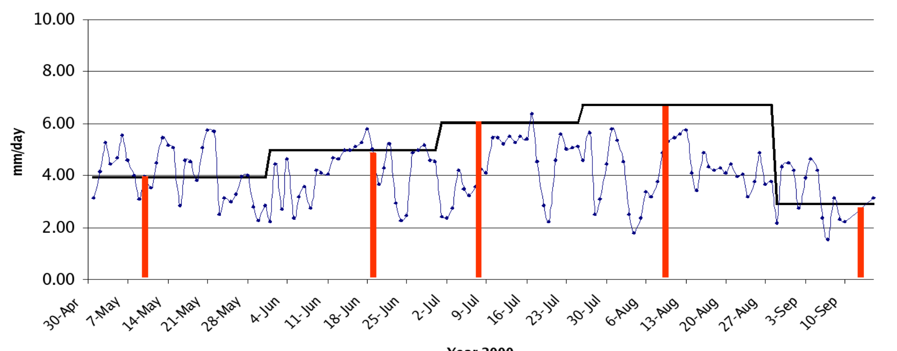

## DESCRIPTION

*i.evapo.time* (i.evapo.time_integration) integrates ETa in time
following a reference ET (typically) from a set of meteorological
stations dataset. Inputs:

- ETa images
- ETa images DOY (Day of Year)
- ETo images
- ETo DOYmin as a single value

Method:

1. each ETa pixel is divided by the same day ETo and become ETrF
2. each ETrF pixel is multiplied by the ETo sum for the representative
    days
3. Sum all n temporal \[ETrF\*ETo_sum\] pixels to make a summed(ET) in
    \[DOYmin;DOYmax\]

representative days calculation: let assume i belongs to range
\[DOYmin;DOYmax\]

```sh
DOYbeforeETa[i] = ( DOYofETa[i] - DOYofETa[i-1] ) / 2
DOYafterETa[i] = ( DOYofETa[i+1] - DOYofETa[i] ) / 2
```

## NOTES

ETo images preparation: If you only have one meteorological station data
set, the easiest way is:

```sh
n=0
for ETo_val in Eto[1] Eto[2] ...
do
    r.mapcalc "eto$n = $ETo_val"
    `expr n = n + 1`
done
```

with Eto\[1\], Eto\[2\], etc being a simple copy and paste from your
data file of all ETo values separated by an empty space from each other.

If you have several meteorological stations data, then you need to grid
them by generating Thiessen polygons or using different interpolation
methods for each day.

For multi-year calculations, just continue incrementing DOY values above
366, it will continue working, up to maximum input of 400 satellite
images.

  
*This is an example of a temporal integration from a weather station as
done by Chemin and Alexandridis (2004)*

## References

Chemin and Alexandridis, 2004. Spatial Resolution Improvement of
Seasonal Evapotranspiration for Irrigated Rice, Zhanghe Irrigation
District, Hubei Province, China. Asian Journal of Geoinformatics, Vol.
5, No. 1, September 2004
([PDF](https://ikee.lib.auth.gr/record/270217/files/Chemin-Alexandridis.pdf))

## SEE ALSO

*[i.eb.eta](i.eb.eta.md), [i.evapo.mh](i.evapo.mh.md),
[i.evapo.pt](i.evapo.pt.md), [i.evapo.pm](i.evapo.pm.md),
[r.sun](r.sun.md)*

## AUTHOR

Yann Chemin, International Rice Research Institute, The Philippines
