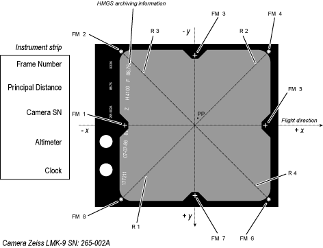

## DESCRIPTION

*i.ortho.camera* creates or modifies entries in a camera reference file.
For ortho-photo rectification, a camera reference file is required for
computation of scanned image to photo-coordinate transformation
parameters. There are two coordinate systems: The image coordinate
system (in pixels) and the photo coordinate system (in milli-meters).
The inner orientation establishes a relation between the pixels and the
image coordinates with help of fiducial marks.

The first prompt in the program will ask you for the name of the camera
reference file to be created or modified. You may create a new camera
reference file by entering a new name, or modify an existing camera
reference file by entering the name of an existing camera file.

After entering the camera file name, following menu is displayed:

Please provide the following information

```shell

    CAMERA NAME:               camera name______
    CAMERA IDENTIFICATION:     identification___
    CALIBRATED FOCAL LENGTH mm.:_________________
    POINT OF SYMMETRY (X)   mm.:_________________
    POINT OF SYMMETRY (Y)   mm.:_________________
    MAXIMUM NUMBER OF FIDUCIALS:_________________

   AFTER COMPLETING ALL ANSWERS, HIT <ESC> TO CONTINUE
               (OR <Ctrl-C> TO CANCEL)
```

The camera name and identification describe the camera reference file.
The calibrated focal length and the point of symmetry are used in
computing the photo-to-target transformation parameters. These values
should be entered from the camera calibration report (usually available
from the photograph supplier).

  
*This example is the camera Zeiss LMK9 265-002A belonging to the
Hellenic Military Geographical Survey (HMGS) and calibrated in December
1985*

The photo coordinate system origin is the so-called calibrated principal
point (PP, Principal Point of Symmetry) which is in the center of the
image. The origin of the axes is at the intersection of the radii traced
from the fiducial marks. In the ideal case of no deviations in the
camera (see camera calibration certificate) the center is the origin and
the values are 0 for both X and Y of Point of Symmetry. But usually the
principal point does not fall on the intersection of the radii at the
center of the picture. This eccentricity is usually of the order of a
few micrometers.

You are then asked to enter the X and Y photo coordinates of each
fiducial as follows. These fiducials (or reseau) marks are index marks
imaged on film which serve as reference photo coordinate system. The
maximum number of fiducials will determine the number of fiducial or
reseau coordinate pairs to be entered below. The origin is the center of
the image (or the point of symmetry) and X and Y are left-right and
up-down. The order is up to the user, but must be kept consistent
throughout the rectification process.

On this screen you should enter the fiducial or reseau photo-coordinates
as given in the camera calibration report. The X, and Y coordinates are
in milli-meters from the principle point.

Please provide the following information

```shell
    Fid#    FID ID          X          Y

    1__    _____        0.0___    0.0___
    2__    _____        0.0___    0.0___
    3__    _____        0.0___    0.0___
    4__    _____        0.0___    0.0___
    5__    _____        0.0___    0.0___
    6__    _____        0.0___    0.0___
    7__    _____        0.0___    0.0___
    8__    _____        0.0___    0.0___
    9__    _____        0.0___    0.0___
    10_    _____        0.0___    0.0___

             next:  end__

     AFTER COMPLETING ALL ANSWERS, HIT <ESC> TO CONTINUE
                    (OR <Ctrl-C> TO CANCEL)
```

The input display is repeated until the number of MAXIMUM FIDUCIALS is
reached.

## SEE ALSO

*[i.ortho.photo](i.ortho.photo.md),
[g.gui.photo2image](g.gui.photo2image.md),
[g.gui.image2target](g.gui.image2target.md),
[i.ortho.init](i.ortho.init.md)*

## AUTHOR

Mike Baba, DBA Systems, Inc.
