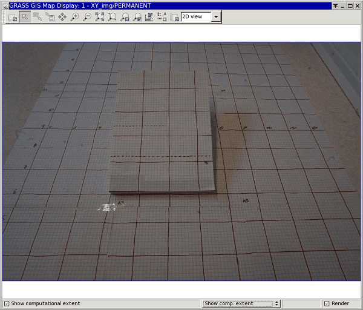
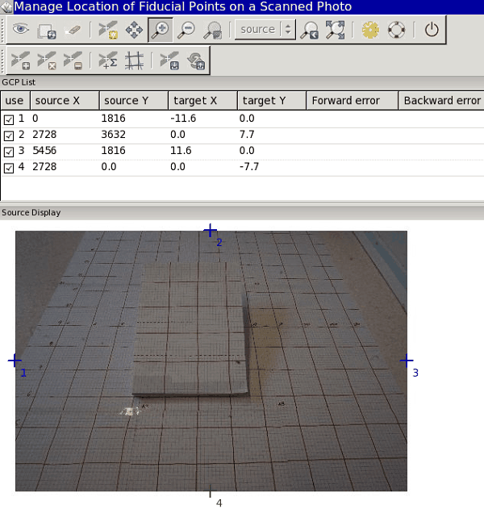
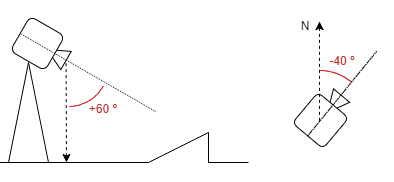
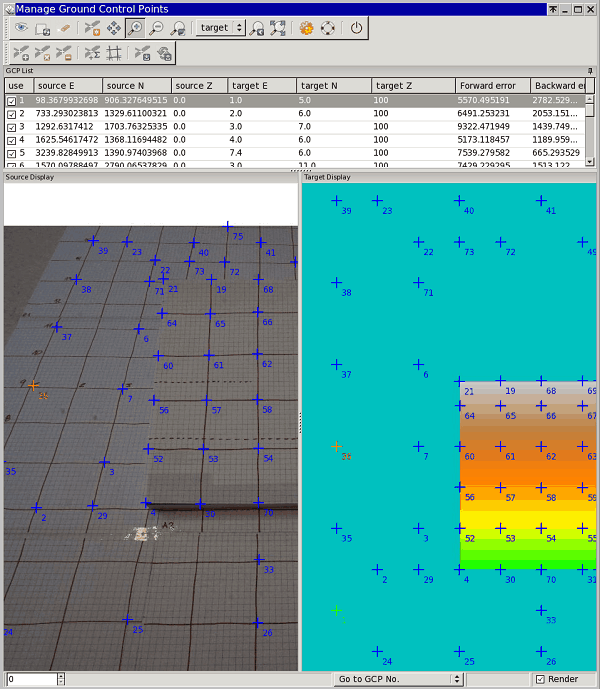
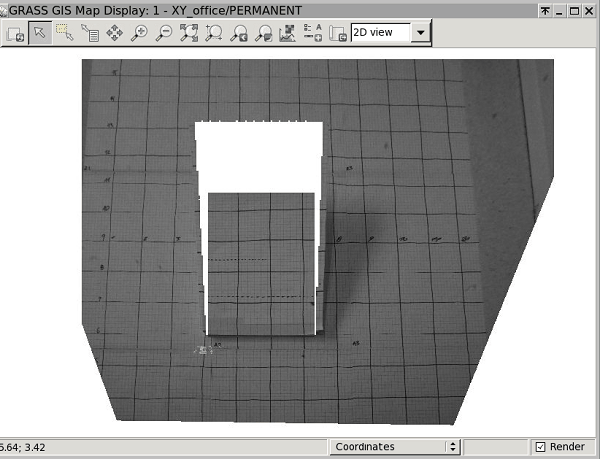

## DESCRIPTION

*i.ortho.photo* is a menu to launch the different parts of the ortho
rectification process of aerial imagery. *i.ortho.photo* allows the user
to ortho-rectify imagery group files consisting of several scanned
aerial photographs (raster maps) of a common area. *i.ortho.photo*
guides the user through 8 steps required to ortho-rectify the raster
maps in a single imagery group. Alternatively, all the steps can be
performed separately by running the appropriate modules.

- *Initialization Options*
  1. Create/Modify imagery group to be orthorectified:
      [i.group](i.group.md)
  2. Select/Modify target project (formerly known as location) and
      mapset for orthorectification: [i.ortho.target](i.ortho.target.md)
  3. Select/Modify target elevation model used for orthorectification:
      [i.ortho.elev](i.ortho.elev.md)
  4. Create/Modify camera file of imagery group:
      [i.ortho.camera](i.ortho.camera.md)
- *Transformation Parameters Computation*
  1. Compute image-to-photo transformation:
      [g.gui.photo2image](g.gui.photo2image.md)
  2. Initialize parameters of camera: [i.ortho.init](i.ortho.init.md)
  3. Compute ortho-rectification parameters from ground control points:
      [g.gui.image2target](g.gui.image2target.md)
- *Ortho-rectification*
  1. Ortho-rectify imagery group: [i.ortho.rectify](i.ortho.rectify.md)

The ortho-rectification procedure in GRASS GIS places the image pixels
on the surface of the earth by matching the coordinate system of the
aerial image in pixels (*image coordinate system*) and the coordinate
system of the camera sensor in millimetres (*photo coordinate system*)
for the interior orientation of the image, and further to the
georeferenced coordinate system defined by projection parameters
(*target coordinate system*) for exterior orientation.

## EXAMPLE

Five groups of input parameters are required for ortho-rectification:

- Aerial image (images),
- Exposure and characteristics of the camera, i.e. its coordinates in
  target coordinate system and height above sea level, focal length,
  yaw, pitch and roll, dimensions of the camera sensor and resolution of
  aerial images,
- Reference surface, i.e. digital elevation model in the target
  coordinate system used to normalize the terrain undulation,
- Topographic reference map used to find corresponding ground control
  points and/or,
- Coordinates of ground control points in the target coordinate system.

  
*Example of an input oblique image in a source project*

To ortho-rectify aerial images the user has to follow the menu options
step by step. Alternatively, all the steps can be performed separately
by running the corresponding modules.

The aerial photos shall be stored in a **source project** - a general
Cartesian coordinate system (XY). Digital elevation model and a map
reference (topo sheet or other map used for ground control point
matching) shall be stored in a **target project** in a real-world
coordinate system (e.g. ETRS33).

The steps to follow are described below:

1. *Create/Modify imagery group to be orthorectified:
    [i.group](i.group.md)*

    This step is to be run in the **source project**.

    In this first step an imagery group of aerial images for
    ortho-rectification is created or modified. The current imagery
    group is displayed at the top of the menu. You may select a new or
    existing imagery group for the ortho-rectification. After choosing
    this option you will be prompted for the name of a new or existing
    imagery group. As a result, a new file
    *mapset/group/name_of_group/**REF*** is created that contains the
    names of all images in a group.

    ```sh
    IMG_0020 source_mapset
    IMG_0021 source_mapset
    IMG_0022 source_mapset
    ```

2. *Select/Modify target project and mapset for orthorectification:
    [i.ortho.target](i.ortho.target.md)*

    This step is to be run in the **source project**.

    The target project and mapset may be selected or modified in Step 2.
    You will be prompted for the names of the projected target project
    and mapset where the ortho-rectified raster maps will reside. The
    target project is also the project from which the elevation model
    (raster map) will be selected (see Step 3). In Step 2, a new file
    *mapset/group/name_of_group/**TARGET*** is created containing the
    names of target project and mapset.

    ```sh
    ETRS_33N
    target_mapset
    ```

3. *Select/Modify target elevation model used for orthorectification:
    [i.ortho.elev](i.ortho.elev.md)*

    This step is to be run in the **source project**.

    Step 3 allows you to select the raster map from the target project
    to be used as the elevation model. The elevation model is required
    for both the computation of photo-to-target parameters (Step 6) and
    for the ortho-rectification of the imagery group files (Step 8). The
    raster map selected for the elevation model should cover the entire
    area of the image group to be ortho-rectified. DTED and DEM files
    are suitable for use as elevation model in the ortho-rectification
    program. In Step 3 you will be prompted for the name of the raster
    map in the target project that you want to use as the elevation
    model. As a result of this step, a new file
    *mapset/group/name_of_group/**ELEVATION*** is created containing
    the name and mapset of the chosen DEM.

    ```sh
    elevation layer :ELEVATION
    mapset elevation:target_mapset
    location        :ETRS_33N
    math expression :(null)
    units           :(null)
    no data values  :(null)
    ```

4. *Create/Modify camera file of imagery group:
    [i.ortho.camera](i.ortho.camera.md)*

    This step is to be run in the **source project**.

    In Step 4 you may select or create a camera reference file that will
    be used with the current imagery group. A camera reference file
    contains information on the internal characteristics of the aerial
    camera, as well as the geometry of the fiducial or reseau marks. The
    most important characteristic of the camera is its focal length.
    Fiducial or reseau marks locations are required to compute the
    scanned image to photo coordinate transformation parameter (Step 5).
    Two new files are created in this step: a file
    *mapset/group/name_of_group/**CAMERA***, containing the name of the
    reference camera and a file *mapset/camera/**name_of_reference***,
    containing the camera parameters.

    ```sh
    CAMERA NAME   sony
    CAMERA ID     123
    CAMERA XP     0
    CAMERA YP     0
    CAMERA CFL    16
    NUM FID       4
          0 -11.6 0
          1 0 7.7
          2 11.6 0
          3 0 -7.7
    ```

5. *Compute image-to-photo transformation:
    [g.gui.photo2image](g.gui.photo2image.md)*

    This step is to be run in the **source project**.

    The scanned image to photo coordinate transformation parameters,
    i.e. the "interior orientation", is computed in Step 5. In this
    interactive step you associate the scanned reference points
    (fiducials, reseau marks, etc.) with their known photo coordinates
    from the camera reference file. A new file
    *mapset/group/name_of_group/**REF_POINTS*** is created, containing
    a list of pairs of coordinates in image and photo coordinate
    systems.

    ```sh
    # Ground Control Points File
    #
    # target location: XY
    # target mapset: source_mapset
    # source  target  status
    # east north east north (1=ok, 0=ignore)
    #-------------------------------------------------------------
    0 1816     -11.6 0.0     1
    2728 3632     0.0 7.7     1
    5456 1816     11.6 0.0     1
    2728 0.0     0.0 -7.7     1
    ```

      
    *Step 5: Image-to-photo transformation of an oblique image*

6. *Initialize parameters of camera: [i.ortho.init](i.ortho.init.md)*

    This step is to be run in the **source project**.

    In Step 6, initial camera exposure station parameters and initial
    variances may be selected or modified.

    - **X**: East aircraft position;
    - **Y**: North aircraft position;
    - **Z**: Flight height above surface;
    - **Omega (pitch)**: Raising or lowering of the aircraft's front
      (turning around the wings' axis);
    - **Phi (roll)**: Raising or lowering of the wings (turning around
      the aircraft's axis);
    - **Kappa (yaw)**: Rotation needed to align the aerial photo to true
      north: needs to be denoted as +90° for clockwise turn and -90° for
      a counter-clockwise turn.

      
    *Principle of pitch and yaw*

    In Step 6, a new file *mapset/group/name_of_group/**INIT_EXP*** is
    created, containing camera parameters.

    ```sh
    INITIAL XC    215258.345387
    INITIAL YC    6911444.022270
    INITIAL ZC    1101.991120
    INITIAL OMEGA 0.000000
    INITIAL PHI   -0.168721
    INITIAL KAPPA 3.403392
    VARIANCE XC    5.000000
    VARIANCE YC    5.000000
    VARIANCE ZC    5.000000
    VARIANCE OMEGA 0.000000
    VARIANCE PHI   0.020153
    VARIANCE KAPPA 0.017453
    STATUS (1=OK, 0=NOT OK) 0
    ```

7. *Compute ortho-rectification parameters from ground control points:
    [g.gui.image2target](g.gui.image2target.md)*

    This step is to be run in the **target project**.

    The photo to target transformation parameters, i.e. the "exterior
    orientation", is computed in Step 7. In this interactive step,
    control points are marked on one or more imagery group files and
    associated with the known standard (e.g. UTM) and elevation
    coordinates. Reasonable rectification results can be obtained with
    around twelve control points well distributed over the image. In
    this step, a new file
    *mapset/group/name_of_group/**CONTROL_POINTS*** is created,
    containing a list of pairs of coordinates of ground control points
    in photo and target coordinate systems.

    ```sh
    # Ground Control Points File
    #
    # target location: ETRS_33N
    # target mapset: target_mapset
    #   source                          target                     status
    #   east    north   height          east    north   height    (1=ok, 0=ignore)
    #------------------------------     ----------------------    ---------------
    98.3679932698 906.327649515 0.0     1.0 5.0  100.0             1
    733.293023813 1329.61100321 0.0     2.0 6.0  100.0             1
    1292.6317412  1703.76325335 0.0     3.0 7.0  100.0             1
    1625.54617472 1368.11694482 0.0     4.0 6.0  100.3             1
    3239.82849913 1390.97403968 0.0     7.4 6.0  100.3             1
    1570.09788497 2790.06537829 0.0     3.0 11.0 100.0             1
    ```

      
    *Step 7: Detail of ground control points matching in an oblique
    image and terrain model*

8. *Ortho-rectify imagery group: [i.ortho.rectify](i.ortho.rectify.md)*

    This step is to be run in the **source project**.

    Step 8 is used to perform the actual image ortho-rectification after
    all of the transformation parameters have been computed.
    Ortho-rectified raster files will be created in the target project
    for each selected imagery group file. You may select either the
    current window in the target project or the minimal bounding window
    for the ortho-rectified image.

      
    *Step 8: Ortho-rectified oblique image*

    As a result, the ortho-rectified raster map is available for
    visualization and further image analysis.

## REFERENCES

Wolf P.R. (1983). *Elements of Photogrammetry: With Air Photo
Interpretation and Remote Sensing* **McGraw Hill Higher Education**
ISBN-10: 0070713456, ISBN-13: 978-0070713451  

## SEE ALSO

*[g.gui.image2target](g.gui.image2target.md),
[g.gui.photo2image](g.gui.photo2image.md), [i.group](i.group.md),
[i.ortho.camera](i.ortho.camera.md), [i.ortho.elev](i.ortho.elev.md),
[i.ortho.init](i.ortho.init.md), [i.ortho.rectify](i.ortho.rectify.md),
[i.ortho.target](i.ortho.target.md)*

## AUTHORS

Mike Baba, DBA Systems, Inc.  
GRASS development team, 199?-2017  
