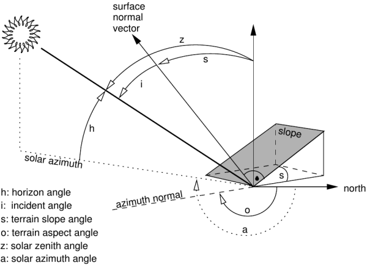

## DESCRIPTION

*i.topo.corr* is used to topographically correct reflectance from
imagery files, e.g. obtained with *i.landsat.toar*, using a sun
illumination terrain model. This illumination model represents the
cosine of the incident angle *i*, i.e. the angle between the normal to
the ground and the sun rays.

Note: If needed, the sun position can be calculated for a given date and
time with *r.sunmask*.

  
Figure showing terrain and solar angles

Using the **-i** flag and given an elevation basemap (metric),
*i.topo.corr* creates a simple illumination model using the formula:

- cos_i = cos(s) \* cos(z) + sin(s) \* sin(z) \* cos(a - o)

where,

- *i* is the incident angle to be calculated,
- *s* is the terrain slope angle (from *r.slope.aspect*),
- *z* is the solar zenith angle (i.e., 90° - solar horizon angle from
  *r.sunmask*),
- *a* the solar azimuth angle (from *r.sunmask*),
- *o* the terrain aspect angle (from *r.slope.aspect*).

For each band file, the corrected reflectance (ref_c) is calculate from
the original reflectance (ref_o) using one of the four offered methods
(one lambertian and two non-lambertian).

### Method: cosine

- ref_c = ref_o \* cos_z / cos_i

### Method: minnaert

- ref_c = ref_o \* (cos_z / cos_i) ^k

where, *k* is obtained by linear regression of  
ln(ref_o) = ln(ref_c) - k ln(cos_i/cos_z)

### Method: c-factor

- ref_c = ref_o \* (cos_z + c)/ (cos_i + c)

where, *c* is a/m from ref_o = a + m \* cos_i

### Method: percent

We can use cos_i to estimate the percent of solar incidence on the
surface, then the transformation (cos_i + 1)/2 varied from 0 (surface in
the side in opposition to the sun: infinite correction) to 1 (direct
exhibition to the sun: no correction) and the corrected reflectance can
be calculated as

- ref_c = ref_o \* 2 / (cos_i + 1)

## NOTES

1. The illumination model (cos_i) with flag -i uses the actual region
    as limits and the resolution of the elevation map.
2. The topographic correction use the full reflectance file (null
    remain null) and its resolution.
3. The elevation map to calculate the illumination model should be
    metric.

## EXAMPLES

First, make a illumination model from the elevation map (here, SRTM).
Then make perform the topographic correction of e.g. the bands toar.5,
toar.4 and toar.3 with output as tcor.toar.5, tcor.toar.4, and
tcor.toar.3 using c-factor (= c-correction) method:

```sh
# first pass: create illumination model
i.topo.corr -i base=SRTM zenith=33.3631 azimuth=59.8897 output=SRTM.illumination

# second pass: apply illumination model
i.topo.corr base=SRTM.illumination input=toar.5,toar.4,toar.3 output=tcor \
  zenith=33.3631 method=c-factor
```

## REFERENCES

- Law K.H. and Nichol J, 2004. Topographic Correction For Differential
  Illumination Effects On Ikonos Satellite Imagery. International
  Archives of Photogrammetry Remote Sensing and Spatial Information, pp.
  641-646.
- Meyer, P. and Itten, K.I. and Kellenberger, KJ and Sandmeier, S. and
  Sandmeier, R., 1993. Radiometric corrections of topographically
  induced effects on Landsat TM data in alpine terrain. Photogrammetric
  Engineering and Remote Sensing 48(17).
- Riaño, D. and Chuvieco, E. and Salas, J. and Aguado, I., 2003.
  Assessment of Different Topographic Corrections in Landsat-TM Data for
  Mapping Vegetation Types. IEEE Transactions On Geoscience And Remote
  Sensing, Vol. 41, No. 5
- Twele A. and Erasmi S, 2005. Evaluating topographic correction
  algorithms for improved land cover discrimination in mountainous areas
  of Central Sulawesi. Göttinger Geographische Abhandlungen, vol. 113.

## SEE ALSO

*[i.landsat.toar](i.landsat.toar.md), [r.mapcalc](r.mapcalc.md),
[r.sun](r.sun.md) [r.sunmask](r.sunmask.md)*

## AUTHOR

E. Jorge Tizado (ej.tizado unileon es)  
Dept. Biodiversity and Environmental Management, University of León,
Spain

Figure derived from Neteler & Mitasova, 2008.
