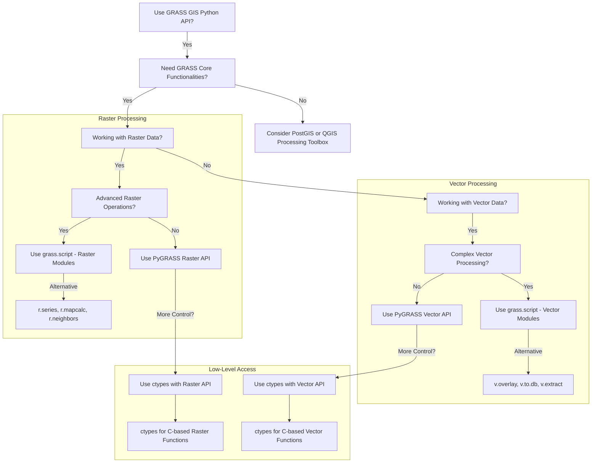

GRASSs' Python interface provides libraries to create GRASS scripts and access
the internal data structures of GRASS. The Python interface is broken down into
three main libraries:
[grass.script](https://grass.osgeo.org/grass-stable/manuals/libpython/script.html#module-script.core),
[grass.pygrass](https://grass.osgeo.org/grass-stable/manuals/libpython/pygrass_index.html),
and [grass.temporal](https://grass.osgeo.org/grass-stable/manuals/libpython/temporal_framework.html).
The `grass.script` library provides a Python interface to GRASS, the `grass.pygrass`
library provides access to the internal data structures of GRASS, and the
`grass.temporal` library provides a Python interface to the temporal framework
in GRASS.

To help you decide which library to use try answering the following questions:



Full Documentation: [GRASS Python Library](https://grass.osgeo.org/grass-stable/manuals/libpython/index.html)

## GRASS Script

### Setup

To get started with the GRASS Python interface, you must first append the GRASS
Python path to the system path and then import the `grass.script` library. From
here, you can create a new project with `gs.create_project` and start a GRASS
session with the `grass.script.setup.init` function to initialize the GRASS
environment.

```python
import sys
import subprocess
from pathlib import Path

# Append GRASS to the python system path
sys.path.append(
    subprocess.check_output(["grass", "--config", "python_path"], text=True).strip()
)

import grass.script as gs

# Create a new project
gs.create_project(path=grassdata, name=project_name, epsg="3358", overwrite=False)

# Initialize the GRASS session
with gs.setup.init(Path("grassdata/project_name")) as session:

    # Run GRASS commands
    gs.run_command('g.region', raster='elevation')
    gs.run_command(
        'r.slope.aspect',
        elevation='elevation',
        slope='slope',
        aspect='aspect'
    )
```

!!! grass-tip "Use `if __name__ == '__main__':`"
    <!-- markdownlint-disable-next-line MD046 -->
    When writing GRASS scripts, it is a good idea to include the GRASS session
    setup in a `if __name__ == '__main__':` block. This will allow the script to
    be imported into other scripts without running the GRASS session setup or executed
    as a standalone script.

### Tool Execution

The `gs.run_command`, `gs.read_command`, `gs.write_command`, and
`gs.parse_command` functions are the four main `grass.scripts`
functions used to execute GRASS tools with Python.

| Function            | Description                                      |
|---------------------|--------------------------------------------------|
| `gs.run_command`    | Run a GRASS command with no return value         |
| `gs.read_command`   | Run a GRASS command and return the `stdout`      |
| `gs.write_command`  | Run a GRASS command and write to `stdin`         |
| `gs.parse_command`  | Run a GRASS command and parse the `stdout`       |

!!! grass-tip "Command Syntax"
    <!-- markdownlint-disable-next-line MD046 -->
    The syntax for the `gs.run_command`, `gs.read_command`, `gs.write_command`,
    and `gs.parse_command` function follows the pattern:
    `function_name(*module.name*, option1=*value1*, option2=*...*, flags=*'flagletters'*)`

The `gs.run_command` function is used to run a GRASS command when you require
no return value from the command. For example, when setting the computational region
with `g.region`:

```python
gs.run_command('g.region', raster='elevation')
```

The `gs.read_command` function is used to run a GRASS command when you require
the results sent to the `stdout`. For example, when reading the output of `r.univar`:

```python
stats = gs.read_command('r.univar', map='elevation', flags='g')
```

The `gs.write_command` function is used to run send data to a GRASS command
through the `stdin`. For example, when writing a custom color scheme to
a raster map with `r.colors`:

```python
color_scheme = """
20% #ffffd4
40% #fed98e
60% #fe9929
80% #d95f0e
100% #993404
"""
gs.write_command('r.colors',
    map='elevation',
    rules='-',  # Read from stdin
    stdin=color_scheme
)
```

The `gs.parse_command` function is used to run a GRASS command when you require
the results sent to the `stdout` and parsed as a key-value pair. For example,
to parse the output of `r.univar` as JSON data:

```python
univar_json = gs.parse_command(
    'r.univar',
    map='elevation',
    format="json",
    flags='g'
)
```

!!! grass-tip "Use JSON Format"
    <!-- markdownlint-disable-next-line MD046 -->
    It is a good idea to use the `JSON` format when parsing the output of a GRASS
    command with `gs.parse_command`. The `JSON` format provides a consistent
    structure for the output and is easy to work with in Python.

Full Documentation: [GRASS Python Library](https://grass.osgeo.org/grass-stable/manuals/libpython/script_intro.html)

### Rasters

The `grass.script.raster` library provides provides functional access to raster metadata
and processing tools. Some of the core functions include `raster_info`, `raster_what`,
`history`, and `mapcalc`.

| Function      | Description                                |
|---------------|--------------------------------------------|
| `raster_info` | Get information about a raster map         |
| `raster_what` | Get information about a raster map         |
| `history`     | Get the history of a raster map            |
| `mapcalc`     | Run a mapcalc expression                   |

Here is an example of how to use the `raster` module:

```python
from grass.script import raster as rgrass

# Get metadata about the elevation raster
rgrass.raster_info('elevation')

# Create a new raster map with the mapcalc expression
rgrass.mapcalc(expression="elevation_2x = elevation * 2")
```

!!! grass-tip "Why not use the tool directly?"
    <!-- markdownlint-disable-next-line MD046 -->
    The `raster` module provides a more functional approach to working with raster
    maps in GRASS.

### Vectors

The `grass.script.vector` library provides functional access to vector metadata
and processing tools. Some of the core functions include `vector_columns`, `vector_info`,
`vector_db`, `vector_db_select`, and `vector_info_topo`.

| Function            | Description                                      |
|---------------------|--------------------------------------------------|
| `vector_columns`    | Get the columns of a vector map                  |
| `vector_info`       | Get information about a vector map               |
| `vector_db`         | Get the database connection of a vector map      |
| `vector_db_select`  | Select data from a vector map                    |
| `vector_info_topo`  | Get topology information about a vector map      |

Here we will use the `vector` module to get the topoloical information about the
`geology` vector map:

```python
from grass.script import vector as vgrass

# Get the topology information about the geology vector map
geology_topo = vgrass.vector_info_topo("geology")

# Get the number nodes
nodes = geology_topo.nodes

```

<!-- These both still need to get finished, but will address in another PR. -->
<!-- ### 3D Rasters

```python
from grass.script import raster3d as r3grass
```

### Database Management

```python
from grass.script import db as dbgrass
``` -->

## Object-Oriented GRASS

PyGRASS is an object-oriented Python library that provides access to the internal
data structures of GRASS for more advanced scripting and modeling. PyGRASS works
directly with the C libraries of GRASS and providing a Pythonic interface. The
core packages of `grass.pygrass` include:

| Topic                        | Documentation Link                                                                 |
|------------------------------|------------------------------------------------------------------------------------|
| Project and Region Management| [grass.pygrass.gis](https://grass.osgeo.org/grass-stable/manuals/libpython/pygrass_gis.html) |
| Raster Data Access           | [grass.pygrass.raster](https://grass.osgeo.org/grass-stable/manuals/libpython/pygrass_raster.html) |
| Vector Data Access           | [grass.pygrass.vector](https://grass.osgeo.org/grass-stable/manuals/libpython/pygrass_vector.html) |
| GRASS Tool Access            | [grass.pygrass.modules](https://grass.osgeo.org/grass-stable/manuals/libpython/pygrass_modules.html) |

For a complete reference of the PyGRASS library, see the Full Documentation:
[PyGRASS Library](https://grass.osgeo.org/grass-stable/manuals/libpython/pygrass_index.html)

### Project Management

The `grass.pygrass.gis` module provides access to the project and region management
of GRASS. The `grass.pygrass.gis` module provides functions to create, manage,
and delete GRASS projects and mapsets. The core classes include `Gisdbase`,
`Location`, `Mapset`, and `VisibleMapset`.

#### Gisdbase

The `Gisdbase` class provides access to the GRASS database
and where you can manage GRASS projects and mapsets.

For example, to list all projects in your GRASS database directory you can use:

```python
from grass.pygrass import gis

grassdata = gis.Gisdbase()
projects = grassdata.locations()
print(projects)
```

This will return a list of all projects in the GRASS database directory as
`Location` objects.

```text
['nc_spm_08_grass7', 'my_project']
```

#### Location

The `Location` object provides access to the specific project
and its mapsets.

```python
from grass.pygrass.gis import Location

location = Location()

# Get the name of the location
print(location.name)

# Get list of mapsets in the location
mapsets = location.mapsets()
```

#### Mapset

The `Mapset` object provides access to the specific mapset
and its layers.

```python
from grass.pygrass.gis import Mapset

# Get the current mapset
mapset = Mapset()

# List all rasters in the mapset
rasters = mapset.glist(type='raster')

```

For more details about the `gis` module, see the Full Documentation:
[GIS Module](https://grass.osgeo.org/grass-stable/manuals/libpython/pygrass_gis.html)

#### Region

The [grass.pygrass.gis.region](https://grass.osgeo.org/grass-stable/manuals/libpython/pygrass.gis.html#pygrass.gis.region.Region)
module gives access to read and modify computational regions. For example, to
get the current extent and resolution of the active mapset:

```python
from grass.pygrass.gis.region import Region

region = Region()

extent = region.get_bbox()
resolution = [region.nsres, region.ewres]

print(f"""
Extent: {extent}
Resolution: {resolution}
""")
```

```text
Extent: Bbox(228500.0, 215000.0, 645000.0, 630000.0)
Resolution: [10.0, 10.0]
```

To set the computational region you can adjust the current `Region` with the
`adjust` method or set it to a specific map to a specific map with `from_rast`
or `from_vect` methods.:

```python
from grass.pygrass.gis.region import Region

region = Region()

# Set the region from the elevation raster
region.from_rast('elevation')

# Adjust the region by adding 100 map units
# to the east and north
region.east += 100
region.north += 100

# Apply the changes
region.adjust()

# Lets compare the new region
extent = region.get_bbox()
resolution = [region.nsres, region.ewres]

print(f"""
Extent: {extent}
Resolution: {resolution}
""")

```

Here we can see that the region has been adjusted by 100 map units to the east
and north while the spatial resolution remains the same.

```text
Extent: Bbox(228600.0, 215000.0, 645100.0, 630000.0)
Resolution: [10.0, 10.0]
```

For more details about the `region` module, see the Full Documentation:
[Region Module](https://grass.osgeo.org/grass85/manuals/libpython/pygrass.gis.html#module-pygrass.gis)

### Data Management

#### Raster

Do you have an idea that requires more advanced raster processing? PyGRASS provides
direct read and write access to raster data with the
[grass.pygrass.raster](https://grass.osgeo.org/grass-stable/manuals/libpython/pygrass_raster.html)
module. The core classes include `RasterRow`, `RasterRowIO`, and `RasterSegment`.
Each class provides a different level of access to the raster data with its own set
of read and write capabilities, as shown in the table below.

| Class          | Description                                             | Read | Write |
|----------------|-------------------------------------------------------- |-------|------|
| [RasterRow](https://grass.osgeo.org/grass-stable/manuals/libpython/pygrass_raster.html#rasterrow)    | Read write access to raster row data.                       | :rabbit2: Random  | :rabbit2: Squental |
| [RasterRowIO](https://grass.osgeo.org/grass-stable/manuals/libpython/pygrass_raster.html#rasterrowio)  | Fast read only access to raster row data.                   | :rabbit2: Cached | :x: No |
| [RasterSegment](https://grass.osgeo.org/grass-stable/manuals/libpython/pygrass_raster.html#rastersegment) | Simultaneous read write access to tiled raster segments stored on disk.       | :turtle: Cached | :turtle: Random |

The `RasterRow` class allows for either read or write access to raster row data
and provides methods to access raster state and metadata. To read all rows of the
`elevation` raster:

```python
from grass.pygrass import raster

with raster.RasterRow('elevation') as elev:

    # Get the total number of rows
    nrows = elev.info.rows
    print(f"Total Rows: {nrows}")

    for row in elev:
        print(row)
```

For practice, let's read a value from a row and column in the `elevation`
raster, double it, and write the value back to a new raster `elevation_new`.

```python
from grass.pygrass import raster

# Open the elevation raster in read mode
with raster.RasterRow('elevation') as elev:

    # Read a random row and column
    value = elev[5][10]

    # Open the new elevation raster in write mode
    with raster.RasterRow('elevation_new', mode='w', mtype="FCELL") as new_elev:
        # Sequentially iterate over the rows and columns
        for row_id, row in enumerate(elev, start=0):
            # When we reach the row and column we want to change
            if row_id == 5:
                # Set the value
                row[10] = value * 2

            # Write the rows to the new raster
            new_elev.put_row(row)
```

!!! grass-tip "RasterSegment"
    <!-- markdownlint-disable-next-line MD046 -->
    The `RasterSegment` class provides simultaneous read and write access to tiled
    raster segments stored on disk. This class is useful for working with large
    raster datasets that do not fit into memory.

#### Vector

The [grass.pygrass.vector](https://grass.osgeo.org/grass-stable/manuals/libpython/pygrass_vector.html#vector)
module provides direct read and write access to vector data in GRASS.
The core classes include `Vector` and `VectorTopo`.

| Class          | Description  |
|----------------|--------------|
| [Vector](https://grass.osgeo.org/grass-stable/manuals/libpython/pygrass.vector.html#pygrass.vector.Vector) | Provides basic information about vector data. |
| [VectorTopo](https://grass.osgeo.org/grass-stable/manuals/libpython/pygrass_vector.html#vectortopo-label) | Read and write access to vector data. |

Here is a simple example with `Vector` to check if a vector map exists and
print the mapset it is in.

```python
from grass.pygrass.vector import Vector

# Check if the roads vector map exists
geology = Vector('roadsmajor')

if roads.exists():
    mapset = roads.mapset
    print(f"The roads vector map exists in the {mapset} mapset")

```

With the `VectorTopo` class you can get the same basic information about the
vector map returned by the `Vector` class in addition to read and write access.

```python
from grass.pygrass.vector import Vector

# Open the roads vector map as a VectorTopo object
with VectorTopo('roadsmajor') as roads:

    # Get the first feature
    first_feature = roads.next()
    print(first_feature)

    # Get the number of nodes
    roads.number_of('nodes')

```

#### Geometry and Attributes

In GRASS vector [geometry](https://grass.osgeo.org/grass-stable/manuals/libpython/pygrass_vector.html#geometry-classes)
and attributes are treated separately. This means that the attributes of a
vector are not automatically read when the geometry is read.

To build a geometry object, you can use the geometory class in the
[grass.pygrass.vector.geometry](https://grass.osgeo.org/grass-stable/manuals/libpython/pygrass.vector.html#module-pygrass.vector.geometry)
module.

| Geometry Class | Description |
|----------------|-------------|
| [Area](https://grass.osgeo.org/grass84/manuals/libpython/pygrass.vector.html#pygrass.vector.geometry.Area) | Represents the topological composition of a closed ring of boundaries and a centroid. |
| [Boundary](https://grass.osgeo.org/grass84/manuals/libpython/pygrass.vector.html#pygrass.vector.geometry.Boundary) | Represents the border line to describe an area. |
| [Centroid](https://grass.osgeo.org/grass84/manuals/libpython/pygrass.vector.html#pygrass.vector.geometry.Centroid) | Represents a centroid feature in a vector map. |
| [Isle](https://grass.osgeo.org/grass84/manuals/libpython/pygrass.vector.html#pygrass.vector.geometry.Isle) | Represents an isle feature in a vector map. |
| [Line](https://grass.osgeo.org/grass84/manuals/libpython/pygrass.vector.html#pygrass.vector.geometry.Line) | Represents a line feature in a vector map. |
| [Point](https://grass.osgeo.org/grass84/manuals/libpython/pygrass.vector.html#pygrass.vector.geometry.Point) | Represents a point feature in a vector map. |

Each geomemtry class has its own set of methods to help extract useful
infomation. For example, let's built a `Boundary` object from a list of points
and calculate the area of the boundary.

```python
from grass.pygrass.vector.geometry import Boundary

# Create a new boundary object
border = Boundary(points=[(0, 0), (0, 2), (2, 2), (2, 0), (0, 0)])

# Get the area of the boundary
area = border.area
```

To access the attributes of a vector map, you can use the `attrs` attribute
of the `VectorTopo` object. The `attrs` attribute is a dictionary that contains
the attributes of the current feature.

```python
from grass.pygrass.vector import VectorTopo

# Open the roads vector map in read mode
with VectorTopo('roadsmajor') as roads:
    # Read attribute the first feature
    read_feature = roads.read(1)
    # Prints the LINESTRING geometry
    print(read_feature)
    # Prints a dictionary of the attributes
    print(dict(read_feature.attrs))

```

To write a new feature to the `roads` vector map with attributes
we need to access the database of the vector map with the `VectorTopo`.

Here is an example of how to write a new feature to the `roads` vector map.

```python
from grass.pygrass.vector import VectorTopo
from grass.pygrass.vector.geometry import Line

with VectorTopo('roadsmajor', mode='rw') as roads:

    # Create a new feature
    # The tuple is shorthand for a list of Point(x, y)
    new_geom = Line([(636981.33, 256517.60), (636983.10, 256526.59)])
    
    # Get the last cat value (primary key)
    last_record = roads.read(-1)
    last_cat = last_record.cat

    # Create an empty feature from the last record
    new_dict = {key: None for key in last_record.attrs}
    new_dict['cat'] = last_cat + 1
    new_dict['MAJORRDS_'] = 2.0
    new_dict['ROAD_NAME'] = 'New Road'
    new_dict['MULTILINE'] = 'No'
    new_dict['PROPYEAR'] = 2025

    # Write the new feature to the vector map
    roads.write(new_geom, new_dict)

    # Write the attributes to the database
    roads.table.conn.commit()

    # Build the topology
    roads.build()
```

Featurs can also be updated by using the [rewrite](https://grass.osgeo.org/grass-stable/manuals/libpython/pygrass.vector.html#pygrass.vector.VectorTopo.rewrite)
method instead of the `write`. If the geometry of the feature has not changed,
you can save the attributes to the database table without rebuilding the
topology using `table.conn.commit`.

#### Querying Vector Data

You can also query the vector map for specific features using the `where` method.
For example, to get all features where the `ROAD_NAME` attribute is `NC-50` and
the line segment length is greater than 1000.

```python
from grass.pygrass.vector import VectorTopo

# Open the roads vector map as a VectorTopo object
with VectorTopo('roadsmajor') as roads:
    # Interate over each feature in the vector map
    for feature in roads.viter('line'):
        # Check if the feature is a line and the length is greater than 1000
        # And the ROAD_NAME attribute is 'NC-50'
        if feature.lenght() < 100 and feature['ROAD_NAME'] == 'NC-50':
            print(feature)
```

You can also use many of `Geometry` and `Attribute` methods to filter
features in a more concise way.

For example, to test if a random point is within 5000 meters of a road segent
you can use the [distance](https://grass.osgeo.org/grass-stable/manuals/libpython/pygrass.vector.html#pygrass.vector.geometry.Line.distance)
method of the [Line](https://grass.osgeo.org/grass84/manuals/libpython/pygrass.vector.html#pygrass.vector.geometry.Line)
geometry object. The [distance](https://grass.osgeo.org/grass-stable/manuals/libpython/pygrass.vector.html#pygrass.vector.geometry.Line.distance)
method returns a [LineDist](https://grass.osgeo.org/grass-stable/manuals/libpython/pygrass.vector.html#pygrass.vector.geometry.LineDist)
object that contains the distance and the closest point on the line.

```python
from grass.pygrass.vector import VectorTopo
from grass.pygrass.vector.geometry import Point

with VectorTopo('roadsmajor') as roads:
    # Get the extent of the roads vector map
    extent = roads.bbox()

    # Create a random point within the extent
    x = random.uniform(extent.east, extent.west)
    y = random.uniform(extent.north, extent.south) 
    random_point = Point(x, y)

    # Iterate over each feature in the vector map
    for feature in roads.viter('lines'):
        # Check if the random point is within a 5000 meters of the line
        line_distance = feature.distance(random_point)
        if line_distance.dist < 5000:
            print(f"""
                The random point {random_point} is within 5000 m 
                of the road segment: {feature.cat}
            """)
```

Or to simple filter a table using `SQL` you can use the `where` method with
[table_to_dict](https://grass.osgeo.org/grass-stable/manuals/libpython/pygrass.vector.html#pygrass.vector.VectorTopo.table_to_dict)
to get a dictionary of the features that match the query, the [table.Filter](https://grass.osgeo.org/grass84/manuals/libpython/pygrass.vector.html#pygrass.vector.table.Filters)
class for more advanced operations.

```python
from grass.pygrass.vector import VectorTopo

# Open the roads vector map as a VectorTopo object
roads = VectorTopo('roadsmajor')
roads.open("r")

# Query the vector map for all features where the
# ROAD_NAME attribute is 'NC-50'
roads.table_to_dict(where="ROAD_NAME = 'NC-50'")
sql_1 = roads.table.filters.get_sql()

# Query the vector map for the first 5 features where the 
# ROAD_NAME attribute is 'NC-70'
roads.table.filters.where("ROAD_NAME = 'NC-70'").limit(5)
sql_2 = roads.table.filters.get_sql()

# Close the vector map
roads.close()
```

The values of the `sql_1` and `sql_2` variable will be the SQL query that was
used to filter the features.

```sql
-- Value of sql_1
SELECT * FROM roadsmajor WHERE ROAD_NAME = 'NC-50' ORDER BY cat;

-- Value of sql_2
SELECT * FROM roadsmajor WHERE ROAD_NAME = 'NC-50' ORDER BY cat LIMIT 5;
```

!!! grass-tip "Used Different SQL Database"
    <!-- markdownlint-disable-next-line MD046 MD033-->
    The default database for GRASS is SQLite, but you can use other SQL databases
    like PostgreSQL with the `driver` option in the `VectorTopo` object.

### GRASS Tool Access

The [grass.pygrass.modules](https://grass.osgeo.org/grass-stable/manuals/libpython/pygrass_modules.html)
module provides access to the GRASS tools and modules. The `Module` class
provides a Pythonic interface to the GRASS modules and tools.

Here we use the `Module` class to create an Module object of the [r.slope.aspect](r.slope.aspect.md)
tool.

```python
from grass.pygrass.modules import Module

slope_aspect_tool = Module(
    "r.slope.aspect", 
    elevation='elevation',
    slope='slope',
    aspect='aspect'
)
```

The `Module` object provides a `run` method to execute the GRASS tool.

```python
slope_aspect_tool.run()
```

but you can also exectute the tool with the `()` operator.

```python
slope_aspect_tool()
```

The `Module` object also provides a the access to the tool attributes
such as the name, discription, keywords, and inputs.

```python
slope_aspect_tool.name
slope_aspect_tool.description
slope_aspect_tool.keywords
slope_aspect_tool.inputs
```

The [grass.pygrass.modules](https://grass.osgeo.org/grass-stable/manuals/libpython/pygrass_modules.html)
module provides an alteravative approach to running GRASS tools.

To learn more about the `Module` class, see the Full Documentation:
[Module Class](https://grass.osgeo.org/grass-stable/manuals/libpython/pygrass_modules.html#module-class)

## Message and Error Handling

The `grass.script` library provides functions to display messages and errors.

| Function | Description |
|----------|-------------|
| `Message` | Display a message to the user |
| `Warning` | Display a warning to the user |
| `Error` | Display an error to the user |
| `Fatal` | Display a fatal error to the user |

Here is an example of how to use the `Message` and `Warning` functions:

```python
import grass.script as gs
# Not localized
gs.Message("Hello World")

# Translation Function
import gettext
_ = gettext.gettext
gs.Warning(_("This is a warning"))
```

Here we can use the GRASS `Error` function to display an error message to the user
when the `g.region` command fails with a `CalledModuleError`.

```python
try:
    gs.run_command('g.region', raster='elevation')
except gs.CalledModuleError as e:
    gs.error(_("Failed to set region: {e}"))

```

!!! grass-tip "Use Formated Strings"
    <!-- markdownlint-disable-next-line MD046 MD033-->
    When using the `gs.Message` and `gs.error` functions, it is a good idea to
    use formated strings to provide more information about the message or error.
    However, f-strings are not safe to use with the `gs.error` function as they
    <!-- markdownlint-disable-next-line MD046 MD033-->
    can expose the user to injection attacks. Instead, use the `str.format` method.<br>
    <!-- markdownlint-disable-next-line MD046 MD033-->
    :x: `gs.fatal(_(f"Error calculating height above nearest drainage: {e.stderr}"))`<br>
    <!-- markdownlint-disable-next-line MD046 MD033-->
    :white_check_mark: `gs.fatal(_("Error calculating height above nearest
    drainage: %s") % e.stderr)`
