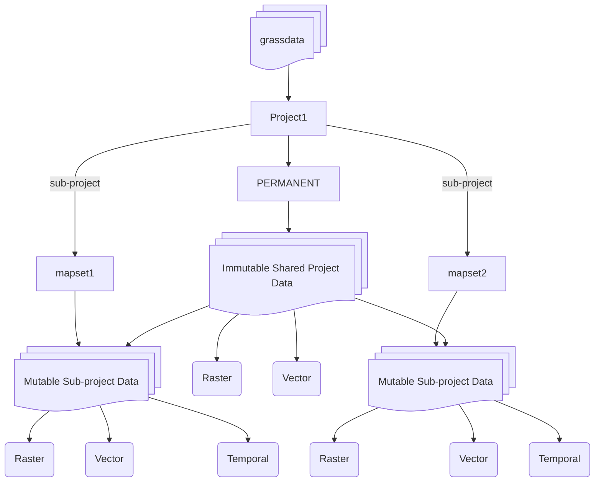

**GRASS** is a geosptial processing engine for advance analysis and visualization of geospatial data. It is a powerful tool for processing and analyzing large geospatial data sets. GRASS GIS is a free and open source software, released under an open source
[GNU GPLed](https://www.gnu.org/licenses/gpl.html).

<!-- markdownlint-disable MD007 -->
<!-- markdownlint-disable MD030 -->
<!-- markdownlint-disable-next-line MD033 -->
<!-- 
 -->

<!-- -   :material-download: **Download**

    ---

    - [Download](https://grass.osgeo.org/download/)
    - [Installation Guide](https://grass.osgeo.org/download/software/)

    ---
    [Download :material-arrow-right-circle:](https://grass.osgeo.org/download/){ .md-button .md-button--primary } -->

## :checkered_flag: **Quick Start**

Get started with GRASS by following the tutorials below.

---

- [Jupyter Notebooks (Linux)](https://grass-tutorials.osgeo.org/content/tutorials/get_started/fast_track_grass_and_python.html)
- [Jupyter Notebooks (Windows)](https://grass-tutorials.osgeo.org/content/tutorials/get_started/JupyterOnWindows_OSGeo4W_Tutorial.html)
- [R with rgrass](https://grass-tutorials.osgeo.org/content/tutorials/get_started/JupyterOnLinux_Tutorial.html)
- [GRASS GUI](https://grass-tutorials.osgeo.org/content/tutorials/get_started/fast_track.html)
- [Full list of tutorials](https://grass-tutorials.osgeo.org/)

---
<!-- [Tutorials :material-arrow-right-circle:](https://grass-tutorials.osgeo.org/){ .md-button .md-button--primary } -->

<!-- -   :checkered_flag: **Tutorials**

    ---
    - [Jupyter Notebooks (Linux)](https://grass-tutorials.osgeo.org/content/tutorials/get_started/fast_track_grass_and_python.html)
    - [Jupyter Notebooks (Windows)](https://grass-tutorials.osgeo.org/content/tutorials/get_started/JupyterOnWindows_OSGeo4W_Tutorial.html)
    - [R with rgrass](https://grass-tutorials.osgeo.org/content/tutorials/get_started/JupyterOnLinux_Tutorial.html)
    - [GRASS GUI](https://grass-tutorials.osgeo.org/content/tutorials/get_started/fast_track.html)

    ---
    [Getting started :material-arrow-right-circle:](helptext.md){ .md-button .md-button--primary } -->

<!-- -   :computer: **Interfaces**

    ---
    - [Command Line Interface](grass.md)
    - [Graphical User Interface](wxguiintro.md)
    - [Display Commands Manual](display.md)

    ---
    [GUI Overview :material-arrow-right-circle:](wxguiintro.md){ .md-button .md-button--primary }

-   :earth_americas: **Spatial Data Processing**

    ---
  
    -  [Intro: 2D Raster Processing](rasterintro.md)
    - [Raster Commands Manual](raster.md)
    - [Intro: 3D Raster (Voxel) Processing](raster3dintro.md)
    - [3D Raster Commands Manual](raster3d.md)
    - [Intro: Image Processing](imageryintro.md)
    - [Imagery Commands Manual](imagery.md)

    ---
    [Raster & Imagery :material-arrow-right-circle:](rasterintro.md){ .md-button .md-button--primary }

-   :material-vector-square: **Vector Processing & Database**

    ---
  
    -  [Intro: Vector Processing & Network Analysis](vectorintro.md)
    - [Vector Commands Manual](vector.md)

    -  [Database Management](databaseintro.md)
    - [SQL Support in GRASS GIS](sql.md)
    - [Database Commands Manual](database.md)

    ---
    [Vector & Database :material-arrow-right-circle:](vectorintro.md){ .md-button .md-button--primary }

-   :material-clock-time-three: **Temporal Processing**

    ---
  
    - [Temporal Data Processing](temporalintro.md)
    - [Temporal Commands Manual](temporal.md)

    ---
    [:material-arrow-right-circle: Temporal Data](temporalintro.md){ .md-button .md-button--primary }

-   :material-map: **Cartography & Visualization**

    ---

    - [PostScript Commands Manual](postscript.md)
    - [wxGUI Cartographic Composer](g.gui.psmap.md)

    ---
    [:material-arrow-right-circle: Cartography](postscript.md){ .md-button .md-button--primary }

-     **Python for GRASS GIS**

      ---

      - [GRASS GIS Python Library](https://grass.osgeo.org/grass${grass_version_major}${grass_version_minor}/manuals/libpython/index.html)
      - [PyGRASS Documentation](https://grass.osgeo.org/grass${grass_version_major}${grass_version_minor}/manuals/libpython/pygrass_index.html)
      - [GRASS GIS in Jupyter Notebooks](https://grass.osgeo.org/grass${grass_version_major}${grass_version_minor}/manuals/libpython/grass.jupyter.html)

    ---
    [:material-arrow-right-circle: Python API](https://grass.osgeo.org/grass${grass_version_major}${grass_version_minor}/manuals/libpython/index.html){ .md-button .md-button--primary } -->

<!-- 
 -->
<!-- markdownlint-enable MD030 -->
<!-- markdownlint-enable MD007 -->

## :book: Basic Concepts

- [Basic Concepts](helptext.md)
- [Project Managment](grass_database.md)
- [Projections and Spatial Transformations](projectionintro.md)

## :books: Advanced Concepts

- [GRASS ASCII Vector Format](vectorascii.md)
- [GRASS Environment Variables](variables.md)
