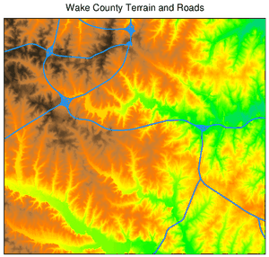

## DESCRIPTION

*ps.map* is a cartographic mapping program for producing high quality
hardcopy maps in PostScript format. Output can include a raster map, any
number of vector overlays, text labels, decorations, and other spatial
data.

A file of mapping instructions that describes the various spatial and
textual information to be printed must be prepared prior to running
*ps.map*.

## NOTES

The order of commands is generally unimportant but may affect how some
layers are drawn. For example to plot **vpoints** above **vareas** list
the **vpoints** entry first. Raster maps are always drawn first, and
only a single raster map (or 3 if part of a RGB group) may be used.

The hash character ('`#`') may be used at the beginning of a line to
indicate that the line is a comment. Blank lines will also be ignored.

Be aware that some mapping instructions require the *end* command and
some do not. Any instruction that allows subcommands will require it,
any instruction that does not allow subcommands will not.

The resolution and extent of raster maps plotted with *ps.map* are
controlled by the current region settings via the
[g.region](g.region.md) module. The output filesize is largely a
function of the region resolution, so special care should be taken if
working with large raster datasets. For example if the desired output is
US-Letter sized paper at 600dpi, with 1" margins and the raster filling
the entire page, the usable area on the page will be 6.5" x 9", which at
600 dots/inch is equivalent to a region of 3900 columns x 5400 rows (see
"`g.region -p`"). Any higher resolution settings will make the output
file larger, but with a consumer printer you probably won't be able to
resolve any better detail in the hardcopy.

The user can specify negative or greater than 100 percentage values for
positioning several map decorations and embedded EPS-files, to move them
outside the current map box region (for example to position a caption,
barscale, or legend above or below the map box).

One point ("pixel") is 1/72 of an inch.

For users wanting to use special characters (such as accented
characters) it is important to note that *ps.map* uses `ISO-8859-1`
encoding. This means that your instructions file will have to be encoded
in this encoding. If you normally work in a different encoding
environment (such as `UTF-8`), you have to transform your file to the
`ISO-8859-1` encoding, for example by using the `iconv` utility:

```sh
iconv -f UTF-8 -t ISO_8859-1 utf_file > iso_file
```

## MAPPING INSTRUCTIONS

The mapping instructions allow the user to specify various spatial data
to be plotted. These instructions are normally prepared in a regular
text file using a system editor. Some instructions are single line
instructions while others are multiple line. Multiple line instructions
consist of the main instruction followed by a subsection of one or more
additional instructions and are terminated with an *end* instruction.

### Instruction keywords

\[ [border](#border) \| [colortable](#colortable) \|
[comments](#comments) \| [copies](#copies) \| [eps](#eps) \|
[geogrid](#geogrid) \| [greyrast](#greyrast) \| [grid](#grid) \|
[group](#group) \| [header](#header) \| [labels](#labels) \|
[line](#line) \| [mapinfo](#mapinfo) \| [maploc](#maploc) \|
[maskcolor](#maskcolor) \| [outline](#outline) \| [paper](#paper) \|
[point](#point) \| [psfile](#psfile) \| [raster](#raster) \|
[read](#read) \| [rectangle](#rectangle) \| [region](#region) \|
[rgb](#rgb) \| [scale](#scale) \| [scalebar](#scalebar) \|
[setcolor](#setcolor) \| [text](#text) \| [vareas](#vareas) \|
[vlines](#vlines) \| [vpoints](#vpoints) \| [vlegend](#vlegend) \|
[end](#end) \]

### Common instructions

Instructions that may be included in the subsection under several
different main instructions are:

**where** *x y*  
The top left corner of the bounding box of the item to be plotted is
located *x* inches from the left edge of the paper and *y* inches from
the top edge of the paper. If *x* is less than or equal to zero, the
default horizontal location is used. If *y* is less than or equal to
zero, the default vertical location is used.

**font** *font name*  
The name of the PostScript font. Fonts present in all PostScript
implementations are:
*Times-Roman*, *Times-Italic*, *Times-Bold*, *Times-BoldItalic*, *Helvetica*,
*Helvetica-Oblique*, *Helvetica-Bold*, *Helvetica-BoldOblique*, *Courier*,
*Courier-Oblique*, *Courier-Bold*, *Courier-BoldOblique*
.  
The default is Helvetica.

**fontsize** *font size*  
The size of the PostScript font (in 1/72nds of an inch). The default is
10 point.

**color** *name*  
The following colors names are accepted by *ps.map*:
*aqua*, *black*, *blue*, *brown*, *cyan*, *gray*, *grey*, *green*,
*indigo*, *magenta*, *orange*, *purple*, *red*, *violet*, *white*, *yellow*.  

For vectors and some plotting commands you can also specify '`none`' or
'`R:G:B`' (e.g '`255:0:0`').

**yes\|no**  
For options that take a yes or no answer, you can simply use the letters
"y" or "n", or type out the full words "Yes" or "No" if you prefer. It
is not case-sensitive. Typically the option with have a default answer
and you only need to specify one if you wish to override it.

### Command usage

#### border

Controls the border which is drawn around the map area.

```sh
USAGE:  border [y|n]
    color color
    width #
    end
```

The **color** may be either a standard GRASS color, a R:G:B triplet, or
"none". The width is specified in points, unless followed by an "i" in
which case it is measured in inches. The default is a black border box
of width 1 point.

The border can be turned off completely with the "`border n`"
instruction. In this case the **end** command should not be given as the
main command will be treated as a single line instruction.

This example would create a grey border 0.1" wide.

```sh
EXAMPLE:
    border
    color grey
    width 0.1i
    end
```

#### colortable

Prints the color table legend for the raster map layer anywhere on the
page.

```sh
USAGE:    colortable [y|n]
    where x y
    raster raster map
    range minimum maximum
    width table width
    height table height (FP legend only)
    cols table columns
    font font name
    fontsize font size
    color text color
    nodata [Y|n]
    tickbar [y|N]
    discrete [y|n]
    end
```

For a categorical (CELL) map the color table will create a legend
displaying the colors for each of a raster map's category values along
with its associated category label. For a floating point (FCELL or
DCELL) map a continuous gradient legend will be created.

If **raster** is omitted, the colortable defaults to the previously
registered raster layer.

The default location for the colortable is immediately below any other
map legend information, starting at the left margin. The default text
color is black.

Omitting the **colortable** instruction would result in no color table.
If the colortable is turned off with a "`colortable N`" instruction the
**end** command should not be given as the main command will be treated
as a single line instruction.

See also the [vlegend](#vlegend) command for creating vector map
legends.

##### Categorical (CELL) Maps

Adding the **nodata N** instruction will prevent the "no data" box from
being drawn (category based legends only). If you have manually added a
"no data" label to the cats/ file it will be shown regardless.

**Note**: Be careful about asking for color tables for integer raster
map layers which have many categories, such as elevation. This could
result in the printing of an extremely long color table! In this
situation it is useful to use the **discrete N** instruction to force a
continuous color gradient legend.

Be aware that the color table only includes categories which have a
label. You can use the *r.category* module to add labels.

##### Floating point (FCELL and DCELL) Maps

The legend's **range** can be adjusted for floating point rasters, but
if set beyond the extent of the map's range be sure that you have set up
color rules with *r.colors* which cover this range. If the map has been
given a data-units label with *r.support* then this label will be
displayed. For floating point legends **width** is width of color band
only. **height** is used only for floating point legend. A horizontal
gradient legend can be achieved by setting the legend width greater than
its height. Adding the **tickbar Y** instruction will change the tick
mark style so that ticks are drawn across the color table instead of
protruding out to the right (floating point legends only). Adding the
**discrete Y** instruction will command the program to treat the map as
a categorical map. In this way the legend can be created with discrete
range bands instead of a continuous gradient. You must use the
*r.category* or *r.support* module to set up the range labels first.  

This example would print a color table immediately below any other map
legend information, starting at the left margin, with 4 columns:

```sh
EXAMPLE:
    colortable y
        cols 4
        width 4
        end
```

#### comments

Prints comments anywhere on the page.

```sh
USAGE:    comments commentfile
    where x y
    font font name
    fontsize font size
    color text color
    end
```

The default location is immediately below the last item item printed,
starting at the left margin. The default text color is black.

If you wish to use parentheses spanning multiple lines you will need to
quote them with a backslash to prevent the PostScript interpreter from
getting confused. e.g. '**`\(`**' and '**`\)`**'

This example prints in blue whatever is in the file *veg.comments*
starting at 1.5 inches from the left edge of the page and 7.25 inches
from the top of the page, using a 15/72 inch Helvetica Bold font.

```sh
EXAMPLE:
    raster vegetation
    comments veg.comments
    where 1.5 7.25
    font Helvetica Bold
    fontsize 15
    color blue
    end
```

Presumably, the file *veg.comments* contain comments pertaining to the
raster map layer *vegetation*, such as "This map was created by
classifying a LANDSAT TM image".

#### copies

Specifies the number of copies to be printed.

```sh
USAGE:    copies n
```

Each page will be printed n times.

This instruction is identical to the *copies* command line parameter.

#### eps

Places EPS (Encapsulated PostScript) pictures on the output map.

```sh
USAGE:    eps east north
    eps x% y%
    epsfile EPS file
    scale #
    rotate #
    masked [y|n]
    end
```

The EPS picture location is entered in the main instruction line by
giving either the map coordinates or by using percentages of the
geographic region. The EPS picture will be *centered* at the given
position. The user must specify full EPS file path **epsfile**. The user
may also specify the **scale** of the icon (default is 1.0), the
**rotate** i.e. rotation in degrees (default is 0) and whether the point
is to be **masked** by the current mask. (See manual entry for
*[r.mask](r.mask.md)* for more information on the mask.)

This example would place a EPS file ./epsf/logo.eps at the point
(E456000 N7890000). This picture would be rotated 20 degrees clockwise,
3 times bigger than in original file and would not be masked by the
current mask.

```sh
EXAMPLE:
    eps 456000 7890000
    epsfile ./epsf/logo.eps
    scale 3
    rotate 20
    masked n
    end
```

Of course, multiple EPS pictures may be drawn with multiple *eps*
instructions.

#### geogrid

Overlays a geographic grid onto the output map.

```sh
USAGE:    geogrid spacing unit
    color color
    numbers # [color]
    font font name
    fontsize font size
    width #
    end
```

The **spacing** and spacing unit of the geographic grid is given on the
main instruction line. The **spacing** unit is given as one of **d** for
degrees, **m** for minutes, and **s** for seconds. The subsection
instructions allow the user to specify the **color** of the geographic
grid lines, whether coordinate **numbers** should appear on the
geographic grid lines, the **width** of the lines (accepts decimal
points \[floating points\] as well as integers), and if they should
appear every grid line (1), every other grid line (2), etc., and what
color the numbers should be. The defaults are black grid lines,
unnumbered.

NOTE: The **geogrid** draws grid numbers on the east and south borders
of the map.

This example would overlay a blue geographic grid with a spacing of 30
minutes onto the output map. Alternate grid lines would be numbered with
yellow numbers.

```sh
EXAMPLE:
    geogrid 30 m
    color blue
    numbers 2 yellow
    end
```

#### greyrast

Selects a raster map layer for output in shades of grey.

```sh
USAGE:    greyrast mapname
```

For each *ps.map* run, only one raster map layer can be requested (using
either the *greyrast* or the *raster* instruction).

#### grid

Overlays a coordinate grid onto the output map.

```sh
USAGE:    grid spacing
    color color
    numbers # [color]
    cross cross size
    font font name
    fontsize font size
    width #
    end
```

The **spacing** of the grid is given (in the geographic coordinate
system units) on the main instruction line. The subsection instructions
allow the user to specify the **color** of the grid lines, whether
coordinate **numbers** should appear on the grid lines, and if they
should appear every grid line (1), every other grid line (2), etc., and
what color the numbers should be. The **cross** argument draws grid
intersection crosses instead of grid lines, with cross size given in
geographic coordinate system units. The defaults are black grid lines,
unnumbered.

This example would overlay a green grid with a spacing of 10000 meters
(for a metered database, like UTM) onto the output map. Alternate grid
lines would be numbered with red numbers.

```sh
EXAMPLE:
    grid 10000
    color green
    numbers 2 red
    end
```

#### group

Selects an RGB imagery group for output.

```sh
USAGE:    group groupname
```

This is similar to *raster*, except that it uses an imagery group
instead of a raster map layer. The group must contain three raster map
layers, comprising the red, green and blue bands of the image.

#### header

Prints the map header above the map.

```sh
USAGE:    header
    file header file
    font font name
    fontsize font size
    color text color
    end
```

If the *file* sub-instruction is absent the header will consist of the
map's title and the project's description. The text will be centered on
the page above the map. The default text color is black.

If the *file* sub-instruction is given the header will consist of the
text in the text file specified, with some special formatting keys:

- `%%` - a literal %
- `%n` - ? newline ?
- `%_` - horizontal bar
- `%c` - "\<raster name\> in mapset \<mapset name\>"
- `%d` - today's date
- `%l` - project name
- `%L` - project's text description
- `%m` - mapset name
- `%u` - user name
- `%x` - mask info
- `%-` - advance to this character column number (see example below)

Example header file:

```sh
%_
LOCATION: %-27l  DATE: %d
MAPSET:   %-27m  USER: %u

RASTER MAP: %c
MASK:     %x
%_
Produced by: US Army CERL, Champaign Illinois
Software:    GRASS
%_
```

This example prints (in red) whatever is in the file *soils.hdr* above
the map, using a 20/72 inch `Courier` font.

```sh
EXAMPLE:
    header
    file soils.hdr
    font Courier
    fontsize 20
    color red
    end
```

#### labels

Selects a labels file for output (see manual entry for
*[v.label](v.label.md) ).*

```sh
USAGE:    labels  labelfile
    font font name
    end
```

NOTE: ps.map can read new option 'ROTATE:' from labels file, which
specifies counter clockwise rotation in degrees.

This example would paint labels from the labels file called
*town.names*. Presumably, these labels would indicate the names of towns
on the map.

```sh
EXAMPLE:
    labels town.names
    end
```

#### line

Draws lines on the output map.

```sh
USAGE:    line east north east north
    line x% y% x% y%
    color color
    width #
    masked [y|n]
    end
```

The beginning and ending points of the line are entered on the main
instruction. These points can be defined either by map coordinates or by
using percentages of the geographic region. The user may also specify
line **color**, **width** in points (1/72"; accepts decimal values as
well as integers), and if the line is to be **masked** by the current
mask. (See manual entry for *[r.mask](r.mask.md)* for more information
on the mask.) The line **width** (if given) is measured in points; an
*i* directly following the number indicates that the width is given in
inches instead.

This example would draw a yellow line from the point x=10% y=80% to the
point x=30% y=70%. This line would be 2 points wide (2/72") and would
appear even if there is a mask.

```sh
EXAMPLE:
    line 10% 80% 30% 70%
    color yellow
    width 2
    masked n
    end
```

Of course, multiple lines may be drawn with multiple *line*
instructions.

#### mapinfo

Prints the portion of the map legend containing the scale, grid and
region information, on or below the map.

```sh
USAGE:    mapinfo
    where x y
    font font name
    fontsize font size
    color text color
    background box color|none
    border color|none
    end
```

The default location is immediately below the map, starting at the left
edge of the map. The default text color is black. The default background
box color is white.

*border* will draw a border around the legend using the specified color.
(see [color instruction](#common-instructions))

This example prints (in brown) the scale, grid and region information
immediately below the map and starting 1.5 inches from the left edge of
the page, using a 12/72 inch `Courier` font.

```sh
EXAMPLE:
    mapinfo
    where 1.5 0
    font Courier
    fontsize 12
    color brown
    end
```

#### maploc

Positions the map on the page.

```sh
USAGE:    maploc  x y [width height]
```

The upper left corner of the map will be positioned *x* inches from the
left edge of the page and *y* inches from the top of the page. If
*width* and *height* (in inches) are present, the map will be rescaled,
if necessary, to fit.

This example positions the upper left corner of the map 2.0 inches from
the left edge and 3.5 inches from the top edge of the map.

```sh
EXAMPLE:
    maploc 2.0 3.5
```

#### maskcolor

Color to be used for mask.

```sh
USAGE:    maskcolor  color
```

#### outline

Outlines the areas of a raster map layer with a specified color.

```sh
USAGE:    outline
    color  color
    width  width of line in points
    end
```

Distinct areas of the raster map will be separated from each other
visually by drawing a border (or outline) in the specified **color**
(default: black). For **width** the program accepts decimal points
\[floating points\] as well as integers. Note: it is important the user
enter the instruction **end** even if a color is not chosen. (It is
hoped that in the future the outline of a different raster map layer
other than the one currently being painted may be placed on the map.)

This example would outline the category areas of the *soils* raster map
layer in grey.

```sh
EXAMPLE:
    raster soils
    outline
    color grey
    width 2
    end
```

#### paper

Specifies paper size and margins.

```sh
USAGE:    paper paper name
    height #
    width #
    left #
    right #
    bottom #
    top #
    end
```

**paper** may select predefined paper name
(a4,a3,a2,a1,a0,us-legal,us-letter,us-tabloid). Default paper size is
a4. The measures are defined in *inches*. **left**, **right**,
**bottom** and **top** are paper margins. If the plot is rotated with
the **-r** command line flag, measures are applied to the *rotated*
page.

```sh
EXAMPLE:
    paper a3
    end
```

```sh
EXAMPLE:
    paper
    width 10
    height 10
    left 2
    right 2
    bottom 2
    top 2
    end
```

#### point

Places additional points or icons on the output map.

```sh
USAGE:    point east north
    point x% y%
    color color
    fcolor color
    symbol symbol group/name
    size #
    width #
    rotate #
    masked [y|n]
    end
```

The point location is entered in the main instruction line by giving
either the map coordinates or by using percentages of the geographic
region. The user may also specify the point **color**, the **size** of
symbol in points, the rotation angle (in degrees CCW), and whether the
point is to be **masked** by the current mask. (See manual entry for
*[r.mask](r.mask.md)* for more information on the mask.) The symbol line
**width** (if given) is measured in points; an *i* directly following
the number indicates that the width is given in inches instead. If a
**width** is not given it will be set proportional to the symbol size.

This example would place a purple diamond (from icon file *diamond*) at
the point (E456000 N7890000). This diamond would be the the size of a 15
points and would not be masked by the current mask.

```sh
EXAMPLE:
    point 456000 7890000
    fcolor purple
    color black
    symbol basic/diamond
    size 15
    masked n
    end
```

Of course, multiple points may be drawn with multiple *point*
instructions.

#### psfile

Copies a file containing PostScript commands into the output file.

**Note:** *ps.map* will not search for this file. The user must be in
the correct directory or specify the full path on the **psfile**
instruction. (Note to /bin/csh users: ~ won't work with this
instruction).

```sh
USAGE:    psfile filename
```

This example copies the file "logo.ps" into the output file.

```sh
EXAMPLE:
    psfile logo.ps
```

#### raster

Selects a raster map layer for output.

```sh
USAGE:    raster mapname
```

For each *ps.map* run, only one raster map layer (or set of layers or
imagery group; see below) can be requested. If no raster map layer is
requested, a completely white map will be produced. It can be useful to
select no raster map layer in order to provide a white background for
vector maps.

Note that an imagery group selected with the *group* option, or a set of
three raster layers selected with the *rgb* option, count as a raster
map layer for the purposes of the preceding paragraph.

The PostScript file's internal title will be set to the raster map's
title, which in turn may be set with the *r.support* module.

This example would paint a map of the raster map layer *soils*.

```sh
EXAMPLE:
    raster soils
```

#### read

Provides *ps.map* with a previously prepared input stream.

```sh
USAGE:    read previously prepared UNIX file
```

Mapping instructions can be placed into a file and read into *ps.map.*

**Note:** *ps.map* will not search for this file. The user must be in
the correct directory or specify the full path on the **read**
instruction. (Note to /bin/csh users: ~ won't work with this
instruction).

This example reads the UNIX file *pmap.roads* into *ps.map*. This file
may contain all the *ps.map* instructions for placing the vector map
layer *roads* onto the output map.

```sh
EXAMPLE:
    read pmap.roads
```

The user may have created this file because this vector map layer is
particularly useful for many *ps.map* outputs. By using the **read**
option, the user need not enter all the input for the **vector**
instruction, but simply **read** the previously prepared file with the
correct instructions.

#### rectangle

Draws rectangle on the output map.

```sh
USAGE:    rectangle east north east north
    rectangle x% y% x% y%
    color color
    fcolor fill color
    width #
    masked [y|n]
    end
```

The two corners of the rectangle are entered on the main instruction.
These points can be defined either by map coordinates or by using
percentages of the geographic region. The user may also specify line
**color**, fill color **fcolor**, **width** in points (accepts decimal
points \[floating points\] as well as integers), and if the rectangle is
to be **masked** by the current mask. (See manual entry for
*[r.mask](r.mask.md)* for more information on the mask.) The border line
**width** (if given) is measured in points; an *i* directly following
the number indicates that the width is given in inches instead.  
Multiple rectangles may be drawn by using multiple *rectangle*
instructions.

This example would draw a yellow rectangle filled by green from the
point x=10% y=80% to the point x=30% y=70%. The border line would be
1/16" wide and would appear even if there is a mask.

```sh
EXAMPLE:
    rectangle 10% 80% 30% 70%
    color yellow
    fcolor green
    width 0.0625i
    masked n
    end
```

#### region

Places the outline of a smaller geographic region on the output.

```sh
USAGE:    region regionfile
    color color
    width #
    end
```

Geographic region settings are created and saved using *the
[g.region](g.region.md)* module. The *ps.map* *region* option can be
used to show an outline of a smaller region which was printed on a
separate run of *ps.map* on other user-created maps.

The user can specify the **color** and the **width** in point units
(accepts decimal points \[floating points\] as well as integers) of the
outline. The default is a black border of one point width (1/72").

This example would place a white outline, 2 points wide, of the
geographic region called *fire.zones* onto the output map. This
geographic region would have been created and saved using
*[g.region](g.region.md)*.

```sh
EXAMPLE:
    region fire.zones
    color white
    width 2
    end
```

#### rgb

Selects three raster map layers for output as an RGB color image.

```sh
USAGE:    rgb red green blue
```

This is similar to *raster*, except that it uses three raster map layers
instead of a single layer. The three layers are composed to form a color
image, similar to *d.rgb*.

For each layer, only one of the components of the layer's color table is
used: the red component for the red layer, and so on. This will give the
desired result if all of the layers have a grey-scale color table, or if
each layer's color table uses the hue appropriate to the layer.

#### scale

Selects a scale for the output map.

```sh
USAGE:    scale scale
```

The scale can be selected either as:

a relative ratio, e.g. 1:25000;

an absolute width of the printed map, e.g. 10 inches;

the number of printed paper panels, e.g. 3 panels *.I* (at the present
time, only 1 panel is supported);

the number of miles per inch, e.g. 1 inch equals 4 miles.

This example would set the scale of the map to 1 unit = 25000 units.

```sh
EXAMPLE:
    scale 1:25000
```

#### scalebar

Draws a scalebar on the map.

```sh
USAGE:    scalebar [f|s]
    where x y
    length overall distance in map units
    units [auto|meters|kilometers|feet|miles|nautmiles]
    height scale height in inches
    segment number of segments
    numbers #
    fontsize font size
    background [Y|n]
    end
```

Draw one of two types of scale bar. Fancy (f) draws alternating black
and white scale boxes. Simple (s) draws a plain line scale. The default
type is fancy. The subsection instructions allow the user to set
**where** the scalebar is placed, the **length** of the scalebar (in
geographic coordinate system units, or those given by **units**), the
**height** of the scalebar in inches, and the number of **segments** (or
tics for simple). The **number** of annotations numbers every n-th
segment. The **background** command can turn off the background box for
the text.

The scalebar **length** is the only required argument. The defaults are
a fancy scalebar with 4 segments, each segment labeled, and a height of
0.1 inches. The default location is 2 inches from the top of the page
and halfway across.

NOTE: The scalebar is centered on the location given.

This example draws a simple scalebar 1000 meters (for a metered
database, like UTM) long, with tics every 200 meters, labeled every
second tic. The scalebar is drawn 5 inches from the top and 4 inches
from the left and is 0.25 inches high.

```sh
EXAMPLE:
    scalebar s
    where 4 5
    length 1000
    height 0.25
    segment 5
    numbers 2
    end
```

#### setcolor

Overrides the color assigned to one or more categories of the raster map
layer.

```sh
USAGE:    setcolor cat(s) color
```

This example would set the color for categories 2,5 and 8 of the raster
map layer *watersheds* to white and category 10 to green. (**NOTE**: no
spaces are inserted between the category values.)

```sh
EXAMPLE:
    raster watersheds
    setcolor 2,5,8 white
    setcolor 10 green
```

Of course, *setcolor* can be requested more than once to override the
default color for additional categories. More than one category can be
changed for each request by listing all the category values separated by
commas (but with no spaces). Also ranges can be included, for example
"1,2,6-10,12". Colors for "`null`" and the "`default`" (i.e.
out-of-range) color may also be reassigned.

#### text

Places text on the map.

```sh
USAGE:    text  east north text
    text  x% y% text
    font fontname
    color color|none
    width #
    hcolor color|none
    hwidth #
    background color|none
    border color|none
    fontsize font size
    size #
    ref reference point
    rotate degrees CCW
    xoffset #
    yoffset #
    opaque [y|n]
    end
```

The user specifies where the text will be placed by providing map
coordinates or percentages of the geographic region. The text follows
these coordinates on the same instruction line. More than one line of
text can be specified by notating the end of a line with **\n** (e.g.
USA**\n**CERL).

The user can then specify various text features:

**font:** the PostScript font. Common possibilities are listed at the
start of this help page. The default is `Helvetica`.

**color** (see [color instruction](#common-instructions));

**width** of the lines used to draw the text to make thicker letters
(accepts decimal points \[floating points\] as well as integers);

**size** and **fontsize.**  **size** gives the vertical height of the
letters in meters on the ground (text size will grow or shrink depending
on the scale at which the map is painted). Alternatively **fontsize**
can set the font size directly. If neither **size** or **fontsize** is
given, a default font size of 10 will be used;

the highlight color (**hcolor**) and the width of the highlight color
(**hwidth**);

the text-enclosing-box **background** color; the text box **border**
color;

**ref.** This reference point specifies the text handle - what part of
the text should be placed on the location specified by the map
coordinates. Reference points can refer to: \[lower\|upper\|center\]
\[left\|right\|center\] of the text to be printed; The default is center
center, i.e. the text is centered on the reference point.

**rotate** sets the text rotation angle, measured in degrees
counter-clockwise.

**yoffset**, which provides finer placement of text by shifting the text
a vertical distance in points (1/72") from the specified north. The
vertical offset will shift the location to the south if positive, north
if negative;

**xoffset**, which shifts the text a horizontal distance in points from
the specified east The horizontal offset will shift the location east if
positive, west if negative;

**opaque**, whether or not the text should be **opaque** to vectors.
Entering **no** to the opaque option will allow the user to see any
vectors which go through the text's background box. Otherwise, they will
end at the box's edge.

The following example would place the text *SPEARFISH LAND COVER* at the
coordinates E650000 N7365000. The text would be a total of 3 points wide
(2 pixels of red text and 1 pixel black highlight), have a white
background enclosed in a red box, and be 500 meters in size. The lower
right corner of the text would be centered over the coordinates
provided. All vectors on the map would stop at the border of this text.

```sh
EXAMPLE:
    text 650000 7365000 SPEARFISH LAND COVER
    font romand
    color red
    width 2
    hcolor black
    hwidth 1
    background white
    border red
    size 500
    ref lower left
    opaque y
    end
```

#### vareas

Selects a vector map layer for output and plots areas.

```sh
USAGE:    vareas vectormap
    layer # (layer number used with cats/where option)
    cats list of categories (e.g. 1,3,5-7)
    where SQL where statement
    masked [y|n]
    color color
    fcolor color
    rgbcolumn column
    width #
    label label to use in legend
    lpos position in legend
    pat pattern file
    pwidth #
    scale #
    end
```

The user can specify:

**color** - color of the vector lines or area boundaries;

**fcolor** - the area fill color;

**rgbcolumn** - name of color definition column used for the area fill
color;

**width** - width of the vectors lines or area boundaries in points
(accepts decimal points \[floating points\] as well as integers);

**masked** - whether or not the raster map layer is to be masked by the
current mask; (see manual entry *[r.mask](r.mask.md)* for more
information on the mask)

**cats** - which categories should be plotted (default is all);

**where** - select features using a SQL where statement. For example:
`vlastnik = 'Cimrman'`;

**label** - for description in [vlegend](#vlegend). Default is:
map(mapset);

**lpos** - position vector is plotted in legend. If lpos is 0 then this
vector is omitted in legend. If more vectors used the same lpos then
their symbols in legend are merged and label for first vector is used.

**pat** - full path to pattern file. The pattern file contains header
and simple PostScript commands. It is similar to EPS but more limited,
meaning that while each pattern file is a true EPS file, most EPS files
are not useful as pattern files because they contain restricted
commands. Color of patterns are set by **fcolor** (red, green, ...,
none, R:G:B). Color of the boundaries remain set by the **color**
instruction. Pattern may be scaled with the **scale** command. Several
standard hatching patterns are provided in
`$GISBASE/etc/paint/patterns/`. Demonstrative images can be found on the
[GRASS Wiki site](https://grasswiki.osgeo.org/wiki/AreaFillPatterns).
You can also create your own custom pattern files in a text editor.
Example of pattern file:

```sh
%!PS-Adobe-2.0 EPSF-1.2
%%BoundingBox: 0 0 10 10
newpath
5 0 moveto
5 10 lineto
stroke
```

**scale** - pattern scale

**pwidth** - pattern line width, width is used by pattern until the
width is overwritten in pattern file.

```sh
EXAMPLE:
    vareas forest
    color blue
    width 1
    masked y
    cats 2,5-7
    end
```

#### vlines

Selects a vector map layer for output and plots lines.

```sh
USAGE:    vlines vectormap
    type line and/or boundary
    layer # (layer number used with cats/where option)
    cats list of categories (e.g. 1,3,5-7)
    where SQL where statement like: vlastnik = 'Cimrman'
    masked [y|n]
    color color
    rgbcolumn column
    width #
    cwidth #
    hcolor color
    hwidth #
    offset #
    coffset #
    ref left|right
    style 00001111
    linecap style
    label label
    lpos #
    end
```

The user can specify:

**type** - the default is lines only;

**color** - color of the vector lines or area boundaries;

**rgbcolumn** - name of color definition column used for the vector
lines or area boundaries;

**width** - width of the vectors lines or area boundaries in points
(accepts decimal points \[floating points\] as well as integers);

**cwidth** - width of the vectors lines. If cwidth is used then width of
line is equal to cwidth \* category value and width is used in legend;

**hcolor** - the highlight color for the vector lines;

**hwidth** - the width of the highlight color in points;

**offset** (experimental) - offset for the vectors lines in points
(1/72") for plotting parallel lines in distance equal to offset (accepts
positive or negative decimal points). Useful to print streets with
several parallel lanes;

**coffset** (experimental) - offset for the vectors lines. If coffset is
used then offset of line is equal to coffset \* category value and
offset is used in legend;

**ref** (experimental) - line justification.

**masked** - whether or not the raster map layer is to be masked by the
current mask; (see manual entry *[r.mask](r.mask.md)* for more
information on the mask);

**style** - the line style allows the vectors to be dashed in different
patterns. This is done by either typing "solid", "dashed", "dotted", or
"dashdotted", or as a series of 0's and 1's in a desired sequence or
pattern. The first block of repeated zeros or ones represents "draw",
the second block represents "blank". An even number of blocks will
repeat the pattern, an odd number of blocks will alternate the pattern.
The default is "solid";

**linecap** - the linecap specifies the look of the ends of the line, or
the end of the dashes in a dashed line. The parameters are: 'butt' for
butt caps (default), 'round' for round caps and 'extended_butt' for
extended butt caps. The shape of the round and the extended butt caps is
related to the line thickness: for round butts the radius is half the
linewidth, while for extended butt the line will extend for half the
linewidth.

**cats** - which categories should be plotted (default is all);

**label** - for description in [vlegend](#vlegend). Default is:
map(mapset);

**lpos** - position vector is plotted in legend. If lpos is 0 then this
vector is omitted in legend. If more vectors used the same lpos then
their symbols in legend are merged and label for first vector is used.

```sh
EXAMPLE:
    vlines streams
    color blue
    width 2
    hcolor white
    hwidth 1
    masked y
    cats 2
    label Streams - category 2
    end
```

#### vpoints

Selects vector point data to be placed on the output map

```sh
USAGE:    vpoints vectormap
    type point and/or centroid
    layer # (layer number used with cats/where/sizecol options)
    cats list of categories (e.g. 1,3,5-7)
    where SQL where statement like: vlastnik = 'Cimrman'
    masked [y|n]
    color color
    fcolor color
    rgbcolumn column
    width #
    eps epsfile
    symbol symbol group/name
    size #
    sizecolumn attribute column used for symbol sizing
    scale scaling factor for sizecolumn values
    rotate #
    rotatecolumn column
    label legend label
    lpos position in legend
    end
```

The user may specify the the **color** of the sites (see section on
[color instruction](#common-instructions)); either the GRASS **symbol** or the
**eps** Encapsulated Postscript file to be used to represent the
presence of a site (if '**\$**' is used in the EPS file path it will be
replaced by category number); and **rotate** (in degrees) for
counter-clockwise rotation.  
The size of the icon (number of times larger than the size it is in the
icon file) is typically given by the **size** option. Alternatively the
size of the symbol or EPS graphic can be taken from an attribute column
by using the **sizecolumn** command. The value given by **sizecolumn**
may be scaled by using the **scale** factor setting (default scaling is
1.0). In a similar manner symbol color can be read from **rgbcolumn**
and the rotation angle read from **rotatecolumn**.

```sh
EXAMPLE:
    vpoints windmills
    color blue
    symbol mills/windmill
    size 10
    end
```

#### vlegend

Prints the portion of the map legend containing the vector information,
on or below the map.

```sh
USAGE:    vlegend
    where x y
    font font name
    fontsize font size
    width width of color symbol
    cols number of columns to print
    span column separation
    border color|none
    end
```

The default location is immediately below the legend containing the
scale, grid and region information, starting at the left edge of the
map. If the *where* instruction is present and *y* is less than or equal
to zero, the vector legend will be positioned immediately below the map,
starting *x* inches from the left edge of the page.

*width* is the width in inches of the color symbol (for lines) in front
of the legend text. The default is 1/24 \* fontsize inches.

*cols* is the number of columns to split the legend into. The default is
one column. The maximum number of columns is 10, or equal to the number
of legend entries if there are less than 10 entries.

*span* is the column separation distance between the left edges of two
columns in a multicolumn legend. It is given in inches. The default is
automatic scaling based on the left margin and the right hand side of
the map box.

*border* will draw a border around the legend using the specified color.
(see [color instruction](#common-instructions))

Alternatively, the user can create a custom legend by using the
[rectangle](#rectangle), [point](#point), and [text](#text)
instructions.

See also the [colortable](#colortable) command for creating raster map
legends.

This example prints the vector legend immediately below the map and
starting 4.5 inches from the left edge of the page, using a 12/72 inch
Helvetica font.

```sh
EXAMPLE:
    vlegend
    where 4.5 0
    font Courier
    fontsize 12
    end
```

#### end

Terminates input and begin painting the map.

```sh
USAGE:    end
```

## EXAMPLES

The following are examples of *ps.map* script files.

### Simple example

The file has been named *simple_map.txt*:

```sh
# this ps.map example draws a map of Wake county, NC
raster elevation
vlines roadsmajor
  color 30:144:255
  width 2
  end
text 50% 105% Wake County Terrain and Roads
   size 550
   end
end
```

Generate map as Postsript file:

```sh
ps.map input=simple_map.txt output=simple_map.ps
```

  
*Figure: Result of the simple Wake county terrain and roads example*

### More complicated example

The following is content of a file named *elevation_map.txt*:

```sh
# this ps.map example draws a map of Wake county, NC
raster elevation
colortable y
  where 1 6.0
  cols 4
  width 4
  font Helvetica
  end
setcolor 6,8,9 white
setcolor 10 green
vlines streams
  width 0.1
  color blue
  masked n
  label streams
  end
vlines roadsmajor
  width 1.5
  style 1111
  color grey
  masked n
  label major roads
  end
vlegend
  where 4.5 0
  font Courier
  fontsize 8
  end
text 30% 100% Wake County Terrain
  color black
  width 1
  background white
  size 550
  ref lower left
  end
text 92% -25% meters
  color black
  width 1
  background white
  size 550
  ref lower left
  end
scale 1:125000
scalebar f
  where 1.5 5.5
  length 5000
  height 0.05
  segment 5
  numbers 5
  end
geogrid 60 s
  color gray
  numbers 2 black
  end
paper a4
   end
end
```

This script file can be entered at the command line:

```sh
# First set the region
g.region raster=elevation

# Generate map as Postsript file
ps.map input=elevation_map.txt output=elevation.ps
```

  
*Figure: Result of for the more complicated Wake county, NC example*

More examples can be found on the [GRASS
Wiki](https://grasswiki.osgeo.org/wiki/Ps.map_scripts) help site.

## SEE ALSO

*[g.gui.psmap](g.gui.psmap.md), [g.region](g.region.md),
[v.label](v.label.md), [wxGUI](wxGUI.md)*

## AUTHORS

Paul Carlson, USDA, SCS, NHQ-CGIS  
Modifications: Radim Blazek, Glynn Clements, Bob Covill, Hamish Bowman
