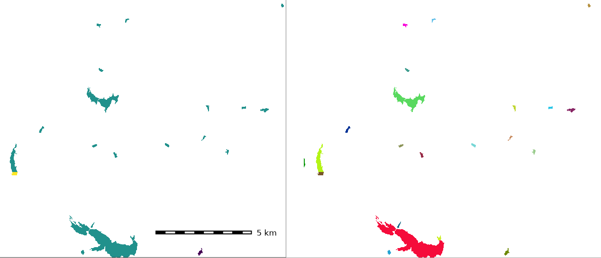
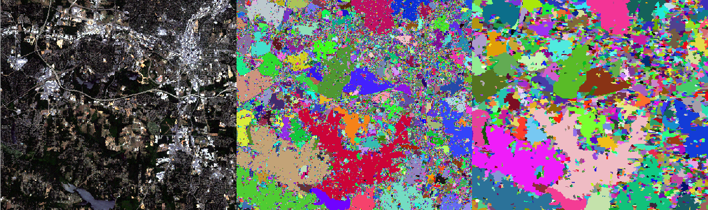

## DESCRIPTION

*r.clump* finds all areas of contiguous cell category values (connected
components) in the input raster map. NULL values in the input are
ignored. It assigns a unique category value to each such area ("clump")
in the resulting output raster map.

Category distinctions in the input raster map are preserved. This means
that if distinct category values are adjacent, they will NOT be clumped
together. The user can run *[r.reclass](r.reclass.md)* prior to
*r.clump* to recategorize cells and reassign cell category values.

*r.clump* can also perform "fuzzy" clumping where neighboring cells that
are not identical but similar to each other are clumped together. Here,
the spectral distance between two cells is scaled to the range \[0, 1\]
and compared to the *threshold* value. Cells are clumped together if
their spectral distance is ≤ *threshold*. The result is very sensitive
to this *threshold* value, a recommended start value is 0.01, then
increasing or decreasing this value according to the desired output.
Once a suitable threshold has been determined, noise can be reduced by
merging small clumps with the *minsize* option.

*r.clump* can also use multiple raster maps of any kind (CELL, FCELL,
DCELL) as input. In this case, the spectral distance between cells is
used to determine the similarity of two cells. This means that input
maps must be metric: the difference cell 1 - cell 2 must make sense.
Categorical maps, e.g. land cover, can not be used in this case.
Examples for valid input maps are satellite imagery, vegetation indices,
elevation, climatic parameters etc.

## NOTES

By default, the resulting clumps are connected only by their four direct
neighbors (left, right, top, bottom). The *-d* flag activates also
diagonal clump tracing.

*r.clump* works properly with raster map that contains only "fat" areas
(more than a single cell in width). Linear elements (lines that are a
single cell wide) may or may not be clumped together depending on the
direction of the line - horizontal and vertical lines of cells are
considered to be contiguous, but diagonal lines of cells are not
considered to be contiguous and are broken up into separate clumps
unless the *-d* flag is used.

A random color table and other support files are generated for the
output raster map.

## EXAMPLES

### Clumping of a raster map

Perform clumping on "lakes" map (North Carolina sample dataset) and
report area sizes for each lake individually rather by waterbody type:

```sh
g.region raster=lakes -p

# report sizes by waterbody type
r.report lakes units=h

# clump per raster polygon
r.clump lakes out=lakes_individual

# report sizes by individual waterbody
r.report lakes_individual units=h
```

  
*Figure: Clumping of rasterized lakes: original lakes map (left) and
clumped lakes map (right)*

### Fuzzy clumping on Landsat bands

Perform fuzzy clumping on Landsat 7 2002 imagery (North Carolina sample
dataset)

```sh
g.region raster=lsat7_2002_10 -p
r.clump in=lsat7_2002_10,lsat7_2002_20,lsat7_2002_30,lsat7_2002_40,lsat7_2002_50,lsat7_2002_70 \
        out=lsat7_2002_clump threshold=0.045

# reduce noise
r.clump in=lsat7_2002_10,lsat7_2002_20,lsat7_2002_30,lsat7_2002_40,lsat7_2002_50,lsat7_2002_70 \
        out=lsat7_2002_clump_min10 threshold=0.045 minsize=10
```

  
*Figure: Fuzzy clumping on Landsat bands: original RGB composite (left),
fuzzy clumped map (middle), and fuzzy clumped with minsize map (right)*

## SEE ALSO

*[r.buffer](r.buffer.md), [r.distance](r.distance.md),
[r.grow](r.grow.md), [r.mapcalc](r.mapcalc.md),
[r.mfilter](r.mfilter.md), [r.neighbors](r.neighbors.md),
[r.to.vect](r.to.vect.md), [r.reclass](r.reclass.md),
[r.statistics](r.statistics.md), [r.support](r.support.md)*

## AUTHORS

Michael Shapiro, U.S. Army Construction Engineering Research
Laboratory  
Markus Metz (diagonal clump tracing, fuzzy clumping)
