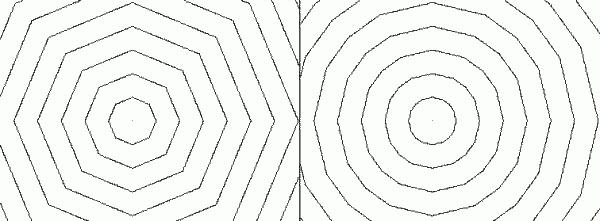
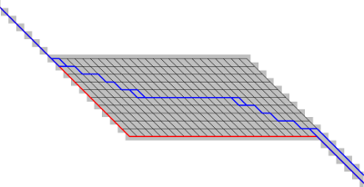

## DESCRIPTION

*r.cost* determines the cumulative cost of moving to each cell on a
*cost surface* (the **input** raster map) from other user-specified
cell(s) whose locations are specified by their geographic coordinate(s).
Each cell in the original cost surface map will contain a category value
which represents the cost of traversing that cell. *r.cost* will
produce 1) an **output** raster map in which each cell contains the
lowest total cost of traversing the space between each cell and the
user-specified points (diagonal costs are multiplied by a factor that
depends on the dimensions of the cell) and 2) a second raster map layer
showing the movement direction to the next cell on the path back to the
start point (see [Movement Direction](#movement-direction)). This module uses the
current geographic region settings. The **output** map will be of the
same data format as the **input** map, integer or floating point.

## OPTIONS

The **input** *name* is the name of a raster map whose category values
represent the surface cost. The **output** *name* is the name of the
resultant raster map of cumulative cost. The **outdir** *name* is the
name of the resultant raster map of movement directions (see [Movement
Direction](#movement-direction)).

*r.cost* can be run with three different methods of identifying the
starting point(s). One or more points (geographic coordinate pairs) can
be provided as specified **start_coordinates** on the command line, from
a vector points file, or from a raster map. All non-NULL cells are
considered to be starting points.

Each *x,y* **start_coordinates** pair gives the geographic location of a
point from which the transportation cost should be figured. As many
points as desired can be entered by the user. These starting points can
also be read from a vector points file through the **start_points**
option or from a raster map through the **start_raster** option.

*r.cost* will stop cumulating costs when either **max_cost** is reached,
or one of the stop points given with **stop_coordinates** is reached.
Alternatively, the stop points can be read from a vector points file
with the **stop_points** option. During execution, once the cumulative
cost to all stopping points has been determined, processing stops.  
Both sites read from a vector points file and those given on the command
line will be processed.

The null cells in the **input** map can be assigned a (positive floating
point) cost with the **null_cost** option.  
When input map null cells are given a cost with the **null_cost**
option, the corresponding cells in the output map are no longer null
cells. By using the **-n** flag, the null cells of the input map are
retained as null cells in the output map.

As *r.cost* can run for a very long time, it can be useful to use the
**--v** verbose flag to track progress.

The Knight's move (**-k** flag) may be used to improve the accuracy of
the output. In the diagram below, the center location (`O`) represents a
grid cell from which cumulative distances are calculated. Those
neighbors marked with an `X` are always considered for cumulative cost
updates. With the **-k** option, the neighbors marked with a `K` are
also considered.

```sh
 . . . . . . . . . . . . . . .
 .   .   . K .   . K .   .   .
 . . . . . . . . . . . . . . .
 .   . K . X . X . X . K .   .
 . . . . . . . . . . . . . . .
 .   .   . X . O . X .   .   .
 . . . . . . . . . . . . . . .
 .   . K . X . X . X . K .   .
 . . . . . . . . . . . . . . .
 .   .   . K .   . K .   .   .
 . . . . . . . . . . . . . . .
```

Knight's move example:

  
*Flat cost surface without (left pane) and with the knight's move (right pane).
 The default is to grow the cost outwards in 8 directions.
 Using the knight's move grows it outwards in 16 directions.*

If the **nearest** output parameter is specified, the module will
calculate for each cell its nearest starting point based on the
minimized accumulative cost while moving over the cost map.

The **solver** option helps to select a particular direction in case of
multiple directions with equal costs. Sometimes fields with equal
cumulative costs exist and multiple paths with equal costs would lead
from a start point to a stop point. By default, a path along the edge of
such a field would be produced or multiple paths of equal costs with the
**-b** flag. An additional variable can be supplied with the **solver**
option to help the algorithm pick a particular direction.

Example for solving multiple directions:

  
*A field of equal cumulative costs with multiple paths (black).
 By default a path along the edge will be selected (red).
 Path selection can be controlled with the solver option (blue).*

Multiple directions can be solved as in the above example with the
following steps:

1. Create multiple directions with **r.cost**/**r.walk** using the
    **-b** flag
2. Extract paths using **r.path format=bitmask**
3. Calculate the distance from NULL cells to paths using
    **r.grow.distance -n input=\<paths from r.path\>**
4. Invert the sign of the distances with **r.mapcalc** because for the
    solver smaller is better, and here we want to get the center of an
    area with multiple directions
5. Use these negative distances as solver for a second pass of
    **r.cost**
6. Extract paths again with **r.path** to get a geometrically optimized
    solution

## NULL CELLS

By default null cells in the input raster map are excluded from the
algorithm, and thus retained in the output map.

If one wants **r.cost** to transparently cross any region of null cells,
the **null_cost**=`0.0` option should be used. Then null cells just
propagate the adjacent costs. These cells can be retained as null cells
in the output map by using the **-n** flag.

## NOTES

Paths from any point to the nearest starting point of *r.cost* can be
extracted with *[r.path](r.path.md)* by using the direction output map
of *r.cost*.

### Algorithm notes

The fundamental approach to calculating minimum travel cost is as
follows:

The user generates a raster map indicating the cost of traversing each
cell in the north-south and east-west directions. This map, along with a
set of starting points are submitted to *r.cost*. The starting points
are put into a heap of cells from which costs to the adjacent cells are
to be calculated. The cell on the heap with the lowest cumulative cost
is selected for computing costs to the neighboring cells. Costs are
computed and those cells are put on the heap and the originating cell is
finalized. This process of selecting the lowest cumulative cost cell,
computing costs to the neighbors, putting the neighbors on the heap and
removing the originating cell from the heap continues until the heap is
empty.

The most time consuming aspect of this algorithm is the management of
the heap of cells for which cumulative costs have been at least
initially computed. *r.cost* uses a minimum heap for efficiently
tracking the next cell with the lowest cumulative costs.

*r.cost*, like most all GRASS raster programs, is also made to be run on
maps larger that can fit in available computer memory. As the algorithm
works through the dynamic heap of cells it can move almost randomly
around the entire area. *r.cost* divides the entire area into a number
of pieces and swaps these pieces in and out of memory (to and from disk)
as needed. This provides a virtual memory approach optimally designed
for 2-D raster maps. The amount of memory to be used by *r.cost* can be
controlled with the **memory** option, default is 300 MB. For systems
with less memory this value will have to be set to a lower value.

## EXAMPLES

Consider the following example:

```sh
       Input:
         COST SURFACE
       . . . . . . . . . . . . . . .
       . 2 . 2 . 1 . 1 . 5 . 5 . 5 .
       . . . . . . . . . . . . . . .
       . 2 . 2 . 8 . 8 . 5 . 2 . 1 .
       . . . . . . . . . . . . . . .
       . 7 . 1 . 1 . 8 . 2 . 2 . 2 .
       . . . . . . . . . . . . . . .
       . 8 . 7 . 8 . 8 . 8 . 8 . 5 .
       . . . . . . . . . . _____ . .
       . 8 . 8 . 1 . 1 . 5 | 3 | 9 .
       . . . . . . . . . . |___| . .
       . 8 . 1 . 1 . 2 . 5 . 3 . 9 .
       . . . . . . . . . . . . . . .


Output (using -k):                Output (not using -k):
   CUMULATIVE COST SURFACE           CUMULATIVE COST SURFACE
 . . . . . . . . . . . . . . .     . . . . * * * * * . . . . . .
 . 21. 21. 20. 19. 17. 15. 14.     . 22. 21* 21* 20* 17. 15. 14.
 . . . . . . . . . . . . . . .     . . . . * * * * * . . . . . .
 . 20. 19. 22. 19. 15. 12. 11.     . 20. 19. 22* 20* 15. 12. 11.
 . . . . . . . . . . . . . . .     . . . . . . * * * * * . . . .
 . 22. 18. 17. 17. 12. 11.  9.     . 22. 18. 17* 18* 13* 11.  9.
 . . . . . . . . . . . . . . .     . . . . . . * * * * * . . . .
 . 21. 14. 13. 12.  8.  6.  6.     . 21. 14. 13. 12.  8.  6.  6.
 . . . . . . . . . .  _____. .     . . . . . . . . . . . . . . .
 . 16. 13.  8.  7.  4 | 0 | 6.     . 16. 13.  8. 7 .  4.  0.  6.
 . . . . . . . . . .  |___|. .     . . . . . . . . . . . . . . .
 . 14.  9.  8.  9.  6.  3.  8.     . 14.  9.  8. 9 .  6.  3.  8.
 . . . . . . . . . . . . . . .     . . . . . . . . . . . . . . .
```

The user-provided starting location in the above example is the boxed
**3** in the above input map. The costs in the output map represent the
total cost of moving from each box ("cell") to one or more (here, only
one) starting location(s). Cells surrounded by asterisks are those that
are different between operations using and not using the Knight's move
(**-k**) option.

### Output analysis

The output map can be viewed, for example, as an elevation model in
which the starting location(s) is/are the lowest point(s). Outputs from
*r.cost* can be used as inputs to *[r.path](r.path.md)* , in order to
trace the least-cost path given by this model between any given cell and
the *r.cost* starting location(s). The two programs, when used together,
generate least-cost paths or corridors between any two map locations
(cells).

### Shortest distance surfaces

The *r.cost* module allows for computing the shortest distance of each
pixel from raster lines, such as determining the shortest distances of
households to the nearby road. For this cost surfaces with cost value 1
are used. The calculation is done with *r.cost* as follows (example for
Spearfish region):

```sh
  g.region raster=roads -p
  r.mapcalc "area.one = 1"
  r.cost -k input=area.one output=distance start_raster=roads
  d.rast distance
  d.rast.num distance

  #transform to metric distance from cell distance using the raster resolution:
  r.mapcalc "dist_meters = distance * (ewres()+nsres())/2."
  d.rast dist_meters
```

### Movement Direction

The movement direction surface is created to record the sequence of
movements that created the cost accumulation surface. This movement
direction surface can be used by *[r.path](r.path.md)* to recover a path
from an end point back to the start point. The direction of each cell
points towards the next cell. The directions are recorded as degrees CCW
from East:

```sh
       112.5      67.5         i.e. a cell with the value 135
157.5  135   90   45   22.5    means the next cell is to the north-west
       180   x   360
202.5  225  270  315  337.5
       247.5     292.5
```

### Cost allocation

Example: calculation of the cost allocation map "costalloc" and the
cumulative cost map "costsurf" for given starting points (map "sources")
and given cost raster map "costs":

```sh
r.cost input=costs start_raster=sources output=costsurf nearest=costalloc
```

### Find the minimum cost path

Once *r.cost* computes the cumulative cost map and an associated
movement direction map, *[r.path](r.path.md)* can be used to find the
minimum cost path.

## SEE ALSO

*[r.walk](r.walk.md), [r.path](r.path.md), [r.in.ascii](r.in.ascii.md),
[r.mapcalc](r.mapcalc.md), [r.out.ascii](r.out.ascii.md)*

## AUTHORS

Antony Awaida, Intelligent Engineering Systems Laboratory, M.I.T.  
James Westervelt, U.S.Army Construction Engineering Research
Laboratory  
Updated for Grass 5 by Pierre de Mouveaux (<pmx@audiovu.com>)  
Markus Metz  
Multiple path directions sponsored by
[mundialis](https://www.mundialis.de)
