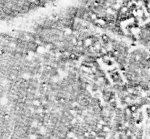
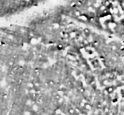
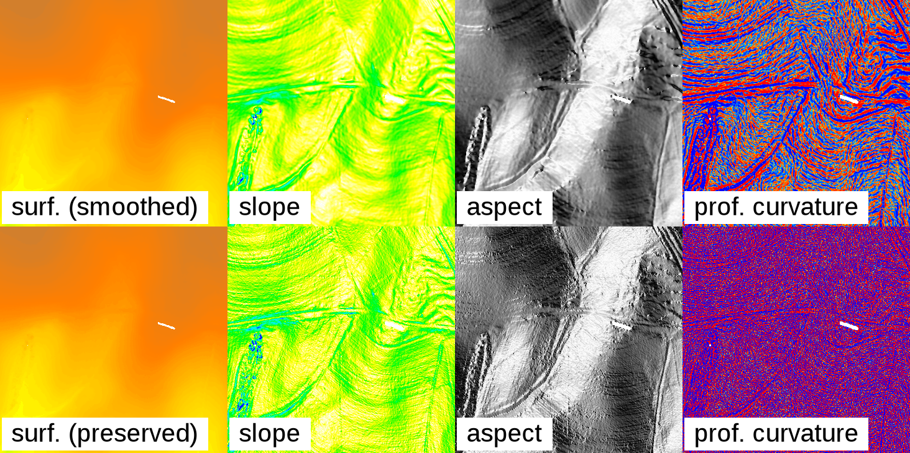
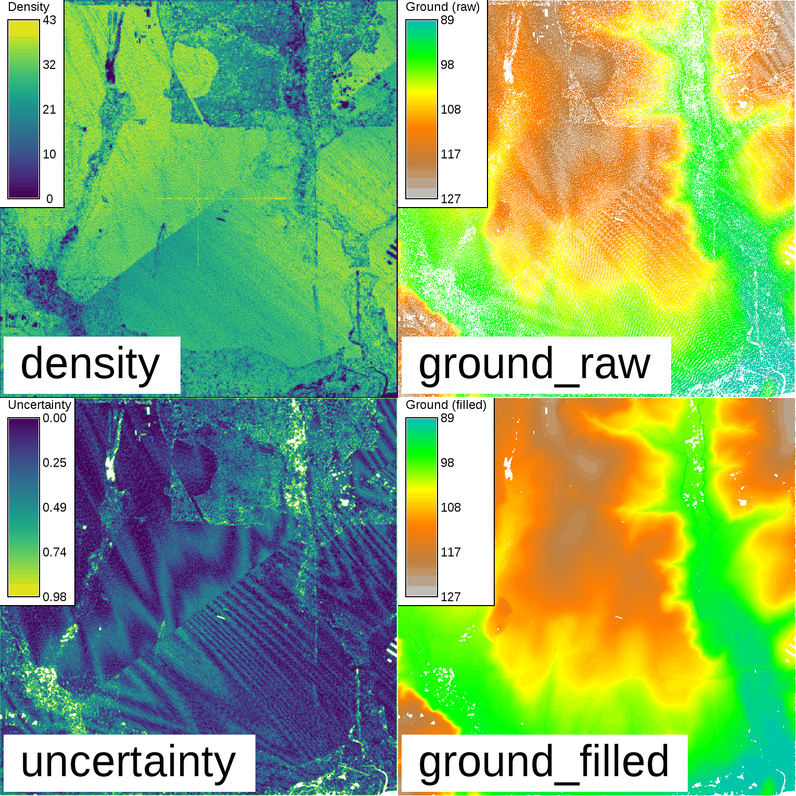

## DESCRIPTION

***r.fill.stats*** is a module for fast gap filling and interpolation
(with smoothing) of dense raster data.

The *r.fill.stats* module is capable of quickly filling **small data
gaps** in large and high-resolution raster maps. It's primary purpose is
to improve high-resolution, rasterized sensor data (such as Lidar data).
As a rule of thumb, there should be at least as many data cells as there
are "no data" (NULL) cells in the input raster map. Several
interpolation modes are available. By default, all values of the input
raster map will be replaced with locally interpolated values in the
output raster map. This is the equivalent of running a low-pass
smoothing filter on the interpolated data and is often desirable, owing
to noisy nature of high-resolution sensor data. With dense data and
small gaps, this should result in only slight deviations from the
original data and produce smooth output. Alternatively, setting the
**-k** flag will disable the low-pass filter and preserve the original
cell values.

Available gap filling modes:

- spatially weighted mean (default)
- simple mean
- simple median
- simple mode

The spatially weighted mean is equivalent to an Inverse Distance
Weighting (IDW; see also *[r.surf.idw](r.surf.idw.md)*) interpolation.
The simple mean is equivalent to a simple low-pass filter. Median and
mode replacements can also be achieved using
*[r.neighbors](r.neighbors.md)*.

Note that *r.fill.stats* is highly optimized for fast processing of
large raster datasets with a small interpolation distance threshold
(i.e. closing small gaps). As a trade-off for speed and a small memory
foot print, some spatial accuracy is lost due to the rounding of the
distance threshold to the closest approximation in input raster cells
and the use of a matrix of precomputed weights at cell resolution (see
further down for details). Note also that processing time will increase
exponentially with higher distance settings. Cells outside the distance
threshold will not be interpolated, preserving the edges of the original
data extent.

This module is not well suited for interpolating sparse input data and
closing large gaps. For such purposes more appropriate methods are
available, such as *[v.surf.bspline](v.surf.bspline.md)*,
*[v.surf.idw](v.surf.idw.md)* or *[v.surf.rst](v.surf.rst.md)*.

Applications where the properties of *r.fill.stats* are advantageous
include the processing of high resolution, close range scanning and
remote sensing datasets. Such datasets commonly feature densely spaced
measurements that have some gaps after rasterization, due to blind
spots, instrument failures, and misalignments between the GIS' raster
cell grids and the original measurement locations. In these cases,
*r.fill.stats* should typically be run using the "weighted mean"
(default) method and with a small distance setting (the default is to
use a search radius of just three cells).

The images below show a gradiometer dataset with gaps and its
interpolated equivalent, produced using the spatially weighted mean
operator (`mode="wmean"`).

 

In addition, *r.fill.stats* can be useful for raster map generalization.
Often, this involves removing small clumps of categorized cells and then
filling the resulting data gaps without "inventing" any new values. In
such cases, the "mode" or "median" interpolators should be used.

### Usage

The most critical user-provided settings are the interpolation/gap
filling method (**mode**) and the maximum distance, up to which
*r.fill.stats* will scan for cells with values (**distance**). The
distance can be expressed as a number of cells (default) or in the
current coordinate reference system's units (if the **-m** flag is
given). The latter are typically meters, but can be any other units of a
*planar* coordinate system.

Note that proper handling of geodetic coordinates (lat/lon) and
distances is currently not implemented. For lat/lon data, the distance
should therefore be specified in cells and usage of *r.fill.stats*
should be restricted to small areas to avoid large inaccuracies that may
arise from the different extents of cells along the latitudinal and
longitudinal axes.

Distances specified in map units (**-m** flag) will be approximated as
accurately as the current region's cell resolution settings allow. The
program will warn if the distance cannot be expressed as whole cells at
the current region's resolution. In such case, the number of cells in
the search window will be rounded up. Due to the rounding effect
introduced by using cells as spatial units, the actual maximum distance
considered by the interpolation may be up to half a cell diagonal larger
than the one specified by the user.

The interpolator type "wmean" uses a precomputed matrix of spatial
weights to speed up computation. This matrix can be examined (printed to
the screen) before running the interpolation, by setting the **-w**
flag. In mode "wmean", the **power** option has the usual meaning in
IDW: higher values mean that cell values in the neighborhood lose their
influence on the cell to be interpolated more rapidly with increasing
distance from the latter. Another way of explaining this effect is to
state that larger "power" settings result in more localized
interpolation, smaller ones in more globalized interpolation. The
default setting is `power=2.0`.

The interpolators "mean", "median" and "mode" are calculated from all
cell values within the search radius. No spatial weighting is applied
for these methods. The "mode" of the input data may not always be
unique. In such case, the mode will be the smallest value with the
highest frequency.

Often, input data will contain spurious extreme measurements (spikes,
outliers, noise) caused by the limits of device sensitivity, hardware
defects, environmental influences, etc. If the normal, valid range of
input data is known beforehand, then the **minimum** and **maximum**
options can be used to exclude those input cells that have values below
or above that range, respectively. This will prevent the influence of
spikes and outliers from spreading through the interpolation.

Unless the **-k** (keep) flag is given, data cells of the input map will
be replaced with interpolated values instead of preserving them in the
output. In modes "wmean" and "mean", this results in a smoothing effect
that includes the original data (see below)!

Besides the result of the interpolation/gap filling, a second output map
can be specified via the **uncertainty** option. The cell values in this
map represent a simple measure of how much uncertainty was involved in
interpolating each cell value of the primary output map, with "0" being
the lowest and "1" being the theoretic highest uncertainty. Uncertainty
is measured by summing up all cells in the neighborhood (defined by the
search radius **distance**) that contain a value in the **input** map,
multiplied by their weights, and dividing the result by the sum of all
weights in the neighborhood. For `mode=wmean`, this means that
interpolated output cells that were computed from many nearby input
cells have very low uncertainty and vice versa. For all other modes, all
weights in the neighborhood are constant "1" and the uncertainty measure
is a simple measure of how many input data cells were present in the
search window.

### Smoothing

The *r.fill.stats* module uses the interpolated values to adjust the
original values and create a smooth surface, which is akin to running a
low-pass filter on the data. Since most high-resolution sensor data is
noisy, this is normally a desired effect and results in output that is
more suitable for deriving secondary products, such as slope, aspect and
curvature maps. Larger settings for the search radius (**distance**)
will result in a stronger smoothing. In practice, some experimentation
with different settings for **distance** and **power** might be required
to achieve good results. In some cases (e.g. when dealing with low-noise
or classified data), it might be desirable to turn off data smoothing by
setting the **-k** (keep) flag. This will ensure that the original cell
data is copied through to the result map without alteration.

  
*Effect of smoothing the original data: The top row shows a gap-filled
surface computed from a rasterized Lidar point cloud (using `mode=wmean`
and `power=2`), and the derived slope, aspect, and profile curvature
maps. The smoothing effect is clearly visible. The bottom row shows the
effect of setting the **-k** flag: Preserving the original cell values
in the interpolated output produces and unsmoothed, noisy surface, and
likewise noisy derivative maps.*

The effect can be seen in the illustration above: Slope, aspect, and
profile curvature are computed using the
*[r.slope.aspect](r.slope.aspect.md)* module, which uses a window
(kernel) for computations that considers only the immediate neighborhood
of each cell. When performed on noisy data, such local operations result
in equally noisy derivatives if the original data is preserved (by
setting the **-k** flag) and no smoothing is performed.

(Note that the effects of noisy data can also be avoided by using
modules that are not restricted to minimal kernel sizes. For example,
aspect and other morphometric parameters can be computed using the
*[r.param.scale](r.param.scale.md)* module which operates with
variable-size cell neighborhoods.)

### Spatial weighting scheme

The key to getting good gap filling results is to understand the spatial
weighting scheme used in mode "wmean". The weights are precomputed and
assigned per cell within the search window centered on the location at
which to interpolate/gap fill all cells within the user-specified
distance.

The illustration below shows the precomputed weights matrix for a search
distance of four cells from the center cell:

```sh
000.00 000.01 000.04 000.07 000.09 000.07 000.04 000.01 000.00
000.01 000.06 000.13 000.19 000.22 000.19 000.13 000.06 000.01
000.04 000.13 000.25 000.37 000.42 000.37 000.25 000.13 000.04
000.07 000.19 000.37 000.56 000.68 000.56 000.37 000.19 000.07
000.09 000.22 000.42 000.68 001.00 000.68 000.42 000.22 000.09
000.07 000.19 000.37 000.56 000.68 000.56 000.37 000.19 000.07
000.04 000.13 000.25 000.37 000.42 000.37 000.25 000.13 000.04
000.01 000.06 000.13 000.19 000.22 000.19 000.13 000.06 000.01
000.00 000.01 000.04 000.07 000.09 000.07 000.04 000.01 000.00
```

Note that the weights in such a small window drop rapidly for the
default setting of `power=2`.

If the distance is given in map units (flag `-m`), then the search
window can be modeled more accurately as a circle. The illustration
below shows the precomputed weights for a distance in map units that is
approximately equivalent to four cells from the center cell:

```sh
...... ...... ...... 000.00 000.00 000.00 ...... ...... ......
...... 000.00 000.02 000.06 000.09 000.06 000.02 000.00 ......
...... 000.02 000.11 000.22 000.28 000.22 000.11 000.02 ......
000.00 000.07 000.22 000.44 000.58 000.44 000.22 000.07 000.00
000.00 000.09 000.28 000.58 001.00 000.58 000.28 000.09 000.00
000.00 000.07 000.22 000.44 000.58 000.44 000.22 000.07 000.00
...... 000.02 000.11 000.22 000.28 000.22 000.11 000.02 ......
...... 000.00 000.02 000.06 000.09 000.06 000.02 000.00 ......
...... ...... ...... 000.00 000.00 000.00 ...... ...... ......
```

When using a small search radius, **cells** must also be set to a small
value. Otherwise, there may not be enough cells with data within the
search radius to support interpolation.

## NOTES

The straight-line metric used for converting distances in map units to
cell numbers is only adequate for planar coordinate systems. Using this
module with lat/lon input data will likely give inaccurate results,
especially when interpolating over large geographical areas.

If the distance is set to a relatively large value, processing time will
quickly approach and eventually exceed that of point-based interpolation
modules such as *[v.surf.rst](v.surf.rst.md)*.

This module can handle cells with different X and Y resolutions.
However, note that the weight matrix will be skewed in such cases, with
higher weights occurring close to the center and along the axis with the
higher resolution. This is because weights on the lower resolution axis
are less accurately calculated. The skewing effect will be stronger if
the difference between the X and Y axis resolution is greater and a
larger "power" setting is chosen. This property of the weights matrix
directly reflects the higher information density along the higher
resolution axis.

Note on printing the weights matrix (using the **-w** flag): the matrix
cannot be printed if it is too large.

The memory estimate provided by the **-u** flag is a lower limit on the
amount of RAM that will be needed.

If the **-s** flag is set, floating point type output will be saved as a
"single precision" raster map, saving ~50% disk space compared to the
default "double precision" output.

## EXAMPLES

### Gap-filling of a dataset using spatially weighted mean (IDW)

Gap-fill a dataset using spatially weighted mean (IDW) and a maximum
search radius of 3.0 map units; also produce uncertainty estimation map:

```sh
r.fill.stats input=measurements output=result dist=3.0 -m mode=wmean uncertainty=uncert_map
```

Run a fast low-pass filter (replacement all cells with mean value of
neighboring cells) on the input map:

```sh
r.fill.stats input=measurements output=result dist=10 mode=mean
```

Fill data gaps in a categorized raster map; preserve existing data:

```sh
r.fill.stats input=categories output=result dist=100 -m mode=mode -k
```

### Lidar point cloud example

Inspect the point density and determine the extent of the point cloud
using the *[r.in.pdal](r.in.pdal.md)* module:

```sh
r.in.pdal -e input=points.las output=density method=n resolution=5 class_filter=2
```

Based on the result, set computational region extent and desired
resolution:

```sh
g.region -pa raster=density res=1
```

Import the point cloud as raster using binning:

```sh
r.in.pdal input=points.las output=ground_raw method=mean class_filter=2
```

Check that there are more non-NULL cells than NULL ("no data") cells:

```sh
r.univar map=ground_raw
```

```sh
total null and non-null cells: 2340900
total null cells: 639184
...
```

Fill in the NULL cells using the default 3-cell search radius:

```sh
r.fill.stats input=ground output=ground_filled uncertainty=uncertainty distance=3 mode=wmean power=2.0 cells=8
```

  
*Binning of Lidar and resulting ground surface with filled gaps. Note
the remaining NULL cells (white) in the resulting ground surface. These
are areas with a lack of cells with values in close proximity.*

### Outlier removal and gap-filling of SRTM elevation data

In this example, the SRTM elevation map in the North Carolina sample
dataset is filtered for outlier elevation values; missing pixels are
then re-interpolated to obtain a complete elevation map:

```sh
g.region raster=elev_srtm_30m -p
d.mon wx0
d.histogram elev_srtm_30m

# remove SRTM outliers, i.e. SRTM below 50m (esp. lakes), leading to no data areas
r.mapcalc "elev_srtm_30m_filt = if(elev_srtm_30m < 50.0, null(), elev_srtm_30m)"
d.histogram elev_srtm_30m_filt
d.rast elev_srtm_30m_filt

# using the IDW method to fill these holes in DEM without low-pass filter
# increase distance to gap-fill larger holes
r.fill.stats -k input=elev_srtm_30m_filt output=elev_srtm_30m_idw distance=100

d.histogram elev_srtm_30m_idw
d.rast elev_srtm_30m_idw

r.mapcalc "diff_orig_idw = elev_srtm_30m - elev_srtm_30m_idw"
r.colors diff_orig_idw color=differences

r.univar -e diff_orig_idw
d.erase
d.rast diff_orig_idw
d.legend diff_orig_idw
```

## SEE ALSO

*[r.fillnulls](r.fillnulls.md), [r.neighbors](r.neighbors.md),
[r.surf.idw](r.surf.idw.md), [v.surf.bspline](v.surf.bspline.md),
[v.surf.idw](v.surf.idw.md), [v.surf.rst](v.surf.rst.md),
[v.fill.holes](v.fill.holes.md)*

[Inverse Distance Weighting in
Wikipedia](https://en.wikipedia.org/wiki/Inverse_distance_weighting)

## AUTHOR

Benjamin Ducke
