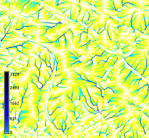

## DESCRIPTION

*r.flow* generates flowlines using a combined raster-vector approach
(see [Mitasova and Hofierka
1993](http://fatra.cnr.ncsu.edu/~hmitaso/gmslab/papers/hmg.rev1.ps) and
[Mitasova et al.
1995](http://fatra.cnr.ncsu.edu/~hmitaso/gmslab/papers/ijgis.html)) from
an input **elevation** raster map (integer or floating point), and
optionally an input **aspect** raster map and/or an input **barrier**
raster map.

There are three possible output raster maps which can be produced in any
combination simultaneously: a vector map **flowline** of flowlines, a
raster map **flowlength** of flowpath lengths, and a raster map
**flowaccumulation** of flowline densities (which are equal upslope
contributed areas per unit width, when multiplied by resolution).

## NOTES

Aspect used for input must follow the same rules as aspect computed in
other modules (see *[v.surf.rst](v.surf.rst.md)* or
*[r.slope.aspect](r.slope.aspect.md)*).

Output **flowline** is generated downhill. The line segments of flowline
vectors have endpoints on edges of a grid formed by drawing imaginary
lines through the centers of the cells in the elevation map. Flowlines
are generated from each cell downhill by default; they can be generated
uphill using the flag **-u**. A flowline stops if its next segment would
reverse the direction of flow (from up to down or vice-versa), cross a
barrier, or arrive at a cell with undefined elevation or aspect. Another
option, **skip**, indicates that only the flowlines from every val-th
cell are to be included in **flowline**. The default **skip** is
`max(1, <rows in elevation>/50, <cols in elevation>/50)`. A high
**skip** usually speeds up processing time and often improves the
readability of a visualization of **flowline**.

Flowpath length output is given in a raster map **flowlength**. The
value in each grid cell is the sum of the planar lengths of all segments
of the flowline generated from that cell. If the flag **-3** is given,
elevation is taken into account in calculating the length of each
segment.

Flowline density downhill or uphill output is given in a raster map
**flowaccumulation.** The value in each grid cell is the number of
flowlines which pass through that grid cell, that means the number of
flowlines from the entire map which have segment endpoints within that
cell. With the **-m** flag less memory is used as aspect at each cell is
computed on the fly. This option incurs a severe performance penalty. If
this flag is given, the **aspect** input map (if any) will be ignored.
The **barrier** parameter is a raster map name with non-zero values
representing barriers as input.

For best results, use input elevation maps with high precision units
(e.g., centimeters) so that flowlines do not terminate prematurely in
flat areas. To prevent the creation of tiny flowline segments with
imperceivable changes in elevation, an endpoint which would land very
close to the center of a grid cell is quantized to the exact center of
that cell. The maximum distance between the intercepts along each axis
of a single diagonal segment and another segment of 1/2 degree different
aspect is taken to be "very close" for that axis. Note that this
distance (the so-called "quantization error") is about 1-2% of the
resolution on maps with square cells.

The values in length maps computed using the **-u** flag represent the
distances from each cell to an upland flat or singular point. Such
distances are useful in water erosion modeling for computation of the LS
factor in the standard form of USLE. Uphill flowlines merge on ridge
lines; by redirecting the order of the flowline points in the output
vector map, dispersed waterflow can be simulated. The density map can be
used for the extraction of ridge lines.

Computing the flowlines downhill simulates the actual flow (also known
as the raindrop method). These flowlines tend to merge in valleys; they
can be used for localization of areas with waterflow accumulation and
for the extraction of channels. The downslope flowline density
multiplied by the resolution can be used as an approximation of the
upslope contributing area per unit contour width. This area is a measure
of potential water flux for the steady state conditions and can be used
in the modeling of water erosion for the computation of the unit stream
power based LS factor or sediment transport capacity.

*r.flow* has been designed for modeling erosion on hillslopes and has
rather strict conditions for ending flowlines. It is therefore not very
suitable for the extraction of stream networks or delineation of
watersheds unless a DEM without pits or flat areas is available
(*[r.fill.dir](r.fill.dir.md)* can be used to fill pits).

To label the vector flowlines automatically, the user can use
*[v.category](v.category.md)* (add categories).

### Algorithm background

*r.flow* uses an original vector-grid algorithm which uses an infinite
number of directions between 0.0000... and 360.0000... and traces the
flow as a line (vector) in the direction of gradient (rather than from
cell to cell in one of the 8 directions = D-infinity algorithm). They
are traced in any direction using aspect (so there is no limitation to 8
directions here). The D8 algorithm produces zig-zag lines. The value in
the outlet is very similar for *r.flow* algorithm (because it is
essentially the watershed area), however the spatial distribution of
flow, especially on hillslopes is quite different. It is still a 1D flow
routing so the dispersal flow is not accurately described, but still
better than D8.

*r.flow* uses a single flow algorithm, i.e. all flow is transported to a
single cell downslope.

### Diagnostics

```sh
Elevation raster map resolution differs from current region resolution
```

The resolutions of all input raster maps and the current region must
match (see *[g.region](g.region.md)*).

```sh
Resolution too unbalanced
```

The difference in length between the two axes of a grid cell is so great
that quantization error is larger than one of the dimensions. Resample
the map and try again.

## EXAMPLE

In this example a flow line vector map, a flow path length raster map
and a flow accumulation raster map are computed from an elevation raster
map (North Carolina sample dataset):

```sh
g.region raster=elevation -p
r.flow elevation=elevation skip=3 flowline=flowline flowlength=flowlength \
       flowaccumulation=flowaccumulation
```

 


Figure: Flow lines with underlying elevation map; flow lines with
underlying flow path lengths (in map units: meters); flow accumulation
map (zoomed view)

## REFERENCES

- Mitasova, H., L. Mitas, 1993, Interpolation by regularized spline with
  tension : I. Theory and implementation. Mathematical Geology 25, p.
  641-655.
  ([online](http://fatra.cnr.ncsu.edu/~hmitaso/gmslab/papers/lmg.rev1.ps))
- Mitasova and Hofierka 1993 : Interpolation by Regularized Spline with
  Tension: II. Application to Terrain Modeling and Surface Geometry
  Analysis. Mathematical Geology 25(6), 657-669
  ([online](http://fatra.cnr.ncsu.edu/~hmitaso/gmslab/papers/hmg.rev1.ps)).
- Mitasova, H., Mitas, L., Brown, W.M., Gerdes, D.P., Kosinovsky, I.,
  Baker, T., 1995: Modeling spatially and temporally distributed
  phenomena: New methods and tools for GRASS GIS. International Journal
  of Geographical Information Systems 9(4), 433-446.
- Mitasova, H., J. Hofierka, M. Zlocha, L.R. Iverson, 1996, Modeling
  topographic potential for erosion and deposition using GIS. Int.
  Journal of Geographical Information Science, 10(5), 629-641. (reply to
  a comment to this paper appears in 1997 in Int. Journal of
  Geographical Information Science, Vol. 11, No. 6)
- Mitasova, H.(1993): Surfaces and modeling. Grassclippings (winter and
  spring) p.18-19.

## SEE ALSO

*[r.basins.fill](r.basins.fill.md), [r.drain](r.drain.md),
[r.fill.dir](r.fill.dir.md), [r.water.outlet](r.water.outlet.md),
[r.watershed](r.watershed.md), [v.category](v.category.md),
[v.to.rast](v.to.rast.md)*

## AUTHORS

*Original version of program:* Maros Zlocha and Jaroslav Hofierka,
Comenius University, Bratislava, Slovakia

*The version of the program (adapted for GRASS 5.0)*: Joshua Caplan,
Mark Ruesink, Helena Mitasova, University of Illinois at
Urbana-Champaign with support from USA CERL. [GMSL/University of
Illinois at
Urbana-Champaign](http://fatra.cnr.ncsu.edu/~hmitaso/gmslab/)
