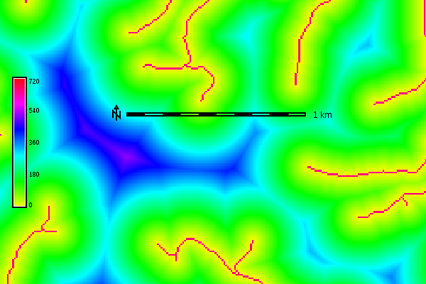

## DESCRIPTION

*r.grow.distance* generates raster maps representing the distance to the
nearest non-null cell in the input map and/or the value of the nearest
non-null cell.

## NOTES

The flag **-n** calculates the respective pixel distances to the nearest
NULL cell.

The user has the option of specifying five different metrics which
control the geometry in which grown cells are created, (controlled by
the **metric** parameter): *Euclidean*, *Squared*, *Manhattan*,
*Maximum*, and *Geodesic*.

The *Euclidean distance* or *Euclidean metric* is the "ordinary"
distance between two points that one would measure with a ruler, which
can be proven by repeated application of the Pythagorean theorem. The
formula is given by:

```sh
d(dx,dy) = sqrt(dx^2 + dy^2)
```

Cells grown using this metric would form isolines of distance that are
circular from a given point, with the distance given by the **radius**.

The *Squared* metric is the *Euclidean* distance squared, i.e. it simply
omits the square-root calculation. This may be faster, and is sufficient
if only relative values are required.

The *Manhattan metric*, or *Taxicab geometry*, is a form of geometry in
which the usual metric of Euclidean geometry is replaced by a new metric
in which the distance between two points is the sum of the (absolute)
differences of their coordinates. The name alludes to the grid layout of
most streets on the island of Manhattan, which causes the shortest path
a car could take between two points in the city to have length equal to
the points' distance in taxicab geometry. The formula is given by:

```sh
d(dx,dy) = abs(dx) + abs(dy)
```

where cells grown using this metric would form isolines of distance that
are rhombus-shaped from a given point.

The *Maximum metric* is given by the formula

```sh
d(dx,dy) = max(abs(dx),abs(dy))
```

where the isolines of distance from a point are squares.

The *Geodesic metric* is calculated as geodesic distance, to be used
only in latitude-longitude coordinate reference system. It is
recommended to use it along with the *-m* flag in order to output
distances in meters instead of map units.

If **minimum_distance** is given, all cells with a distance smaller than
**minimum_distance** will be set to NULL.

If **maximum_distance** is given, all cells with a distance larger than
**maximum_distance** will be set to NULL. The resultant output is
equivalent to a buffer.

If both **minimum_distance** and **maximum_distance** are given, the
result will be similar to a doughnut, a restricted belt for a given
distance range. All cells outside this distance range will be set to
NULL.

## EXAMPLES

### Distance from the streams network

North Carolina sample dataset:

```sh
g.region raster=streams_derived -p
r.grow.distance input=streams_derived distance=dist_from_streams
r.colors map=dist_from_streams color=rainbow
```

  
*Euclidean distance from the streams network in meters (map subset)*

  
*Euclidean distance from the streams network in meters (detail, numbers
shown with d.rast.num)*

### Distance from sea in meters in latitude-longitude CRS

```sh
g.region raster=sea -p
r.grow.distance -m input=sea distance=dist_from_sea_geodetic metric=geodesic
r.colors map=dist_from_sea_geodetic color=rainbow
```

  
*Geodesic distances to sea in meters*

## SEE ALSO

*[r.grow](r.grow.md), [r.distance](r.distance.md),
[r.buffer](r.buffer.md), [r.cost](r.cost.md), [r.patch](r.patch.md)*

*[Wikipedia Entry: Euclidean
Metric](https://en.wikipedia.org/wiki/Euclidean_metric)  
[Wikipedia Entry: Manhattan
Metric](https://en.wikipedia.org/wiki/Manhattan_metric)*

## AUTHOR

Glynn Clements
