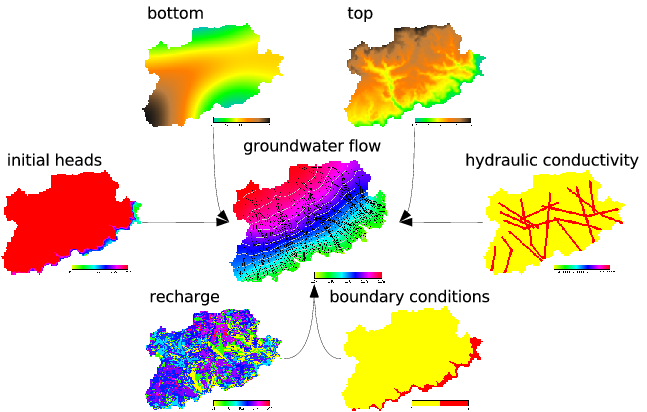

## DESCRIPTION

*r.gwflow* is a numerical program which calculates implicit transient,
confined and unconfined groundwater flow in two dimensions based on
raster maps and the current region settings. All initial and boundary
conditions must be provided as raster maps. The unit of the current
project's coordinate reference system must be meters.

This module is sensitive to mask settings. All cells which are outside
the mask are ignored and handled as no flow boundaries.

  
*Workflow of r.gwflow*

*r.gwflow* calculates the piezometric head and optionally the water
budget and the filter velocity field, based on the hydraulic
conductivity and the piezometric head. The vector components can be
visualized with paraview if they are exported with *r.out.vtk*.  
  
The groundwater flow will always be calculated transient. For stady
state computation set the timestep to a large number (billions of
seconds) or set the storativity/ effective porosity raster map to
zero.  
  
The water budget is calculated for each non inactive cell. The sum of
the budget for each non inactive cell must be near zero. This is an
indicator of the quality of the numerical result.

## NOTES

The groundwater flow calculation is based on Darcy's law and a numerical
implicit finite volume discretization. The discretization results in a
symmetric and positive definite linear equation system in form of *Ax =
b*, which must be solved. The groundwater flow partial differential
equation is of the following form:

(dh/dt)\*S = div (K grad h) + q

In detail for 2 dimensions:

(dh/dt)\*S = Kxx \* (d^2h/dx^2) + Kyy \* (d^2h/dy^2) + q

- h -- the piezometric head im \[m\]
- dt -- the time step for transient calculation in \[s\]
- S -- the specific storage \[1/m\]
- Kxx -- the hydraulic conductivity tensor part in x direction in
  \[m/s\]
- Kyy -- the hydraulic conductivity tensor part in y direction in
  \[m/s\]
- q - inner source/sink in meter per second \[1/s\]

Confined and unconfined groundwater flow is supported. Be aware that the
storativity input parameter is handled differently in case of unconfined
flow. Instead of the storativity, the effective porosity is expected.

To compute unconfined groundwater flow, a simple Picard based
linearization scheme is used to solve the resulting non-linear equation
system.

Two different boundary conditions are implemented, the Dirichlet and
Neumann conditions. By default the calculation area is surrounded by
homogeneous Neumann boundary conditions. The calculation and boundary
status of single cells must be set with a status map, the following
states are supported:

- 0 == inactive - the cell with status 0 will not be calculated, active
  cells will have a no flow boundary to this cell
- 1 == active - this cell is used for groundwater flow calculation,
  inner sources and recharge can be defined for those cells
- 2 == Dirichlet - cells of this type will have a fixed piezometric head
  value which do not change over the time

Note that all required raster maps are read into main memory.
Additionally the linear equation system will be allocated, so the memory
consumption of this module rapidely grow with the size of the input
maps.  
  
The resulting linear equation system *Ax = b* can be solved with several
solvers. An iterative solvers with sparse and quadratic matrices support
is implemented. The conjugate gradients method with (pcg) and without
(cg) precondition. Additionally a direct Cholesky solver is available.
This direct solver only work with normal quadratic matrices, so be
careful using them with large maps (maps of size 10.000 cells will need
more than one gigabyte of RAM). Always prefer a sparse matrix solver.

## EXAMPLE

Use this small script to create a working groundwater flow area and
data. Make sure you are not in a lat/lon projection. It includes
drainage and river input as well.

```sh
# set the region accordingly
g.region res=25 res3=25 t=100 b=0 n=1000 s=0 w=0 e=1000 -p3

#now create the input raster maps for confined and unconfined aquifers
r.mapcalc expression="phead = if(row() == 1 , 50, 40)"
r.mapcalc expression="status = if(row() == 1 , 2, 1)"
r.mapcalc expression="well = if(row() == 20 && col() == 20 , -0.01, 0)"
r.mapcalc expression="hydcond = 0.00025"
r.mapcalc expression="recharge = 0"
r.mapcalc expression="top_conf = 20.0"
r.mapcalc expression="top_unconf = 70.0"
r.mapcalc expression="bottom = 0.0"
r.mapcalc expression="null = 0.0"
r.mapcalc expression="poros = 0.15"
r.mapcalc expression="s = 0.0001"

# The maps of the river
r.mapcalc expression="river_bed = if(col() == 35 , 48, null())"
r.mapcalc expression="river_head = if(col() == 35 , 49, null())"
r.mapcalc expression="river_leak = if(col() == 35 , 0.0001, null())"

# The maps of the drainage
r.mapcalc expression="drain_bed = if(col() == 5 , 48, null())"
r.mapcalc expression="drain_leak = if(col() == 5 , 0.01, null())"

#confined groundwater flow with cg solver and sparse matrix, river and drain
#do not work with this confined aquifer (top == 20m)
r.gwflow solver=cg top=top_conf bottom=bottom phead=phead status=status \
  hc_x=hydcond hc_y=hydcond q=well s=s recharge=recharge output=gwresult_conf \
  dt=8640000 type=confined vx=gwresult_conf_velocity_x vy=gwresult_conf_velocity_y budget=budget_conf

#unconfined groundwater flow with cg solver and sparse matrix, river and drain are enabled
# We use the effective porosity as storativity parameter
r.gwflow solver=cg top=top_unconf bottom=bottom phead=phead \
  status=status hc_x=hydcond hc_y=hydcond q=well s=poros recharge=recharge \
  river_bed=river_bed river_head=river_head river_leak=river_leak \
  drain_bed=drain_bed drain_leak=drain_leak \
  output=gwresult_unconf dt=8640000 type=unconfined vx=gwresult_unconf_velocity_x \
  budget=budget_unconf vy=gwresult_unconf_velocity_y

# The data can be visulaized with paraview when exported with r.out.vtk
r.out.vtk -p in=gwresult_conf,status vector=gwresult_conf_velocity_x,gwresult_conf_velocity_y,null \
  out=/tmp/gwdata_conf2d.vtk
r.out.vtk -p elevation=gwresult_unconf in=gwresult_unconf,status vector=gwresult_unconf_velocity_x,gwresult_unconf_velocity_y,null \
  out=/tmp/gwdata_unconf2d.vtk

#now load the data into paraview
paraview --data=/tmp/gwdata_conf2d.vtk &
paraview --data=/tmp/gwdata_unconf2d.vtk &
```

## SEE ALSO

*[r.solute.transport](r.solute.transport.md), [r3.gwflow](r3.gwflow.md),
[r.out.vtk](r.out.vtk.md)*

## AUTHOR

Sören Gebbert

This work is based on the Diploma Thesis of Sören Gebbert available
[here](https://grass.osgeo.org/gdp/hydrology/gebbert2007_diplom_stroemung_grass_gis.pdf)
at Technical University Berlin in Germany.
