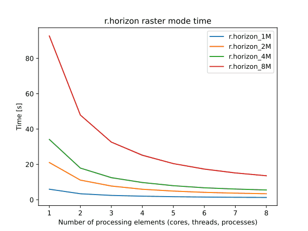
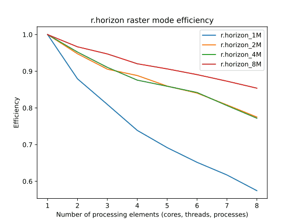

## DESCRIPTION

**r.horizon** computes the angular height of terrain horizon in radians.
It reads a raster of elevation data and outputs the horizon outline in
one of two modes:

- point: as a series of horizon heights in the specified directions from
  the given point(s). The results are written to the stdout.
- raster: in this case the output is one or more raster maps, with each
  point in a raster giving the horizon height in a specific direction.
  One raster is created for each direction.

The directions are given as azimuthal angles (in degrees), with the
angle starting with 0 towards East and moving counterclockwise (North is
90, etc.). The calculation takes into account the actual projection, so
the angles are corrected for direction distortions imposed by it. The
directions are thus aligned to those of the geographic projection and
not the coordinate system given by the rows and columns of the raster
map. This correction implies that the resulting cardinal directions
represent true orientation towards the East, North, West and South. The
only exception of this feature is x,y coordinate system, where this
correction is not applied.

Using the **-c** flag, the azimuthal angles will be printed in compass
orientation (North=0, clockwise).

Activating the **-l** flag allows additionally printing the distance to
each horizon angle.

### Input parameters

The *elevation* parameter is an input elevation raster map. If the
buffer options are used (see below), this raster should extend over the
area that accommodate the presently defined region plus defined buffer
zones.

The *step* parameter gives the angle step (in degrees) between
successive azimuthal directions for the calculation of the horizon.
Thus, a value of 5 for the *step* will give a total of 360/5=72
directions (72 raster maps if used in the raster map mode).

The *start* parameter gives the angle start (in degrees) for the
calculation of the horizon. The default value is 0 (East with North
being 90 etc.).

The *end* parameter gives the angle end (in degrees) for the calculation
of the horizon. The end point is omitted! So for example if we run
r.horizon with step=10, start=30 and end=70 the raster maps generated by
r.horizon will be only for angles: 30, 40, 50, 60. The default value is
360.

The *direction* parameter gives the initial direction of the first
output. This parameter acts as an direction angle offset. For example,
if you want to get horizon angles for directions 45 and 225 degrees, the
*direction* should be set to 45 and *step* to 180. If you only want one
single direction, use this parameter to specify desired direction of
horizon angle, and set the *step* size to 0 degrees. Otherwise all
angles for a given starting *direction* with step of *step* are
calculated.

The *distance* controls the sampling distance step size for the search
for horizon along the line of sight. The default value is 1.0 meaning
that the step size will be taken from the raster resolution. Setting the
value below 1.0 might slightly improve results for directions apart from
the cardinal ones, but increasing the processing load of the search
algorithm.

The *maxdistance* value gives a maximum distance to move away from the
origin along the line of sight in order to search for the horizon
height. The default *maxdistance* is the full map extent. The smaller
this value the faster the calculation but the higher the risk that you
may miss a terrain feature that can contribute significantly to the
horizon outline. Note that a viewshed can be calculated with
*r.viewshed*.

The *coordinate* parameter takes one or multiple pairs of
easting-northing values in the current coordinate system and calculates
the values of angular height of the horizon around each point. To
achieve the consistency of the results, the point coordinate is aligned
to the midpoint of the closest elevation raster cell.

If an analyzed point (or raster cell) lies close to the edge of the
defined region, the horizon calculation may not be realistic, since it
may not see some significant terrain features which could have
contributed to the horizon, because these features are outside the
region. There are to options how to set the size of the buffer that is
used to increase the area of the horizon analysis. The *bufferzone*
parameter allows you to specify the same size of buffer for all cardinal
directions and the parameters *e_buff*, *n_buff*, *s_buff*, and *w_buff*
allow you to specify a buffer size individually for each of the four
directions. The buffer parameters influence only size of the read
elevation map, while the analysis in the raster mode will be done only
for the area specified by the current region definition.

The *output* parameter defines the basename of the output horizon raster
maps. The raster name of each horizon direction raster will be
constructed as *basename\_*ANGLE, where ANGLE is the angle in degrees
with the direction. If you use **r.horizon** in the point mode this
option will be ignored.

The *file* parameter allows saving the resulting horizon angles in a
comma separated ASCII file with option **format=plain** or in a JSON
file with option **format=json** (point mode only). If you use
**r.horizon** in the raster map mode this option will be ignored.

At the moment the elevation and maximum distance must be measured in
meters, even if you use geographical coordinates (longitude/latitude).
If your projection is based on distance (easting and northing), these
too must be in meters. The buffer parameters must be in the same units
as the raster coordinates (e.g., for latitude-longitude buffers are
measured in degrees).

## NOTES

### Method

The calculation method is based on the method used in **r.sun** to
calculate shadows. It starts at a very shallow angle and walks along the
line of sight and asks at each step whether the line of sight "hits" the
terrain. If so, the angle is increased to allow the line of sight to
pass just above the terrain at that point. This is continued until the
line of sight reaches a height that is higher than any point in the
region or until it reaches the border of the region (see also the
*bufferzone,e_buff*, *n_buff*, *s_buff*, and *w_buff*). The number of
lines of sight (azimuth directions) is determined from the *direction*
and *step* parameters. The method takes into account the curvature of
the Earth whereby remote features will seem to be lower than they
actually are. It also accounts for the changes of angles towards
cardinal directions caused by the projection (see above).

The output with the **-d** flag is azimuth degree (-90 to 90, where 0 is
parallel with the focal cell).

All horizon values are positive (or zero). While negative values are in
theory possible, **r.horizon** currently does not support them.

### Performance

Parallel processing is implemented for the raster mode. To enable
parallel processing, the user can specify the number of threads to be
used with the **nprocs** parameter. Figures below show benchmark results
running on Intel® Core™ i5-13600K CPU @ 3.5GHz. See benchmark scripts in
the source code for more details.

The iterations of the algorithm used in **r.horizon** depends on the
topography. As a result, the benchmark results may vary depending on the
topography of the study area.



  
*Figure: Benchmark shows execution time, parallel speedup and efficiency
for different numbers of cells (1M, 2M, 4M, and 8M).*

## EXAMPLES

The examples are intended for the North Carolina sample dataset.

### Point mode

**Example 1**: determine horizon angle in 225 degree direction (output
of horizon angles CCW from East):

```sh
g.region raster=elevation -p
r.horizon elevation=elevation direction=215 step=0 bufferzone=200 \
    coordinates=638871.6,223384.4 maxdistance=5000
```

**Example 2**: determine horizon values starting at 90 deg (North), step
size of 5 deg, saving result as CSV file:

```sh
r.horizon elevation=elevation direction=90 step=5 bufferzone=200 \
    coordinates=638871.6,223384.4 maxdistance=5000 file=horizon.csv
```

**Example 3**: test point near highway intersection, saving result as
CSV file for plotting the horizon around the highway intersection:

```sh
g.region n=223540 s=220820 w=634650 e=638780 res=10 -p
r.horizon elevation=elevation direction=0 step=5 bufferzone=200 \
    coordinates=636483.54,222176.25 maxdistance=5000 -d file=horizon.csv
```

  
*Test point near high way intersection (North Carolina sample dataset)*

  
*Horizon angles for test point (CCW from East)*

We can plot horizon in polar coordinates using Matplotlib in Python:

```python
import numpy as np
import matplotlib.pyplot as plt

horizon = np.genfromtxt('horizon.csv', delimiter=',')
horizon = horizon[1:, :]

ax = plt.subplot(111, polar=True)
bars = ax.plot(horizon[:, 0] / 180 * np.pi,
               (90 - horizon[:, 1]) / 180 * np.pi)
# uncomment the 2 following lines when using -c flag
# ax.set_theta_direction(-1)
# ax.set_theta_zero_location('N')
plt.show()
```

  
*Horizon plot in polar coordinates.*

### Raster map mode

Raster map mode (output maps "horangle\*" become input for *r.sun*):

```sh
g.region raster=elevation -p

# we put a bufferzone of 10% of maxdistance around the study area
# compute only direction between 90 and 270 degrees
r.horizon elevation=elevation step=30 start=90 end=300 \
    bufferzone=200 output=horangle maxdistance=5000
```

## REFERENCES

Hofierka J., 1997. Direct solar radiation modelling within an open GIS
environment. Proceedings of JEC-GI'97 conference in Vienna, Austria, IOS
Press Amsterdam, 575-584

Hofierka J., Huld T., Cebecauer T., Suri M., 2007. Open Source Solar
Radiation Tools for Environmental and Renewable Energy Applications,
[International Symposium on Environmental Software
Systems](https://www.researchgate.net/profile/Ralf-Denzer-2/publication/269166795_Environmental_Software_Systems_Volume_7_Second_Edition/links/54847f450cf283750c370758/Environmental-Software-Systems-Volume-7-Second-Edition.pdf#page=464),
Prague, 2007

Neteler M., Mitasova H., 2004. Open Source GIS: A GRASS GIS Approach,
[Springer](https://link.springer.com/book/10.1007/978-0-387-68574-8),
New York. ISBN: 1-4020-8064-6, 2nd Edition 2004 (reprinted 2005), 424
pages

Project
[PVGIS](https://joint-research-centre.ec.europa.eu/photovoltaic-geographical-information-system-pvgis_en),
European Commission, DG Joint Research Centre 2001-2007

Suri M., Hofierka J., 2004. A New GIS-based Solar Radiation Model and
Its Application for Photovoltaic Assessments. [Transactions in
GIS](http://web.archive.org/web/20060212122544/http://www.blackwellpublishing.com:80/toc.asp?ref=1361-1682),
8(2), 175-190 (DOI:
[10.1111/j.1467-9671.2004.00174.x](https://doi.org/10.1111/j.1467-9671.2004.00174.x))

## SEE ALSO

*[r.sun](r.sun.md), [r.sunmask](r.sunmask.md),
[r.viewshed](r.viewshed.md)*

## AUTHORS

Thomas Huld, Joint Research Centre of the European Commission, Ispra,
Italy  

Tomas Cebecauer, Joint Research Centre of the European Commission,
Ispra, Italy  

Jaroslav Hofierka, GeoModel s.r.o., Bratislava, Slovakia  
Marcel Suri, Joint Research Centre of the European Commission, Ispra,
Italy

© 2007, Thomas Huld, Tomas Cebecauer, Jaroslav Hofierka, Marcel Suri
<Thomas.Huld@jrc.it> <Tomas.Cebecauer@jrc.it>
[hofierka@geomodel.sk](mailto:hofi@geomodel.sk) <Marcel.Suri@jrc.it>
