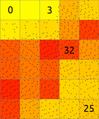
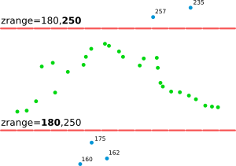
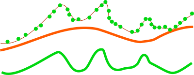
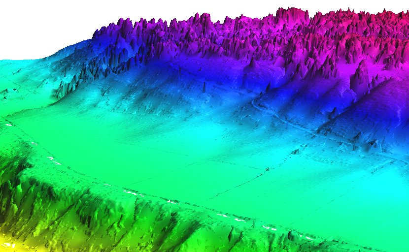
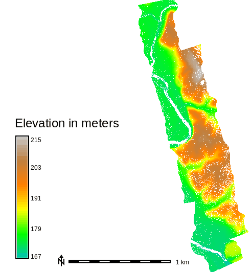

## DESCRIPTION

The *r.in.pdal* module loads PDAL library supported point clouds (with
emphasis on LiDAR LAS files) into a new raster map using binning. The
user may choose from a variety of statistical methods which will be used
for binning when creating the new raster.

Since a new raster map is created during the binning, the binning of
points depends on the current computational region settings (extent and
resolution) by default (see more about binning below). When using the
**-e** flag, the binning will be done in the extent of the point cloud,
so the resulting raster will have extent based on the input point cloud.
When the *resolution=value* parameter is used, the binning is done using
the provided resolution and the resulting raster will have that
resolution (see more below for more information about extent and
resolution management).

*r.in.pdal* is designed for processing massive point cloud datasets, for
example raw LiDAR or sidescan sonar swath data.

### Binning

The main difference between *r.in.pdal* and *[v.in.pdal](v.in.pdal.md)*
is that *r.in.pdal* creates a raster instead of just importing the
points into GRASS GIS. However, *r.in.pdal* does not merely rasterizes
the points from the point cloud. *r.in.pdal* uses binning to derive
values for individual raster cells, so the value of a cell is typically
an aggregation of values of individual points falling into one cell. In
general binning is the conversion of points into a regular grid. The
binning of points with X and Y coordinates starts with the overlay of a
grid of bins over the points.

In the basic case, binning is a method which counts the number of points
which fall into one raster cell, i.e. bin. The number of points per cell
(bin) indicates the density of points in the point cloud. The cell (bin)
is always square or rectangular in case of *r.in.pdal* because the
result is GRASS GIS 2D raster. The result of binning where the number of
point per cell is counted is sometimes called 2D (two dimensional)
histogram because a histogram is used in univariate statistics (in one
dimension) to count the number samples falling into a given bin.



*Figure: The binning on left was used to count number of points per
(sometimes also called 2D histogram). The numbers in cells are examples
of counts, the rest is represented by the color. The binning on right
was used with mean to create a surface based on the values associated
with the points. The numbers show examples of cell values. Note also the
cells without any points which were assigned the NULL value.*

The basic concept of binning is extended when the points have another
value associated with them. For LiDAR data this value can be the Z
coordinate or intensity. The value for a given cell (bin) is computed
using univariate statistics from the values of all points in the cell.
For example, computing the mean value of Z coordinates can yield a
raster representing the digital elevation model. Another example is the
range of Z coordinates which can be used as a rough estimate of
vegetation height.

### Statistics

Available statistics for populating the output raster map are:

n  
This computes the number (count) of points per cell. The result is a
indicator of spatially variable density of points in the given area.

min  
This finds the minimum of point values in each cell. It can be useful
when finding topography in a forested or urban environment and there is
a lot of points per one cells (terrain is oversampled considering the
desired resolution). It can also create surfaces independent on the
noise from premature hits as it will always select the lowest point.

max  
This finds the maximum of point values in each cell. In connection with
**base_raster** it can yield maximum vegetation of feature height per
cell. For this purpose, it is usually much more appropriate than *mean*
which would yield heights mostly influenced by the vertical distribution
of points.

range  
This computes the range of point values in each cell. The range of Z
coordinates per cell can be used as a rough estimate of vegetation
height when the cells are small enough, slopes low and the area is
mostly vegetated. However, for more profound analysis, the base raster
together with different statistics is recommended.

sum  
This computes the sum of point values per cell. This is useful
especially when intensity is used as a value.

mean  
This is a mean (average) value of point values in cell. When used with Z
coordinates (the default) and points from the ground class, the
resulting raster is a digital elevation model. When intensity is used as
a point value, the resulting raster contains mean intensity per cell.
Note that *mean* gives heights influenced by the vertical distribution
of points.

stddev  
This computes the standard deviation of point values for each cell.

variance  
This computes the variance of point values for each cell. Variance and
derivatives use the biased estimator (n). It is calculated by Welford
algorithm.

coeff_var  
This computes the coefficient of variance of point values for each cell.
Coefficient of variance is given in percentage and defined as
`100 * sqrt(variance) / mean`.

median  
This computes the median of point values for each cell

mode  
This computes the mode (the most common value) of point values for each
cell. If there are more than one mode for a cell, an arbitrary one will
be selected.

percentile  
p-*th* (nth) percentile of points in cell

skewness  
This is a skewness of point values in cell

trimmean  
This is a trimmed mean of point values in cell. Trimmed mean also know
as truncated mean is a mean computed after discarding values at the low
end and at the high end. How many values to discard is given by the
**trim** option in percent. In statistics the usual percentage of
trimmed values ranges from 5 to 25 percent.

sidnmax  
Maximum number of points in cell per source ID. Points are counted for
each source separately and largest count is used as the final cell
value. Corresponds to majority density (*Dmax*) as defined by Smeeckaert
et al., 2013.

sidnmin  
Minimum number of points in cell per source ID. Points are counted for
each source separately and smallest count is used as the final cell
value. Corresponds to minority density (*Dmin*) as defined by Smeeckaert
et al., 2013.

ev1, ev2, ev3  
1st, 2nd and 3rd eigenvalue of point x, y and z coordinates within a
cell (Mallet et al. 2011).

Note that different statistics have different memory requirements (see
below for details).

In varied terrain the user may find that *min* maps make for a good
noise filter as most LIDAR noise is from premature hits. The *min* map
may also be useful to find the underlying topography in a forested or
urban environment if the cells are oversampled.

### Filtering and selection

Points are always filtered by spatial extent (based on current
computational region) unless *-e* flag is set. Afterwards import value
scaling is performed, followed by filtering by having value in range.

Points falling outside the current computational region will be skipped.
This includes points falling *exactly* on the southern or eastern region
bound. To capture those adjust the region with:

```sh
g.region s=s-0.000001
```

See *[g.region](g.region.md)* for details about computation region
handling in GRASS GIS.

The **zrange** parameter may be used for filtering the input data by
vertical extent. Example uses include filtering out extreme outliers and
outliers on relatively flat terrain. This parameter can be also used for
cutting the point cloud into vertical sections preparing it for further
processing by separate sections, together as if it would be an imagery
group (see *[i.group](i.group.md)*), or combined into a 3D raster using
*[r.to.rast3](r.to.rast3.md)*. In for these last examples, it might
actually be more advantageous to use *[r3.in.lidar](r3.in.lidar.md)*
module. The **zrange** parameter is especially powerful when used
together with the **base_raster** parameter. The **zrange** is applied
to Z values after the **base_raster** reduction.



*Figure: This is the principle of zrange filter. Points with the Z
coordinate value below the lower value in the range (here 180) are
filtered out (blue points) and same applies for points above higher
value in the range (here 250). All other points are preserved (green
points).*

Filtering can be performed also on intensity values with *irange*
parameter. If imported dimension is neither Z nor intensity, filtering
can be performed with *drange* parameter. Filtering by Z values and
intensity can be performed independently on imported dimension. If
imported dimension is not Z nor intensity, filtering can be performed
with all three parameters simultaneously (*zrange*, *irange* and
*drange*) or any of their combination.

A LiDAR pulse can have multiple returns. The first return values can be
used to obtain a digital surface model (DSM) where e.g. canopy cover is
represented. The last return values can be used to obtain a digital
terrain model (DTM) where e.g. the forest floor instead of canopy cover
is represented. The **return_filter** option allows selecting one of
first, mid, or last returns. Return number and number of returns in the
pulse associated with each point are compared to determine if the point
is first, mid, or last return.

LiDAR points often come as already classified into standardized classes.
For example, class number 2 represents ground. For other classes see LAS
format specification in references. The **class_filter** option allows
selecting one or more classes using numbers (integers) separated by
comma.

The user can use a combination of *r.in.pdal* **output** maps to create
custom raster-based filters, for example, use
*[r.mapcalc](r.mapcalc.md)* to create a `mean-(2*stddev)` map. (In this
example the user may want to include a lower bound filter in *r.mapcalc*
to remove highly variable points (small *n*) or run *r.neighbors* to
smooth the stddev map before further use.)

Note that proper filtering of the input points in not only critical for
the analysis itself but it can also speed up the processing.

LiDAR points can contain a lot of attributes besides their coordinates.
By default *r.in.pdal* will use point Z coordinate as the output raster
value source. The *dimension* option allows using different point
attributes as an output instead of Z value. In case if other than Z
value is chosen, output map type will be set to CELL. Explanation of
various attributes can be found in LAS Specification chapter "Point Data
Records". Be ware - not all attributes might be present and also their
value ranges and meaning might vary between LAS file producers.

PDAL supports creation of custom dimensions (point attributes) in LAS
files. Use *user_dimension* option to provide name of any dimension for
import. This option supersedes one specified by *dimension* option.

### Reduction to a base raster

For analysis of features on the terrain surface, especially vegetation
it is advantageous to remove the influence of the terrain on heights
because the height above the terrain is important (e.g. height of a
tree) rather than height of the top of the tree above the see level. In
this case, the base raster would be digital elevation model which can be
one derived from the point cloud, or obtained in some other way. LiDAR
data often come with precomputed DEMs (quality should be checked in this
case) and there is often a DEM available for a given area (fit with the
point cloud, especially vertical, and resolution should be checked).



*Figure: This is a profile of base raster (in orange) representing
digital elevation model and selected points, e.g. first return, from
point cloud (green dots). By default the points would create a digital
surface model (thin brown line) but after reducing the Z coordinates
using the base raster, the created surface is a derived from the height
of points relative to the base raster.*

The usage of base raster is not limited to digital elevation model. The
base raster can be any surface which has some relation to the point
values, for example digital surface model representing top of the
canopy.

### Setting extent and resolution

Since the creation of raster maps depends on the computational region
settings (extent and resolution), as default the current region extents
and resolution are used for the import. When using the *-e* flag along
with the *resolution=value* parameter, the region used for the new
raster will be based the point cloud extent and the provided resolution.
It is therefore recommended to first use the *-s* flag to get the
extents of the LiDAR point cloud to be imported, then adjust the current
region extent and resolution accordingly, and only then proceed with the
actual import. Another option is to automatically set the region extents
based on the LAS dataset itself (*-e* flag) along with the desired
raster resolution. The best option is to know the point cloud extent
ahead, e.g. from tiling scheme, and use it. See below for details.

Since the *r.in.pdal* generates a raster map through binning from the
original LiDAR points, the target computational region extent and
resolution have to be determined. A typical workflow would involve the
examination of the LAS data's associated documentation or the scan of
the LAS data file with *r.in.pdal*'s **-g** flag to find the input
data's bounds.

Another option is to automatically set the region extents based on the
LAS dataset extent (**-e** flag) along with the desired raster
resolution using the *resolution* parameter.

The **-g** flag prints extent of input data set(s) in a shell style
suitable as command line parameters for *g.region*. Note, extent is
determined from data set(s) metadata and without scanning whole dataset
and thus selectros and filters are not applied.

A simpler option is to automatically set the region extents based on the
LAS dataset (**-e** flag) along with the target raster resolution using
the *resolution* parameter. Also here it is recommended to verify and
optimize the resulting region settings with *g.region* prior to
importing the dataset.

### Transformation

Point Z axis values can be altered by scaling parameter set by *zscale*.
Each point X axis value is multiplied by provided value before any
filtering or further transformation takes place. In the same way act
*iscale* and *dscale* parameters - values are multiplied before range
filters *irange* or *drnage* are applied (if present).

Output value scaling can be performed independently of filtering by
providing *dscale* parameter. This scaling parameter is applied only to
output value independently of its dimension. Thus if *zrange* and
*dscale* are set for Z output dimension, filtering by *zrange* will be
done with unscaled values but output will be scaled by *dscale*.
*dscale* takes precedence over *zscale* and *iscale* if more than one
parameter is provided.

## NOTES

### Format and projection support

The typical file extensions for the LAS format are .las and .laz
(compressed). The compressed LAS (.laz) format can be imported only if
libLAS has been compiled with LASzip support. It is also recommended to
compile libLAS with GDAL which is used to test if the LAS coordinate
reference system matches that of the GRASS project (previously called
location).

### Memory consumption

While the **input** file can be arbitrarily large, *r.in.pdal* will use
a large amount of system memory (RAM) for large raster regions (\>
10000x10000 pixels). If the module refuses to start complaining that
there isn't enough memory, use the **percent** parameter to run the
module in several passes. In addition using a less precise map format
(`CELL` \[integer\] or `FCELL` \[floating point\]) will use less memory
than a `DCELL` \[double precision floating point\] **output** map. For
**methods**=*n, mode, sidnmin, sidnmax*, the `CELL` format is used
automatically.

The *mean* and *range* methods will use average amount of memory
(comparing to other methods). Methods such as *n, min, max*, and *sum*
will use less memory, while *stddev, variance*, and *coeff_var* will use
more.

The memory usage for regular statistics mentioned above is based solely
on region (raster) size. However, the aggregate functions *median, mode,
percentile, skewness* and *trimmean* will use more memory and may not be
appropriate for use with arbitrarily large input files without a small
value for the **percent** option because unlike the other statistics
memory use for these also depends on the number of data points.

The default map **type**=`FCELL` is intended as compromise between
preserving data precision and limiting system resource consumption.

### Trim option

Trim option value is used only when calculating trimmed mean values.
Attempt to use it with other statistical methods will result in an
error.

### Print flag

The **-p** flag will use PDAL library built-in LAS file metadata
printing function. It will also include a list of supported dimension
names. Any of listed dimensions can be passed to the **user_dimension**
option. Dimensions are not checked for presence of data for any of
points in the file and thus importing a dimension without actual data
will result in an empty map.

## EXAMPLES

Simple example of binning of point from a LAS file into a newly created
raster map in an existing project/mapset (using metric units):

```sh
# set the computational region automatically, resol. for binning is 5m
r.in.pdal -e -o input=points.las resolution=5 output=lidar_dem_mean
g.region raster=lidar_dem_mean -p
r.univar lidar_dem_mean
```

### Finding suitable extent and resolution

For the output raster map, a **suitable resolution** can be found by
dividing the number of input points by the area covered (this requires
an iterative approach as outlined here):

```sh
# print LAS metadata (Number of Points)
r.in.pdal -p input=points.las
# Point count: 1287775

# scan for LAS points cloud extent
r.in.pdal -g input=points.las output=dummy -o
# n=2193507.740000 s=2190053.450000 e=6070237.920000 w=6066629.860000 b=-3.600000 t=906.000000

# set computation region to this extent
g.region n=2193507.740000 s=2190053.450000 e=6070237.920000 w=6066629.860000 -p

# print resulting extent
g.region -p
#  rows:       3454
#  cols:       3608

# points_per_cell = n_points / (rows * cols)
# Here: 1287775 / (3454 * 3608) = 0.1033359 LiDAR points/raster cell
# As this is too low, we need to select a lower raster resolution

g.region res=5 -ap
#  rows:       692
#  cols:       723
#  Now: 1287775 / (692 * 723) = 2.573923 LiDAR points/raster cell

# import as mean
r.in.pdal input=points.las output=lidar_dem_mean method=mean -o

# import as max
r.in.pdal input=points.las output=lidar_dem_max method=max -o

# import as p'th percentile of the values
r.in.pdal input=points.las output=lidar_dem_percentile_95 \
           method=percentile pth=95 -o
```

  
*Mean value DEM in perspective view, imported from LAS file*

Further hints: how to calculate number of LiDAR points/square meter:

```sh
g.region -e
  # Metric project:
  # points_per_sq_m = n_points / (ns_extent * ew_extent)

  # Lat/Lon project:
  # points_per_sq_m = n_points / (ns_extent * ew_extent*cos(lat) * (1852*60)^2)
```

### Serpent Mound dataset

This example is analogous to the example used in the GRASS wiki page for
[importing LAS as raster
DEM](http://grasswiki.osgeo.org/wiki/LIDAR#Import_LAS_as_raster_DEM).

The sample LAS data are in the file "Serpent Mound Model LAS Data.laz",
available at [Serpent Mound Model LAS
Data.laz](https://github.com/PDAL/data/raw/4ee9ee43b195268a59113555908c1c0cdf955bd4/liblas/Serpent-Mound-Model-LAS-Data.laz):

```sh
# print LAS file info
r.in.pdal -p input="Serpent Mound Model LAS Data.laz"

# using v.in.lidar to create a new project
# create a project with CRS information of the LAS data
v.in.lidar -i input="Serpent Mound Model LAS Data.laz" project=Serpent_Mound

# quit and restart GRASS in the newly created project "Serpent_Mound"

# scan the extents of the LAS data
r.in.pdal -g input="Serpent Mound Model LAS Data.laz"

# set the region to the extents of the LAS data, align to resolution
g.region n=4323641.57 s=4320942.61 w=289020.90 e=290106.02 res=1 -ap

# import as raster DEM
r.in.pdal input="Serpent Mound Model LAS Data.laz" \
           output=Serpent_Mound_Model_LAS_Data method=mean
```

  
*Figure: Elevation for the whole area of Serpent Mound dataset*

### Height above ground

The mean height above ground of the points can be computed for each
raster cell (the ground elevation is given by the raster map
`elevation`):

```sh
g.region raster=elevation -p
r.in.pdal input=points.las output=mean_height_above_ground base_raster=elevation method=mean
```

In this type of computation, it might be advantageous to change the
resolution to match the precision of the points rather than deriving it
from the base raster.

### Multiple file input

The file option requires a file that contains a list of file names with
the full path. For example, a list of files in the directory
/home/user/data:

```sh
points1.laz
points2.laz
points3.laz
```

would be lised in the file as:

```sh
/home/user/data/points1.laz
/home/user/data/points2.laz
/home/user/data/points3.laz
```

On Linux and OSX, this file can be automatically generated with the
command:

```sh
ls /home/user/data/*.laz > /home/user/data/filelist.txt
```

On Windows:

```sh
dir /b c:\users\user\data\*.laz > c:\users\user\data\filelist.txt
```

The mean height above ground example above would then be:

```sh
g.region raster=elevation -p
r.in.pdal file=/home/user/data/filelist.txt output=mean_height_above_ground base_raster=elevation method=mean
```

In Python, the list of files can be created using the *glob* Python
module:

```sh
import glob
import gscript

file_list_name = '/home/user/data/filelist.txt'
with open(, mode='w') as file_list:
    for path in glob.iglob('/home/user/data/lidar/*.las'):
        file_list.write(path + "\n")

gscript.run_command('r.in.pdal', file=file_list_name,
                    output='mean_height_above_ground',
                    base_raster='elevation' method='mean')
```

## KNOWN ISSUES

- Only one method can be applied for a single run and multiple map
  output from a single run (e.g.
  `method=string[,string,...] output=name[,name,...]` or
  `n=string mean=string`) is no supported.

If you encounter any problems (or solutions!) please contact the GRASS
Development Team.

## SEE ALSO

*[g.region](g.region.md), [r.in.xyz](r.in.xyz.md),
[r.mapcalc](r.mapcalc.md), [r.univar](r.univar.md),
[v.in.lidar](v.in.lidar.md), [r3.in.lidar](r3.in.lidar.md),
[v.vect.stats](v.vect.stats.md)  
[v.lidar.correction](v.lidar.correction.md),
[v.lidar.edgedetection](v.lidar.edgedetection.md),
[v.lidar.growing](v.lidar.growing.md), [v.outlier](v.outlier.md),
[v.surf.bspline](v.surf.bspline.md)*  
[Trimmed mean](https://en.wikipedia.org/wiki/Truncated_mean) (Truncated
mean, Wikipedia article), [OpenTopography](http://opentopography.org/)
(LiDAR point cloud repository)

## REFERENCES

- V. Petras, A. Petrasova, J. Jeziorska, H. Mitasova (2016): *Processing
  UAV and lidar point clouds in GRASS GIS*. XXIII ISPRS Congress 2016
  \[[ISPRS
  Archives](https://doi.org/10.5194/isprs-archives-XLI-B7-945-2016),
  [ResearchGate](https://www.researchgate.net/publication/304340172_Processing_UAV_and_lidar_point_clouds_in_GRASS_GIS)\]
- [ASPRS LAS
  format](http://www.asprs.org/Committee-General/LASer-LAS-File-Format-Exchange-Activities.html)
- [PDAL - Point Data Abstraction Library](https://pdal.io/)

## AUTHORS

Markus Metz  
Vaclav Petras, [NCSU GeoForAll
Lab](https://geospatial.ncsu.edu/geoforall/) (base_raster option,
documentation),  
Maris Nartiss, [LU GZZF](https://www.geo.lu.lv/) (refactoring,
additional filters, custom dimension support)  
based on *r.in.xyz* by Hamish Bowman and Volker Wichmann
