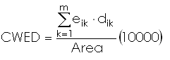

## DESCRIPTION

*r.li.cwed* (contrast weighted edge density) calculates the edge density
between patch types specified:



with:

- **k**: attribute
- **m**: number of non-null attributes in the sampling area
- **e_ik**: total
  length of edge in landscape between patch types i and k
- **d_ik**:
  dissimilarity (edge contrast weight) between patch types i and k
- **Area**: total landscape area

The input file contains a row for each couple of patch type that we want
to consider in the calculation. Each row must be saved using this
syntax:

```sh
patchType1,patchType2,dissimilarityBetweenPatchType1andPatchType2
```

## NOTES

Do not use absolute path names for the **config** and **output**
file/map parameters. If the "moving window" method was selected in
**g.gui.rlisetup**, then the output will be a raster map, otherwise an
ASCII file will be generated in the folder
`C:\Users\userxy\AppData\Roaming\GRASS8\r.li\output\` (MS-Windows) or
`$HOME/.grass8/r.li/output/` (GNU/Linux).

If the sample area contains only NULL values it is considered to have 0
patch and CWED=0. If Area is 0 *r.li.cwed* returns -1. This is only
possible if the map is masked.  
If you want to change these -1 values to NULL, run subsequently on the
resulting map:

```sh
r.null setnull=-1 input=my_map
```

after index calculation.

## EXAMPLES

To calculate the contrast weighted edge density index on map *my_map*,
using *my_conf* configuration file (previously defined with
*g.gui.rlisetup*) and saving results in *my_out*, run:

```sh
r.li.cwed input=my_map conf=my_conf output=my_out \
          path=/path/to/weights.csv
```

Example for input "weights.csv" file:

```sh
12,16,0.65
44,123,0.32
56,12,0.54
23,66,0.99
```

## SEE ALSO

*[r.li](r.li.md) (package overview),
[g.gui.rlisetup](g.gui.rlisetup.md)*

## REFERENCES

McGarigal, K., and B. J. Marks. 1995. FRAGSTATS: spatial pattern
analysis program for quantifying landscape structure. USDA For. Serv.
Gen. Tech. Rep. PNW-351. ([PDF](https://doi.org/10.2737/PNW-GTR-351))

## AUTHORS

Serena Pallecchi, student of Computer Science University of Pisa
(Italy).  
Commission from Faunalia Pontedera (PI), Italy (<www.faunalia.it>)  
Markus Metz
