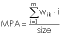

## DESCRIPTION

*r.li.mpa* (mean pixel attribute) calculates the average value of the
attribute of all the non-null cells in the sampling area as:  
  
with:  

- *i*: attribute
- *m*: number of non-null attributes in the sampling area
- *w_i*: number of cells of attribute *i*
- *size*: size of sampling area (in cells)

## NOTES

Do not use absolute path names for the **config** and **output**
file/map parameters. If the "moving window" method was selected in
**g.gui.rlisetup**, then the output will be a raster map, otherwise an
ASCII file will be generated in the folder
`C:\Users\userxy\AppData\Roaming\GRASS8\r.li\output\` (MS-Windows) or
`$HOME/.grass8/r.li/output/` (GNU/Linux).

If the input raster map contains only NULL values then *r.li.mpa*
considers to have 0 patches.  
If area is 0 *r.li.mpa* returns -1; it is possible only if the raster is
masked  
If you want to change these -1 values to NULL, run subsequently on the
resulting map:

```sh
r.null setnull=-1 input=my_map
```

after index calculation.

## EXAMPLES

To calculate the mean pixel attribute index on map *my_map*, using
*my_conf* configuration file (previously defined with *g.gui.rlisetup*)
and saving results in *my_out*, run:

```sh
r.li.mpa input=my_map conf=my_conf output=my_out
```

Forest map (Spearfish sample dataset) example:

```sh
g.region raster=landcover.30m -p
r.mapcalc "forests = if(landcover.30m >= 41 && landcover.30m <= 43,1,null())"
r.li.mpa input=forests conf=movwindow7 out=forests_mpa_mov7
r.univar forests_mpa_mov7
```

Forest map (North Carolina sample dataset) example:

```sh
g.region raster=landclass96 -p
r.mapcalc "forests = if(landclass96 == 5, 1, null() )"
r.li.mpa input=forests conf=movwindow7 out=forests_mpa_mov7

# verify
r.univar forests_mpa_mov7
r.to.vect input=forests output=forests type=area
d.mon wx0
d.rast forests_mpa_mov7
d.vect forests type=boundary
```

## SEE ALSO

*[r.li](r.li.md) (package overview),
[g.gui.rlisetup](g.gui.rlisetup.md)*

## REFERENCES

McGarigal, K., and B. J. Marks. 1995. FRAGSTATS: spatial pattern
analysis program for quantifying landscape structure. USDA For. Serv.
Gen. Tech. Rep. PNW-351. ([PDF](https://doi.org/10.2737/PNW-GTR-351))

## AUTHORS

Serena Pallecchi, student of Computer Science University of Pisa
(Italy).  
Commission from Faunalia Pontedera (PI), Italy (<www.faunalia.it>)  
Markus Metz
