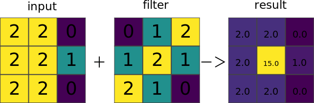
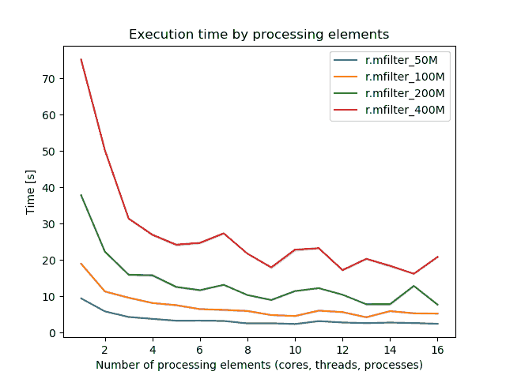
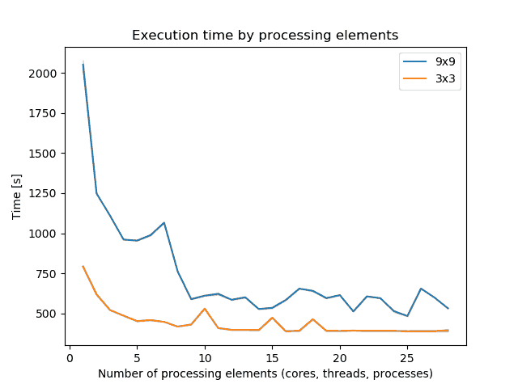

## DESCRIPTION

*r.mfilter* filters the raster *input* to produce the raster *output*
according to the matrix *filter* designed by the user (see *FILTERS*
below).

  
*Figure: Illustration for a custom 3x3 filter*

The filter is applied *repeat* times (default *value* is 1). The
*output* raster map layer can be given a *TITLE* if desired. (This TITLE
should be put in quotes if it contains more than one word.)

With **-z** flag the filter is applied only to null values in the input
raster map layer. The non-null category values are not changed. Note
that if there is more than one filter step, this rule is applied to the
intermediate raster map layer -- only null category values which result
from the first filter will be changed. In most cases this will NOT be
the desired result. Hence -z should be used only with single step
filters.

The **filter** parameter defines the name of an existing, user-created
UNIX ASCII file whose contents is a matrix defining the way in which the
*input* file will be filtered. The format of this file is described
below, under FILTERS.

The **repeat** parameter defines the number of times the *filter* is to
be applied to the *input* data.

### FILTERS

The *filter* file is a normal UNIX ASCII file designed by the user. It
has the following format:

```sh
     TITLE      TITLE
     MATRIX     n
                  .
     n lines of n values
                  .
     DIVISOR    d
     TYPE        S/P
```

TITLE  
A one-line TITLE for the filter. If a TITLE was not specified on the
command line, it can be specified here. This TITLE would be used to
construct a TITLE for the resulting raster map layer. It should be a
one-line description of the filter.

MATRIX  
The matrix (n x n) follows on the next n lines. *n* must be an odd
integer greater than or equal to 3. The matrix itself consists of n rows
of n values. The values must be separated from each other by at least 1
blank.

DIVISOR  
The filter divisor is *d*. If not specified, the default is 1. If the
divisor is zero (0), then the divisor is dependent on the category
values in the neighborhood (see HOW THE FILTER WORKS below).

TYPE  
The filter type. *S* means sequential, while *P* mean parallel. If not
specified, the default is S.

Sequential filtering happens in place. As the filter is applied to the
raster map layer, the category values that were changed in neighboring
cells affect the resulting category value of the current cell being
filtered.

Parallel filtering happens in such a way that the original raster map
layer category values are used to produce the new category value.

More than one filter may be specified in the filter file. The additional
filter(s) are described just like the first. For example, the following
describes two filters:

### EXAMPLE FILTER FILE

```sh
      TITLE     3x3 average, non-null data only, followed by 5x5 average
     MATRIX    3
     1 1 1
     1 1 1
     1 1 1
     DIVISOR   0
     TYPE      P

     MATRIX    5
     1 1 1 1 1
     1 1 1 1 1
     1 1 1 1 1
     1 1 1 1 1
     1 1 1 1 1
     DIVISOR   25
     TYPE      P
```

### HOW THE FILTER WORKS

The filter process produces a new category value for each cell in the
input raster map layer by multiplying the category values of the cells
in the n x n neighborhood around the center cell by the corresponding
matrix value and adding them together. If a divisor is specified, the
sum is divided by this divisor. (If a zero divisor was specified, then
the divisor is computed for each cell as the sum of the MATRIX values
where the corresponding input cell is non-null.)

If more than one filter step is specified, either because the repeat
value was greater than one or because the filter file contained more
than one matrix, these steps are performed sequentially. This means that
first one filter is applied to the entire input raster map layer to
produce an intermediate result; then the next filter is applied to the
intermediate result to produce another intermediate result; and so on,
until the final filter is applied. Then the output cell is written.

### PERFORMANCE

By specifying the number of parallel processes with **nprocs** option,
*r.mfilter* can run significantly faster, see benchmarks below.


  
*Figure: Benchmark on the left shows execution time for different number
of cells for 9x9 matrix, benchmark on the right shows execution time for
16 billion cells for different matrix sizes. (Intel Core i9-10940X CPU @
3.30GHz x 28)*

Note that parallelization is implemented only for the parallel filter,
not the sequential one. To take advantage of the parallelization, GRASS
GIS needs to compiled with OpenMP enabled.

## NOTES

If the resolution of the geographic region does not agree with the
resolution of the raster map layer, unintended resampling of the
original data may occur. The user should be sure that the geographic
region is set properly.

## SEE ALSO

*[g.region](g.region.md), [r.clump](r.clump.md),
[r.neighbors](r.neighbors.md), [r.resamp.filter](r.resamp.filter.md),  
[Raster Parallelization with
OpenMP](https://grasswiki.osgeo.org/wiki/Raster_Parallelization_with_OpenMP)*

## AUTHORS

Glynn Clements. Based upon r.mfilter, by Michael Shapiro, U.S.Army
Construction Engineering Research Laboratory.  
Aaron Saw Min Sern (OpenMP support).
