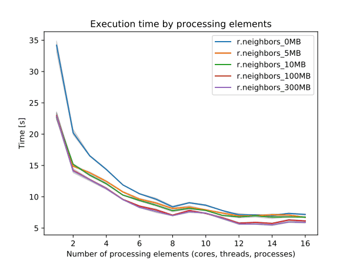

## DESCRIPTION

***r.neighbors*** looks at each cell in a raster input map, and examines
the values assigned to the cells in some user-defined "neighborhood"
around it. It outputs a new raster map layer in which each cell is
assigned a value that is some (user-specified) function of the values in
that cell's neighborhood. For example, each cell in the output layer
might be assigned a value equal to the average of the values appearing
in its 3 x 3 cell "neighborhood" in the input layer. Note that the
centre cell is also included in the calculation.

  
*Figure: Illustration for an 3x3 average neighborhood*

### OPTIONS

The user must specify the names of the raster map layers to be used for
**input** and **output**, the **method** used to analyze neighborhood
values (i.e., the neighborhood function or operation to be performed),
and the **size** of the neighborhood.

The user can optionally specify a **selection** map, to compute new
values only where the raster cells of the selection map are not NULL. In
case of a NULL cells, the values from the input map are copied into the
output map. This may useful to smooth only parts of an elevation map
(pits, peaks, ...).

*Example how to use a selection map with method=average:*  
input map:

```sh
1 1  1 1 1
1 1  1 1 1
1 1 10 1 1
1 1  1 1 1
1 1  1 1 1
```

selection map, NULL values are marked as \*:

```sh
* * * * *
* * 1 * *
* 1 1 1 *
* * 1 * *
* * * * *
```

The output map:

```sh
1 1 1 1 1
1 1 2 1 1
1 2 2 2 1
1 1 2 1 1
1 1 1 1 1
```

Without using the selection map, the output map would look like this:

```sh
1 1 1 1 1
1 2 2 2 1
1 2 2 2 1
1 2 2 2 1
1 1 1 1 1
```

It is also possible to weigh cells within the neighborhood. This can be
either done with a custom weights matrix or by specifying a weighting
function.

In order to use a custom weights matrix, *file* needs to be specified as
a **weighting_function** and a path to a text file containing the
weights needs to be given in the **weight** option.

Alternatively, *gaussian* and *exponential* weighting functions can be
selected as weighting function.

For the *gaussian* weighting function, the user specifies the sigma
value (σ) for the gauss filter in the **weighting_factor** option. The
sigma value represents the standard deviation of the gaussian
distribution, where the weighting formula for the gaussian filter is
defined as follows:

exp(-(x\*x+y\*y)/(2\*σ^2))/(2\*π\*σ^2)

Lower values for sigma result in a steeper curve, so that more weight is
put on cells close to the center of the moving window with a steeper
decrease in weights with distance from the center.

For the *exponential* weighting function, the user specifies a factor
for an exponential kernel in the **weighting_factor**. Negative factors
result in negative exponential decrease in weights from the center cell.
The weighting formula for the exponential kernel is defined as follows:

exp(factor\*sqrt(x\*x+y\*y))

Stronger negative values for the factor result in a steeper curve, so
that more weight is put on cells close to the center of the moving
window with a steeper decrease in weights with distance from the center.

Optionally, the user can also run ***r.neighbors*** specify the
**TITLE** to be assigned to the raster map layer **output**, select to
not align the resolution of the output with that of the input (the
**-a** option). These options are described further below.

*Neighborhood Operation Methods:* The **neighborhood** operators
determine what new value a center cell in a neighborhood will have after
examining values inside its neighboring cells. Each cell in a raster map
layer becomes the center cell of a neighborhood as the neighborhood
window moves from cell to cell throughout the map layer.
***r.neighbors*** can perform the following operations:

**average**  
The average value within the neighborhood. In the following example, the
result would be:  
(7\*4 + 6 + 5 + 4\*3)/9 = 5.6667  
The result is rounded to the nearest integer (in this case 6).

```sh
   Raw Data     Operation     New Data
   +---+---+---+          +---+---+---+
   | 7 | 7 | 5 |          |   |   |   |
   +---+---+---+ average  +---+---+---+
   | 4 | 7 | 4 |--------->|   | 6 |   |
   +---+---+---+          +---+---+---+
   | 7 | 6 | 4 |          |   |   |   |
   +---+---+---+          +---+---+---+
```

**median**  
The value found half-way through a list of the neighborhood's values,
when these are ranged in numerical order.

**mode**  
The most frequently occurring value in the neighborhood.

**minimum**  
The minimum value within the neighborhood.

**maximum**  
The maximum value within the neighborhood.

**range**  
The range value within the neighborhood.

**stddev**  
The statistical standard deviation of values within the neighborhood
(rounded to the nearest integer).

**sum**  
The sum of values within the neighborhood.

**count**  
The count of filled (not NULL) cells.

**variance**  
The statistical variance of values within the neighborhood (rounded to
the nearest integer).

**diversity**  
The number of different values within the neighborhood. In the above
example, the diversity is 4.

**interspersion**  
The percentage of cells containing values which differ from the values
assigned to the center cell in the neighborhood, plus 1. In the above
example, the interspersion is:  
5/8 \* 100 + 1 = 63.5  
The result is rounded to the nearest integer (in this case 64).

**quart1, quart3**  
The result will be the first or the third quartile (equal of 25th and
75th percentiles).

**perc90**  
The result will be the 90th percentile of neighborhood.

**quantile**  
Any quantile as specified by "quantile" input parameter.

*Neighborhood Size:* The neighborhood **size** specifies which cells
surrounding any given cell fall into the neighborhood for that cell. The
**size** must be an odd integer and represent the length of one of
moving window edges in cells. For example, a size value of 3 will result
in

```sh
                              _ _ _
                             |_|_|_|
    3 x 3 neighborhood --->  |_|_|_|
                             |_|_|_|

```

*Matrix weights:* A custom matrix can be used if none of the
neighborhood operation methods are desirable by using the **weight**.
This option must be used in conjunction with the **size** option to
specify the matrix size and *file* needs to be specified as
**weighting_function**. The weights desired are to be entered into a
text file. For example, to calculate the focal mean with a matrix
**size** of 3,

```sh
r.neigbors in=input.map out=output.map size=3 weighting_function=file \
weight=weights.txt
```

The contents of the weight.txt file:

```sh
3 3 3
1 4 8
9 5 3
```

This corresponds to the following 3x3 matrix:

```sh
+-+-+-+
|3|3|3|
+-+-+-+
|1|4|8|
+-+-+-+
|9|5|3|
+-+-+-+
```

To calculate an annulus shaped neighborhood the contents of weight.txt
file may be e.g. for size=5:

```sh
 0 1 1 1 0
 1 0 0 0 1
 1 0 0 0 1
 1 0 0 0 1
 0 1 1 1 0
```

The way that weights are used depends upon the specific aggregate
(**method**) being used. However, most of the aggregates have the
property that multiplying all of the weights by the same factor won't
change the final result (an exception is **method=count**). Also, most
(if not all) of them have the properties that an integer weight of N is
equivalent to N occurrences of the cell value, and having all weights
equal to one produces the same result as when weights are not used. When
weights are used, the calculation for **method=average** is:

```sh
  sum(w[i]*x[i]) / sum(w[i])
```

In the case where all weights are zero, this will end up with both the
numerator and denominator to zero, which produces a NULL result.

### FLAGS

**-a**  
If specified, ***r.neighbors*** will not align the output raster map
layer with that of the input raster map layer. The ***r.neighbors***
program works in the current geographic region. It is recommended, but
not required, that the resolution of the geographic region be the same
as that of the raster map layer. By default, if unspecified,
***r.neighbors*** will align these geographic region settings.

**-c**  
This flag will use a circular neighborhood for the moving analysis
window, centered on the current cell.

The exact masks for the first few neighborhood sizes are as follows:

```sh
3x3     . X .        5x5    . . X . .    7x7    . . . X . . .
        X O X               . X X X .           . X X X X X .
        . X .               X X O X X           . X X X X X .
                            . X X X .           X X X O X X X
                            . . X . .           . X X X X X .
                                                . X X X X X .
                                                . . . X . . .


9x9    . . . . X . . . .        11x11   . . . . . X . . . . .
       . . X X X X X . .                . . X X X X X X X . .
       . X X X X X X X .                . X X X X X X X X X .
       . X X X X X X X .                . X X X X X X X X X .
       X X X X O X X X X                . X X X X X X X X X .
       . X X X X X X X .                X X X X X O X X X X X
       . X X X X X X X .                . X X X X X X X X X .
       . . X X X X X . .                . X X X X X X X X X .
       . . . . X . . . .                . X X X X X X X X X .
                                        . . X X X X X X X . .
                                        . . . . . X . . . . .
```

## NOTES

The ***r.neighbors*** program works in the current geographic region
with the current mask, if any. It is recommended, but not required, that
the resolution of the geographic region be the same as that of the
raster map layer. By default, ***r.neighbors*** will align these
geographic region settings. However, the user can select to keep
original input and output resolutions which are not aligned by
specifying this (e.g., using the **-a** option).

***r.neighbors*** doesn't propagate NULLs, but computes the aggregate
over the non-NULL cells in the neighborhood.

The **-c** flag and the **weights** parameter are mutually exclusive.
Any use of the two together will produce an error. Differently-shaped
neighborhood analysis windows may be achieved by using the **weight=**
parameter to specify a weights file where all values are equal. The user
can also vary the weights at the edge of the neighborhood according to
the proportion of the cell that lies inside the neighborhood circle,
effectively anti-aliasing the analysis mask.

For aggregates where a weighted calculation isn't meaningful
(specifically: minimum, maximum, diversity and interspersion), the
weights are used to create a binary mask, where zero causes the cell to
be ignored and any non-zero value causes the cell to be used.

***r.neighbors*** copies the GRASS *color* files associated with the
input raster map layer for those output map layers that are based on the
neighborhood average, median, mode, minimum, and maximum. Because
standard deviation, variance, diversity, and interspersion are indices,
rather than direct correspondents to input values, no *color* files are
copied for these map layers. (The user should note that although the
*color* file is copied for *average* neighborhood function output,
whether or not the color file makes sense for the output will be
dependent on the input data values.)

### Propagation of output precision

The following logic has been implemented: For any aggregate, there are
two factors affecting the output type:

1. Whether the input map is integer or floating-point.
2. Whether the weighted or unweighted version of the aggregate is used.

These combine to create four possibilities:

| input type/weight | integer |         | float   |         |
|-------------------|---------|---------|---------|---------|
| no                | yes     | no      | yes     |         |
| average           | float   | float   | float   | float   |
| median            | \[1\]   | \[1\]   | float   | float   |
| mode              | integer | integer | \[2\]   | \[2\]   |
| minimum           | integer | integer | float   | float   |
| maximum           | integer | integer | float   | float   |
| range             | integer | integer | float   | float   |
| stddev            | float   | float   | float   | float   |
| sum               | integer | float   | float   | float   |
| count             | integer | float   | integer | float   |
| variance          | float   | float   | float   | float   |
| diversity         | integer | integer | integer | integer |
| interspersion     | integer | integer | integer | integer |
| quart1            | \[1\]   | \[1\]   | float   | float   |
| quart3            | \[1\]   | \[1\]   | float   | float   |
| perc90            | \[1\]   | \[1\]   | float   | float   |
| quantile          | \[1\]   | \[1\]   | float   | float   |

\[1\] For integer input, quantiles may produce float results from
interpolating between adjacent values.  
\[2\] Calculating the mode of floating-point data is essentially
meaningless.

With the current aggregates, there are 5 cases:

1. Output is always float: average, variance, stddev, quantiles (with
    interpolation).
2. Output is always integer: diversity, interspersion.
3. Output is integer if unweighted, float if weighted: count.
4. Output matches input: minimum, maximum, range, mode (subject to note
    2 above), quantiles (without interpolation).
5. Output is integer for integer input and unweighted aggregate,
    otherwise float: sum.

### Performance

To enable parallel processing, the user can specify the number of
threads to be used with the **nprocs** parameter (default 1). The
**memory** parameter (default 300) can also be provided to determine the
size of the buffer for computation.


  
*Figure: Benchmark on the left shows execution time for different number
of cells, benchmark in the middle shows execution time for different
sizes of neighborhood for a 10000x10000 raster and benchmark on the
right shows execution time for different memory size for a 10000x10000
raster. See benchmark scripts in source code. (Intel Core i9-10940X CPU
@ 3.30GHz x 28)*

To reduce the memory requirements to minimum, set option **memory** to
zero. To take advantage of the parallelization, GRASS GIS needs to be
compiled with OpenMP enabled.

## EXAMPLES

### Measure occupancy of neighborhood

Set up 10x10 computational region to aid visual inspection of results

```sh
g.region rows=10 cols=10
```

Fill 50% of computational region with randomly located cells.
"distance=0" will allow filling adjacent cells.

```sh
r.random.cells output=random_cells distance=0 ncells=50
```

Count non-empty (not NULL) cells in 3x3 neighborhood

```sh
r.neighbors input=random_cells output=counts method=count
```

Optionally - exclude centre cell from the count (= only look around)

```sh
r.mapcalc "count_around = if( isnull(random_cells), counts, counts - 1)"
```

## SEE ALSO

*[g.region](g.region.md), [r.clump](r.clump.md),
[r.mapcalc](r.mapcalc.md), [r.mfilter](r.mfilter.md),
[r.statistics](r.statistics.md), [r.support](r.support.md)*

## AUTHORS

Original version: Michael Shapiro, U.S.Army Construction Engineering
Research Laboratory  
Updates for GRASS GIS 7 by Glynn Clements and others
