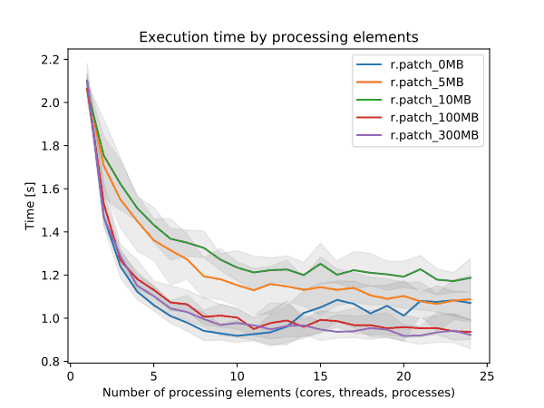

## DESCRIPTION

The GRASS program *r.patch* allows the user to build a new raster map
the size and resolution of the current region by assigning known data
values from input raster maps to the cells in this region.  
In case of overlapping input raster maps this is done by filling in "no
data" cells, those that do not yet contain data, contain NULL data, or,
optionally contain 0 data, with the data from the first input map. Once
this is done the remaining holes are filled in by the next input map,
and so on.  
In case of adjacent input raster maps the output map contains the map
mosaic.

Hence this command is useful for

- making a composite raster map layer from two or more adjacent map
  layers,
- for filling in "holes" in a raster map layer's data (e.g., in digital
  elevation data), or
- for updating an older map layer with more recent data.

The current geographic region definition and mask settings are
respected.

  
*Figure: Result of patching of two raster maps containing NULLs using
the default settings.*

### Stacking order

The first *name* listed in the string **input**=*name*,*name*,*name*,...
is the name of the first map whose data values will be used to fill in
cells in the current region. Then, the second through the last input
maps (..., *name*, *name*, ...) will be used, in order, to supply data
values for the remaining "no data" cells (or cells with value 0 with
**-z** flag).

In other words, the first raster map is used first and if it had some
"no data" cells, then second raster map is used for these cells, then
the third and so on. So the formal command line syntax can be also
written as **input**=*primary*,*secondary*,*tertiary*,... For two raster
maps, the first one can be viewed as the primary one or the default one
and the second one as the secondary one or a fallback.

  
*Figure: Result of patching of two raster maps using the **-z** flag to
treat zeros as NULLs. Note the value 1 being preserved from the first
raster while the value 6 is taken from the second raster instead of the
value 0 from the first raster because zeros are replaced with the **-z**
flag active.*

### Relation to SQL COALESCE() function

The module is corresponds to the SQL COALESCE() function. This function
takes two or more arguments and returns a copy of its first non-NULL
argument. If all arguments are NULL, the function returns NULL.

The *r.patch* module iterates over all cells and for each cell of the
output raster map uses the first corresponding non-NULL cell in the
series of the input raster maps.

### Example of filling areas

Below, the raster map layer on the far left is **patched** with the
middle (*patching*) raster map layer, to produce the *composite* raster
map layer on the right. The example assumes zero values to be treated as
NULLs (**-z** flag).

```sh
  1 1 1 0 2 2 0 0    0 0 1 1 0 0 0 0    1 1 1 1 2 2 0 0
  1 1 0 2 2 2 0 0    0 0 1 1 0 0 0 0    1 1 1 2 2 2 0 0
  3 3 3 3 2 2 0 0    0 0 0 0 0 0 0 0    3 3 3 3 2 2 0 0
  3 3 3 3 0 0 0 0    4 4 4 4 4 4 4 4    3 3 3 3 4 4 4 4
  3 3 3 0 0 0 0 0    4 4 4 4 4 4 4 4    3 3 3 4 4 4 4 4
  0 0 0 0 0 0 0 0    4 4 4 4 4 4 4 4    4 4 4 4 4 4 4 4
```

Switching the *patched* and the *patching* raster map layers produces
the following results:

```sh
  0 0 1 1 0 0 0 0    1 1 1 0 2 2 0 0    1 1 1 1 2 2 0 0
  0 0 1 1 0 0 0 0    1 1 0 2 2 2 0 0    1 1 1 1 2 2 0 0
  0 0 0 0 0 0 0 0    3 3 3 3 2 2 0 0    3 3 3 3 2 2 0 0
  4 4 4 4 4 4 4 4    3 3 3 3 0 0 0 0    4 4 4 4 4 4 4 4
  4 4 4 4 4 4 4 4    3 3 3 0 0 0 0 0    4 4 4 4 4 4 4 4
  4 4 4 4 4 4 4 4    0 0 0 0 0 0 0 0    4 4 4 4 4 4 4 4
```

## NOTES

Frequently, this program is used to patch together adjacent map layers
which have been digitized separately. The program
*[v.mkgrid](v.mkgrid.md)* can be used to make adjacent maps align
neatly.

The user should check the current geographic region settings before
running *r.patch*, to ensure that the region boundaries encompass all of
the data desired to be included in the composite map and to ensure that
the region resolution is the resolution of the desired data. To set the
geographic region settings to one or several raster maps, the *g.region*
program can be used:

```sh
g.region raster=map1[,map2[,...]]
```

Use of *r.patch* is generally followed by use of the GRASS programs
*[g.remove](g.remove.md)* and *[g.rename](g.rename.md)*; *g.remove* is
used to remove the original (un-patched) raster map layers, while
*g.rename* is used to then assign to the newly-created composite
(patched) raster map layer the name of the original raster map layer.

*r.patch* reads the existing category label files and color tables from
the *input* maps and creates these files for the patched, composite
*output* map. This can be quite time consuming for certain maps,
especially if there are many different category values across the
patched maps. The *-s* flag allows disabling the reading and creation of
these support files, meaning that the *output* map will have no category
labels and no explicit color table.

Number of raster maps to be processed is given by the limit of the
operating system. For example, both the hard and soft limits are
typically 1024. The soft limit can be changed with e.g. `ulimit -n 1500`
(UNIX-based operating systems) but not higher than the hard limit. If it
is too low, you can as superuser add an entry in

```sh
/etc/security/limits.conf
# <domain>      <type>  <item>         <value>
your_username  hard    nofile          1500
```

This would raise the hard limit to 1500 file. Be warned that more files
open need more RAM. See also the Wiki page [Hints for large raster data
processing](https://grasswiki.osgeo.org/wiki/Large_raster_data_processing).

Operating systems usually limit the length of the command line which
limits the number of input raster maps user can pass to the module using
the option **input**. In that case, *[r.series](r.series.md)* can be
used instead of *r.patch*.

### PERFORMANCE

By specifying the number of parallel processes with **nprocs** option,
*r.patch* can run significantly faster, see benchmarks below.


  
*Figure: Benchmark on the left shows execution time for different number
of cells, benchmark on the right shows execution time for different
memory size for 5000x5000 raster. See benchmark scripts in source code.
(Intel Core i9-10940X CPU @ 3.30GHz x 28)*

To reduce the memory requirements to minimum, set option **memory** to
zero. To take advantage of the parallelization, GRASS GIS needs to
compiled with OpenMP enabled.

## EXAMPLES

### Example with three maps

The input are three maps called roads, water and forest. Primarily, we
want to use the values from roads, then from water and if no other
values are available we want to use forest. First we set the computation
region assuming that the all three maps fully overlap and have the same
resolution (so we can safely use the just the one without further
modifications of the region). Then we perform the patching.

```sh
g.region raster=roads
r.patch input=roads,water,forest output=result
```

### Map mosaic example using Bash syntax

Create a list of maps matching a pattern, extend the region to include
them all, and patch them together to create a mosaic. Overlapping maps
will be used in the order listed.

```sh
MAPS=`g.list type=raster separator=comma pat="map_*"`
g.region raster=$MAPS -p
r.patch input=$MAPS output=maps_mosaic
```

## SEE ALSO

*[g.region](g.region.md), [g.remove](g.remove.md),
[g.rename](g.rename.md), [r.mapcalc](r.mapcalc.md),
[r.support](r.support.md), [r.series](r.series.md),
[v.mkgrid](v.mkgrid.md)*

[Hints for large raster data
processing](https://grasswiki.osgeo.org/wiki/Large_raster_data_processing)

## AUTHORS

Michael Shapiro, U.S. Army Construction Engineering Research
Laboratory  
Huidae Cho (-z flag and performance improvement)  
Aaron Saw Min Sern (OpenMP support).
