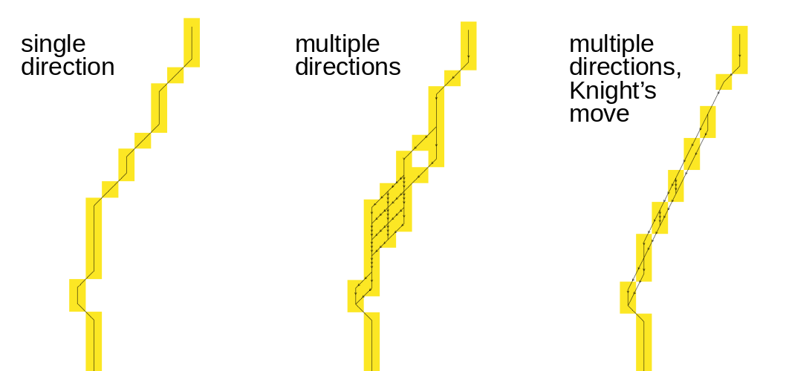

## DESCRIPTION

*r.path* traces a path from starting points following input directions.
Such a movement direction map can be generated with
*[r.walk](r.walk.html)*, *[r.cost](r.cost.html)*,
*[r.slope.aspect](r.slope.aspect.html)*,
*[r.watershed](r.watershed.html)*, or *[r.fill.dir](r.fill.dir.html)*,
provided that the direction is in degrees, measured counterclockwise
from east.

Alternatively, bitmask-encoded directions can be provided where each bit
position corresponds to a specific neighbour. A path will continue to
all neighbours with their bit set. This means a path can split and
merge. Such bitmasked directions can be created with the **-b** flag of
*[r.cost](r.cost.html)* and *[r.walk](r.walk.html)*.

::: code
    Direction encoding for neighbors of x

      135  90  45          7 8 1
      180  x  360          6 x 2
      225 270 315          5 4 3

      degrees           bit positions
      CCW from East
:::

A path stops when the direction is zero or negative, indicating a stop
point or outlet.

The **output** raster map will show one or more least-cost paths between
each user-provided location(s) and the target points (direction ≤ 0). By
default, the **output** will be an integer CELL map with the id of the
start points along the least cost path, and null cells elsewhere.

With the **-c** (*copy*) flag, the values raster map cell values are
copied verbatim along the path. With the **-a** (*accumulate*) flag, the
accumulated cell value from the starting point up to the current cell is
written on output. With either the **-c** or the **-a** flags, the
**raster_path** map is created with the same cell type as the **values**
raster map (integer, float or double). With the **-n** (*number*) flag,
the cells are numbered consecutively from the starting point to the
final point. The **-c**, **-a**, and **-n** flags are mutually
incompatible.

The **start_coordinates** parameter consists of map E and N grid
coordinates of a starting point. Each x,y pair is the easting and
northing (respectively) of a starting point from which a path will be
traced following **input** directions. The **start_points** parameter
can take multiple vector maps containing additional starting points.

## NOTES

The directions are recorded as degrees CCW from East, the Knight\'s move
of r.cost and r.walk is considered:

::: code
           112.5     67.5
    157.5  135   90  45   22.5
           180   x   0
    202.5  225  270  315  337.5
           247.5     292.5
:::

i.e. a cell with the value 135 means the next cell is to the North-West,
and a cell with the value 157.5 means that the next cell is to the
West-North-West.

## EXAMPLES

### Hydrological path

We are using the full North Carolina sample dataset. First we create the
two points from a text file using *[v.in.ascii](v.in.ascii.html)* module
(here the text file is CSV and we are using unix here-file syntax with
EOF, in GUI just enter the values directly for the parameter input):

::: code
    v.in.ascii input=- output=start format=point separator=comma <<EOF
    638667.15686275,220610.29411765
    638610.78431373,220223.03921569
    EOF
:::

We need to supply a direction raster map to the *r.path* module. To get
these directions, we use the *[r.watershed](r.watershed.html)* module:

::: code
    r.watershed elevation=elev_lid792_1m accumulation=accum drainage=drain_dir
:::

The directions are categorical and we convert them to degrees using
raster algebra:

::: code
    r.mapcalc "drain_deg = if(drain_dir != 0, 45. * abs(drain_dir), null())"
:::

Now we are ready to extract the drainage paths starting at the two
points.

::: code
    r.path input=drain_deg raster_path=drain_path vector_path=drain_path start_points=start
:::

Before we visualize the result, we set a color table for the elevation
we are using and create a shaded relief map:

::: code
    r.colors map=elev_lid792_1m color=elevation
    r.relief input=elev_lid792_1m output=relief
:::

We visualize the input and output data:

::: code
    d.shade shade=relief color=elev_lid792_1m
    d.vect map=drain_path color=0:0:61 width=4 legend_label="drainage paths"
    d.vect map=start color=none fill_color=224:0:0 icon=basic/circle size=15 legend_label=origins
    d.legend.vect -b
:::

::: {align="center"}
[{width="300"
height="280"}](r_path_with_r_watershed_direction.png)\
*Figure: Drainage paths from two points where directions from
r.watershed were used*
:::

### Least-cost path

We compute bitmask encoded movement directions using *r.walk:*

::: code
    g.region swwake_30m -p

    # create friction map based on land cover
    r.recode input=landclass96 output=friction rules=- << EOF
    1:3:0.1:0.1
    4:5:10.:10.
    6:6:1000.0:1000.0
    7:7:0.3:0.3
    EOF

    # without Knight's move
    r.walk -b elevation=elev_ned_30m friction=friction output=walkcost \
        outdir=walkdir start_coordinates=635576,216485

    r.path input=walkdir start_coordinates=640206,222795 \
        raster_path=walkpath vector_path=walkpath

    # with Knight's move
    r.walk -b -k elevation=elev_ned_30m friction=friction output=walkcost_k \
        outdir=walkdir_k start_coordinates=635576,216485

    r.path input=walkdir_k start_coordinates=640206,222795 \
        raster_path=walkpath_k vector_path=walkpath_k

    # without Knight's move and without bitmask encoding (single direction)
    r.walk elevation=elev_ned_30m friction=friction output=walkcost_s \
        outdir=walkdir_s start_coordinates=635576,216485

    r.path input=walkdir_s start_coordinates=640206,222795 \
        raster_path=walkpath_s vector_path=walkpath_s
:::

The extracted least-cost path splits and merges on the way from the
start point to the stop point (start point for r.walk). Note the gaps in
the raster path when using the Knight\'s move.

::: code
:::

::: {align="center"}
[{width="600"
height="274"}](r_path_with_bitmask.png)\
*Figure: Comparison of shortest paths using single directions and
multiple bitmask encoded directions without and with Knight\'s move*
:::

## SEE ALSO

*[g.region](g.region.html), [r.basins.fill](r.basins.fill.html),
[r.cost](r.cost.html), [r.fill.dir](r.fill.dir.html),
[r.mapcalc](r.mapcalc.html), [r.recode](r.recode.html),
[r.terraflow](r.terraflow.html), [r.walk](r.walk.html),
[r.watershed](r.watershed.html)*

## AUTHOR

Markus Metz\
Multiple path directions sponsored by
[mundialis](https://www.mundialis.de)
