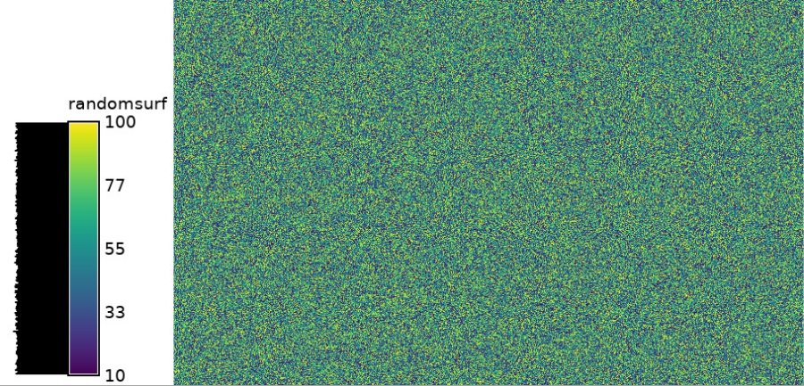
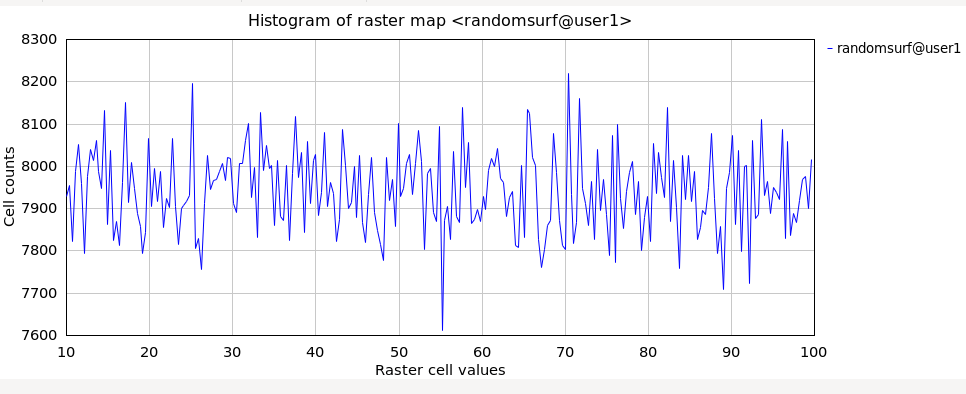

## DESCRIPTION

*r.random.surface* generates a spatially dependent random surface. The
random surface is composed of values representing the deviation from the
mean of the initial random values driving the algorithm. The initial
random values are independent Gaussian random deviates with a mean of 0
and standard deviation of 1. The initial values are spread over each
output map using filter(s) of diameter distance. The influence of each
random value on nearby cells is determined by a distance decay function
based on exponent. If multiple filters are passed over the output maps,
each filter is given a weight based on the weight inputs. The resulting
random surface can have *any* mean and variance, but the theoretical
mean of an infinitely large map is 0.0 and a variance of 1.0.
Description of the algorithm is in the **NOTES** section.

The random surface generated are composed of floating point numbers, and
saved in the category description files of the output map(s). Cell
values are uniformly or normally distributed between 1 and high values
inclusive (determined by whether the **-u** flag is used). The category
names indicate the average floating point value and the range of
floating point values that each cell value represents.

*r.random.surface's* original goal is to generate random fields for
spatial error modeling. A procedure to use *r.random.surface* in spatial
error modeling is given in the **NOTES** section.

### Detailed parameter description

**output**  
Random surface(s). The cell values are a random distribution between the
low and high values inclusive. The category values of the output map(s)
are in the form *\#.# \#.# to \#.#* where each \#.# is a floating point
number. The first number is the average of the random values the cell
value represents. The other two numbers are the range of random values
for that cell value. The *average* mean value of generated `output`
map(s) is 0. The *average* variance of map(s) generated is 1. The random
values represent the standard deviation from the mean of that random
surface.

**distance**  
Distance determines the spatial dependence of the output map(s). The
distance value indicates the minimum distance at which two map cells
have no relationship to each other. A distance value of 0.0 indicates
that there is no spatial dependence (i.e., adjacent cell values have no
relationship to each other). As the distance value increases, adjacent
cell values will have values closer to each other. But the range and
distribution of cell values over the output map(s) will remain the same.
Visually, the clumps of lower and higher values gets larger as distance
increases. If multiple values are given, each output map will have
multiple filters, one for each set of distance, exponent, and weight
values.

**exponent**  
Exponent determines the distance decay exponent for a particular filter.
The exponent value(s) have the property of determining the *texture* of
the random surface. Texture will decrease as the exponent value(s) get
closer to 1.0. Normally, exponent will be 1.0 or less. If there are no
exponent values given, each filter will be given an exponent value of
1.0. If there is at least one exponent value given, there must be one
exponent value for each distance value.

**flat**  
Flat determines the distance at which the filter.

**weight**  
Weight determines the relative importance of each filter. For example,
if there were two filters driving the algorithm and weight=1.0, 2.0 was
given in the command line: The second filter would be twice as important
as the first filter. If no weight values are given, each filter will be
just as important as the other filters defining the random field. If
weight values exist, there must be a weight value for each filter of the
random field.

**high**  
Specifies the high end of the range of cell values in the output map(s).
Specifying a very large high value will minimize the *errors* caused by
the random surface's discretization. The word errors is in quotes
because errors in discretization are often going to cancel each other
out and the spatial statistics are far more sensitive to the initial
independent random deviates than any potential discretization errors.

**seed**  
Specifies the random seed(s), one for each map, that *r.random.surface*
will use to generate the initial set of random values that the resulting
map is based on. If the random seed is not given, *r.random.surface*
will get a seed from the process ID number.

## NOTES

While most literature uses the term random field instead of random
surface, this algorithm always generates a surface. Thus, its use of
random surface.

*r.random.surface* builds the random surface using a filter algorithm
smoothing a map of independent random deviates. The size of the filter
is determined by the largest distance of spatial dependence. The shape
of the filter is determined by the distance decay exponent(s), and the
various weights if different sets of spatial parameters are used. The
map of independent random deviates will be as large as the current
region PLUS the extent of the filter. This will eliminate edge effects
caused by the reduction of degrees of freedom. The map of independent
random deviates will ignore the current mask for the same reason.

One of the most important uses for *r.random.surface* is to determine
how the error inherent in raster maps might effect the analyses done
with those maps.

## EXAMPLE

Generate a random surface (using extent of North Carolina sample
dataset):

```sh
g.region raster=elevation res=100 -p
r.surf.random output=randomsurf min=10 max=100

# verify distribution
r.univar -e map=randomsurf
```

  
*Figure: Random surface example (min: 10; max: 100)*

With the histogram tool the cell values versus count can be shown.

  
*Figure: Histogram of random surface example (min: 10; max: 100)*

## REFERENCES

Random Field Software for GRASS by Chuck Ehlschlaeger

As part of my dissertation, I put together several programs that help
GRASS (4.1 and beyond) develop uncertainty models of spatial data. I
hope you find it useful and dependable. The following papers might
clarify their use:

- Ehlschlaeger, C.R., Shortridge, A.M., Goodchild, M.F., 1997.
  Visualizing spatial data uncertainty using animation. Computers &
  Geosciences 23, 387-395.
  doi:[10.1016/S0098-3004(97)00005-8](https://doi.org/10.1016/S0098-3004(97)00005-8)
- Ehlschlaeger, C.R., Shortridge, A.M., 1996. [Modeling Uncertainty in
  Elevation Data for Geographical
  Analysis](http://www.geo.hunter.cuny.edu/~chuck/paper.html).
  Proceedings of the 7th International Symposium on Spatial Data
  Handling, Delft, Netherlands, August 1996.
- Ehlschlaeger, C.R., Goodchild, M.F., 1994. [Dealing with Uncertainty
  in Categorical Coverage Maps: Defining, Visualizing, and Managing Data
  Errors](http://www.geo.hunter.cuny.edu/~chuck/acm/paper.html).
  Proceedings, Workshop on Geographic Information Systems at the
  Conference on Information and Knowledge Management, Gaithersburg MD,
  1994.
- Ehlschlaeger, C.R., Goodchild, M.F., 1994. [Uncertainty in Spatial
  Data: Defining, Visualizing, and Managing Data
  Errors](http://www.geo.hunter.cuny.edu/~chuck/gislis/gislis.html).
  Proceedings, GIS/LIS'94, pp. 246-253, Phoenix AZ, 1994.

## SEE ALSO

*[r.random](r.random.md), [r.random.cells](r.random.cells.md),
[r.mapcalc](r.mapcalc.md), [r.surf.random](r.surf.random.md)*

## AUTHORS

Charles Ehlschlaeger, Michael Goodchild, and Chih-chang Lin; National
Center for Geographic Information and Analysis, University of
California, Santa Barbara
