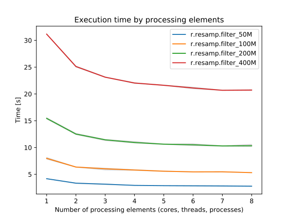

## DESCRIPTION

*r.resamp.filter* resamples an input raster, filtering the input with an
analytic kernel. Each output cell is typically calculated based upon a
small subset of the input cells, not the entire input. *r.resamp.filter*
performs convolution (i.e. a weighted sum is calculated for every raster
cell).

The radii must be given in map units. In order to consider more than one
input cell, at least one finite radius must be larger than half the
resolution of the input map, otherwise the selected kernels will have no
effect.

The module maps the input range to the width of the window function, so
wider windows will be "sharper" (have a higher cut-off frequency), e.g.
lanczos3 will be sharper than lanczos2.

*r.resamp.filter* implements FIR (finite impulse response) filtering.
All of the functions are low-pass filters, as they are symmetric. See
[Wikipedia: Window
function](https://en.wikipedia.org/wiki/Window_function) for examples of
common window functions and their frequency responses.

A piecewise-continuous function defined by sampled data can be
considered a mixture (sum) of the underlying signal and quantisation
noise. The intent of a low pass filter is to discard the quantisation
noise while retaining the signal. The cut-off frequency is normally
chosen according to the sampling frequency, as the quantisation noise is
dominated by the sampling frequency and its harmonics. In general, the
cut-off frequency is inversely proportional to the width of the central
"lobe" of the window function.

When using *r.resamp.filter* with a specific radius, a specific cut-off
frequency regardless of the method is chosen. So while lanczos3 uses 3
times as large a window as lanczos1, the cut-off frequency remains the
same. Effectively, the radius is "normalised".

All of the kernels specified by the **filter** parameter are multiplied
together. Typical usage will use either a single finitie window or an
infinite kernel along with a finite window.

### Usage hints

To smooth a map, keeping its resolution, a good starting point is to use
the filters **gauss,box** with the radii *0.5 \* input resolution*, *2
\* input resolution*. See also [r.neighbors](r.neighbors.md)

When resampling a map to a higher resolution (alternative to
interpolation, e.g. [r.resamp.interp](r.resamp.interp.md)), a good
starting point is to use the filters **gauss,box** with the radii *1.5
\* input resolution*, *3 \* input resolution*.

When resampling a map to a lower resolution (alternative to aggregation,
e.g. [r.resamp.stats](r.resamp.stats.md)), a good starting point is to
use the filters **gauss,box** with the radii *0.25 \* output
resolution*, *1 \* output resolution*.

These are recommendations for initial settings. The selection of filters
and radii might need adjustment according to the actual purpose.

## NOTES

Resampling modules (*r.resample, r.resamp.stats, r.resamp.interp,
r.resamp.rst, r.resamp.filter*) resample the map to match the current
region settings.

When using a kernel which can have negative values (sinc, Lanczos), the
*-n* flag should be used. Otherwise, extreme values can arise due to the
total weight being close (or even equal) to zero.

Kernels with infinite extent (Gauss, normal, sinc, Hann, Hamming,
Blackman) must be used in conjunction with a finite windowing function
(box, Bartlett, Hermite, Lanczos).

The way that Lanczos filters are defined, the number of samples is
supposed to be proportional to the order ("a" parameter), so lanczos3
should use 3 times as many samples (at the same sampling frequency, i.e.
cover 3 times as large a time interval) as lanczos1 in order to get a
similar frequency response (higher-order filters will fall off faster,
but the frequency at which the fall-off starts should be the same). See
[Wikipedia:
Lanczos-kernel.svg](https://en.wikipedia.org/wiki/File:Lanczos-kernel.svg)
for an illustration. If both graphs were drawn on the same axes, they
would have roughly the same shape, but the a=3 window would have a
longer tail. By scaling the axes to the same width, the a=3 window has a
narrower central lobe.

For longitude-latitude coordinate reference systems, the interpolation
algorithm is based on degree fractions, not on the absolute distances
between cell centers. Any attempt to implement the latter would violate
the integrity of the interpolation method.

### PERFORMANCE

By specifying the number of parallel processes with **nprocs** option,
*r.resamp.filter* can run faster, see benchmarks below.

  
*Figure: Benchmark shows execution time for different number of cells.
See benchmark script in the source code.*

To reduce the memory requirements to minimum, set option **memory** to
zero. To take advantage of the parallelization, GRASS GIS needs to
compiled with OpenMP enabled.

## SEE ALSO

*[g.region](g.region.md), [r.mfilter](r.mfilter.md),
[r.resample](r.resample.md), [r.resamp.interp](r.resamp.interp.md),
[r.resamp.rst](r.resamp.rst.md), [r.resamp.stats](r.resamp.stats.md)*

Overview: [Interpolation and
Resampling](https://grasswiki.osgeo.org/wiki/Interpolation) in GRASS GIS

## AUTHOR

Glynn Clements
