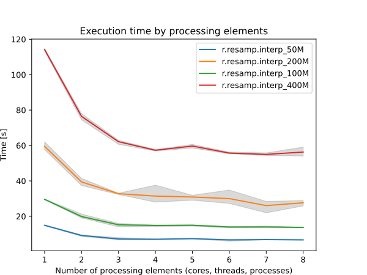

## DESCRIPTION

*r.resamp.interp* resamples an input raster map by interpolating between
the neighboring cells via a selectable resampling algorithm. All cells
present in the neighborhood of the input raster cell must be non-null to
generate a non-null cell in the output raster map. A choice of four
interpolation methods is available; each uses the weighted values of a
different number of adjacent cells in the input map to determine the
value of each cell in the output map as follows:

- nearest neighbour (1 cell)
- bilinear (4 cells)
- bicubic (16 cells)
- lanczos (25 cells)

This module is intended for reinterpolation of continuous data to a
different resolution rather than for interpolation from scattered data
(use the *v.surf.\** modules for that purpose).

## NOTES

Resampling modules (*r.resample, r.resamp.stats, r.resamp.interp,
r.resamp.rst*) resample the map to match the current region settings.

Note that for bilinear, bicubic and lanczos interpolation, cells of the
output raster that cannot be bounded by the appropriate number of input
cell centers are set to NULL (NULL propagation). This could occur due to
the input cells being outside the current region, being NULL or masked.

For longitude-latitude coordinate reference systems, the interpolation
algorithm is based on degree fractions, not on the absolute distances
between cell centers. Any attempt to implement the latter would violate
the integrity of the interpolation method.

### PERFORMANCE

By specifying the number of parallel processes with **nprocs** option,
*r.resamp.interp* can run significantly faster, see benchmarks below.

  
*Figure: Benchmark shows execution time for different number of cells.
See benchmark scripts in source code.*

To reduce the memory requirements to minimum, set option **memory** to
zero. To take advantage of the parallelization, GRASS GIS needs to
compiled with OpenMP enabled.

## EXAMPLE

Resample elevation raster map to a higher resolution (from 500m to 250m;
North Carolina sample dataset):

```sh
g.region raster=elev_state_500m -p
g.region res=250 -ap
r.resamp.interp input=elev_state_500m output=elev_state_250m \
                method=bilinear
```

  
Original 500m resolution elevation map

  
Resampled (bilinear) 250m resolution elevation map

## SEE ALSO

*[g.region](g.region.md), [r.resample](r.resample.md),
[r.resamp.filter](r.resamp.filter.md), [r.resamp.rst](r.resamp.rst.md),
[r.resamp.stats](r.resamp.stats.md)*

Overview: [Interpolation and
Resampling](https://grasswiki.osgeo.org/wiki/Interpolation) in GRASS GIS

## AUTHOR

Glynn Clements
