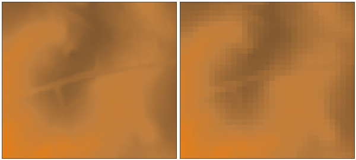

## DESCRIPTION

*r.resamp.stats* fills a grid cell (raster) matrix with aggregated
values generated from a set of input layer data points.

Without the *-w* switch, the aggregate is computed over all of the input
cells whose centers lie within the output cell.

With the *-w* switch, the aggregate uses the values from all input cells
which intersect the output cell, weighted according to the proportion of
the source cell which lies inside the output cell. This is slower, but
produces a more accurate result.

## NOTES

Resampling modules (*r.resample, r.resamp.stats, r.resamp.interp,
r.resamp.rst*) resample the map to match the current region settings.

The notion of weighting doesn't make any sense for the min and max
aggregates. However, the *-w* flag still has significance in that, when
multiple destination cells overlap a source cell, the source cell is
included in the calculation of all of the destination cells.

## EXAMPLE

Resample elevation raster map to a lower resolution (from 6m to 20m;
North Carolina sample dataset):

```sh
g.region raster=el_D782_6m -p
g.region res=20 -ap
# from 6m to 20m: weighted resampling -w
r.resamp.stats -w input=el_D782_6m output=el_D782_20m
```

  
*Resampling of 6m DEM (left) to 20m DEM (right) with weighted resampling
(subset)*

## SEE ALSO

*[g.region](g.region.md), [r.resample](r.resample.md),
[r.resamp.rst](r.resamp.rst.md), [r.resamp.filter](r.resamp.filter.md),
[r.resamp.interp](r.resamp.interp.md), [r.neighbors](r.neighbors.md)*

Overview: [Interpolation and
Resampling](https://grasswiki.osgeo.org/wiki/Interpolation) in GRASS GIS

Examples how statistical functions are applied can be found in the
[r.neighbors](r.neighbors.md) module documentation.

## AUTHOR

Glynn Clements
