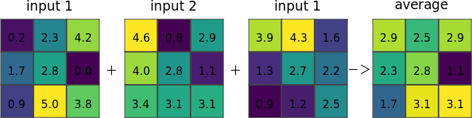
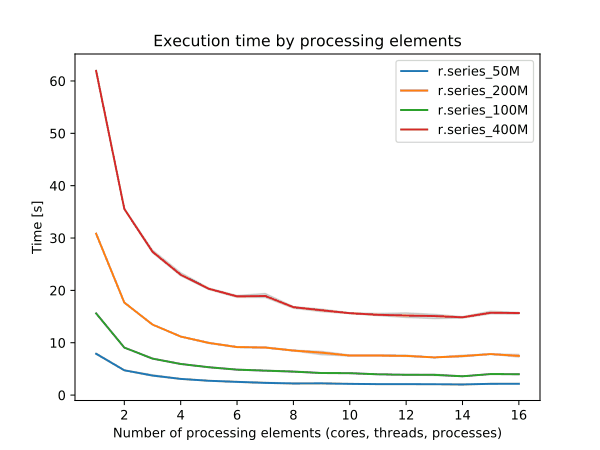
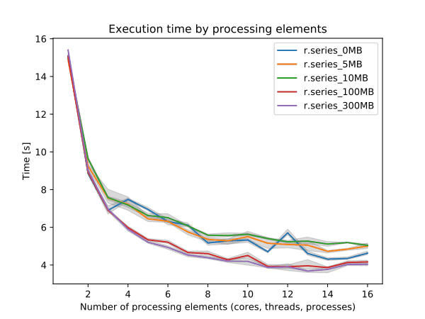

## DESCRIPTION

*r.series* makes each output cell value a function of the values
assigned to the corresponding cells in the input raster map layers.

  
*Figure: Illustration for an average of three input rasters*

Following methods are available:

- average: average value
- count: count of non-NULL cells
- median: median value
- mode: most frequently occurring value
- minimum: lowest value
- min_raster: raster map number with the minimum time-series value
- maximum: highest value
- max_raster: raster map number with the maximum time-series value
- stddev: standard deviation
- range: range of values (max - min)
- sum: sum of values
- variance: statistical variance
- diversity: number of different values
- slope: linear regression slope
- offset: linear regression offset
- detcoeff: linear regression coefficient of determination
- tvalue: linear regression t-value
- quart1: first quartile
- quart3: third quartile
- perc90: ninetieth percentile
- quantile: arbitrary quantile
- skewness: skewness
- kurtosis: kurtosis

Note that most parameters accept multiple answers, allowing multiple
aggregates to be computed in a single run, e.g.:

```sh
r.series input=map1,...,mapN \
         output=map.mean,map.stddev \
     method=average,stddev
```

or:

```sh
r.series input=map1,...,mapN \
         output=map.p10,map.p50,map.p90 \
         method=quantile,quantile,quantile \
         quantile=0.1,0.5,0.9
```

The same number of values must be provided for all options.

## NOTES

### No-data (NULL) handling

With *-n* flag, any cell for which any of the corresponding input cells
are NULL is automatically set to NULL (NULL propagation). The aggregate
function is not called, so all methods behave this way with respect to
the *-n* flag.

Without *-n* flag, the complete list of inputs for each cell (including
NULLs) is passed to the aggregate function. Individual aggregates can
handle data as they choose. Mostly, they just compute the aggregate over
the non-NULL values, producing a NULL result only if all inputs are
NULL.

### Minimum and maximum analysis

The *min_raster* and *max_raster* methods generate a map with the number
of the raster map that holds the minimum/maximum value of the
time-series. The numbering starts at *0* up to *n* for the first and the
last raster listed in *input=*, respectively.

### Range analysis

If the *range=* option is given, any values which fall outside that
range will be treated as if they were NULL. The *range* parameter can be
set to *low,high* thresholds: values outside of this range are treated
as NULL (i.e., they will be ignored by most aggregates, or will cause
the result to be NULL if -n is given). The *low,high* thresholds are
floating point, so use *-inf* or *inf* for a single threshold (e.g.,
*range=0,inf* to ignore negative values, or *range=-inf,-200.4* to
ignore values above -200.4).

### Linear regression

Linear regression (slope, offset, coefficient of determination, t-value)
assumes equal time intervals. If the data have irregular time intervals,
NULL raster maps can be inserted into time series to make time intervals
equal (see example).

### Quantiles

*r.series* can calculate arbitrary quantiles.

### Memory consumption

Memory usage is not an issue, as *r.series* only needs to hold one row
from each map at a time.

### Management of open file limits

The maximum number of raster maps that can be processed is given by the
user-specific limit of the operating system. For example, the soft
limits for users are typically 1024 files. The soft limit can be changed
with e.g. `ulimit -n 4096` (UNIX-based operating systems) but it cannot
be higher than the hard limit. If the latter is too low, you can as
superuser add an entry in:

```sh
/etc/security/limits.conf
# <domain>      <type>  <item>         <value>
your_username  hard    nofile          4096
```

This will raise the hard limit to 4096 files. Also have a look at the
overall limit of the operating system

```sh
cat /proc/sys/fs/file-max
```

which on modern Linux systems is several 100,000 files.

For each map a weighting factor can be specified using the *weights*
option. Using weights can be meaningful when computing the sum or
average of maps with different temporal extent. The default weight is
1.0. The number of weights must be identical to the number of input maps
and must have the same order. Weights can also be specified in the input
file.

Use the **-z** flag to analyze large amounts of raster maps without
hitting open files limit and the *file* option to avoid hitting the size
limit of command line arguments. Note that the computation using the
*file* option is slower than with the *input* option. For every single
row in the output map(s) all input maps are opened and closed. The
amount of RAM will rise linearly with the number of specified input
maps. The *input* and *file* options are mutually exclusive: the former
is a comma separated list of raster map names and the latter is a text
file with a new line separated list of raster map names and optional
weights. As separator between the map name and the weight the character
"\|" must be used.

### Performance

To enable parallel processing, the user can specify the number of
threads to be used with the **nprocs** parameter (default 1). The
**memory** parameter (default 300 MB) can also be provided to determine
the size of the buffer in MB for computation.


  
*Figure: Benchmark on the left shows execution time for different number
of cells, benchmark on the right shows execution time for different
memory size for 10000x10000 raster. See benchmark scripts in source
code. (Intel Core i9-10940X CPU @ 3.30GHz x 28)*

To reduce the memory requirements to minimum, set option **memory** to
zero. To take advantage of the parallelization, GRASS GIS needs to
compiled with OpenMP enabled.

## EXAMPLES

Using *r.series* with wildcards:  

```sh
r.series input="`g.list pattern='insitu_data.*' sep=,`" \
         output=insitu_data.stddev method=stddev
```

Note the *g.list* script also supports regular expressions for selecting
map names.

Using *r.series* with NULL raster maps (in order to consider a
"complete" time series):  

```sh
r.mapcalc "dummy = null()"
r.series in=map2001,map2002,dummy,dummy,map2005,map2006,dummy,map2008 \
         out=res_slope,res_offset,res_coeff meth=slope,offset,detcoeff
```

Example for multiple aggregates to be computed in one run (3 resulting
aggregates from two input maps):

```sh
r.series in=one,two out=result_avg,res_slope,result_count meth=sum,slope,count
```

Example to use the file option of r.series:

```sh
cat > input.txt << EOF
map1
map2
map3
EOF

r.series file=input.txt out=result_sum meth=sum
```

Example to use the file option of r.series including weights. The weight
0.75 should be assigned to map2. As the other maps do not have weights
we can leave it out:

```sh
cat > input.txt << EOF
map1
map2|0.75
map3
EOF

r.series file=input.txt out=result_sum meth=sum
```

Example for counting the number of days above a certain temperature
using daily average maps ('???' as DOY wildcard):

```sh
# Approach for shell based systems
r.series input=`g.list rast pattern="temp_2003_???_avg" separator=comma` \
         output=temp_2003_days_over_25deg range=25.0,100.0 method=count

# Approach in two steps (e.g., for Windows systems)
g.list rast pattern="temp_2003_???_avg" output=mapnames.txt
r.series file=mapnames.txt \
         output=temp_2003_days_over_25deg range=25.0,100.0 method=count
```

## SEE ALSO

*[g.list](g.list.md), [g.region](g.region.md),
[r.quantile](r.quantile.md),
[r.series.accumulate](r.series.accumulate.md),
[r.series.interp](r.series.interp.md), [r.univar](r.univar.md)*

[Hints for large raster data
processing](https://grasswiki.osgeo.org/wiki/Large_raster_data_processing)

## AUTHOR

Glynn Clements
