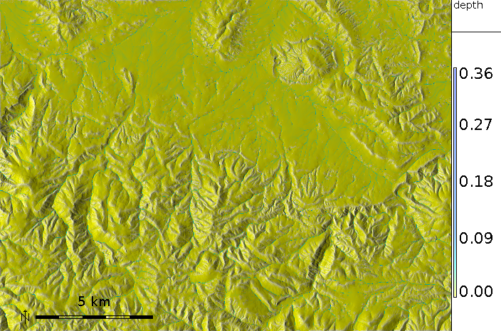
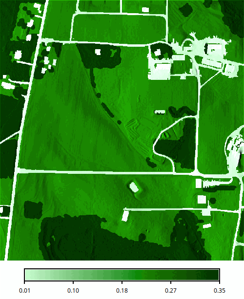
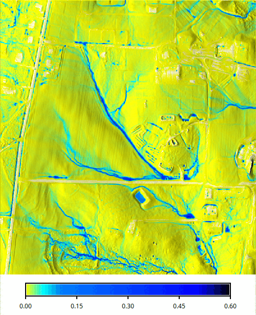
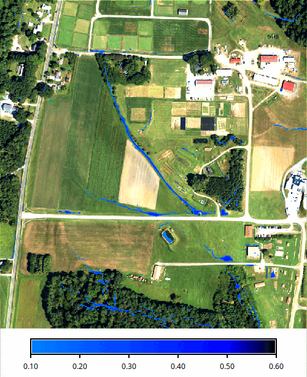

## DESCRIPTION

*r.sim.water* is a landscape scale simulation model of overland flow
designed for spatially variable terrain, soil, cover and rainfall excess
conditions. A 2D shallow water flow is described by the bivariate form
of Saint Venant equations. The numerical solution is based on the
concept of duality between the field and particle representation of the
modeled quantity. Green's function Monte Carlo method, used to solve the
equation, provides robustness necessary for spatially variable
conditions and high resolutions (Mitas and Mitasova 1998). The key
inputs of the model include elevation (**elevation** raster map), flow
gradient vector given by first-order partial derivatives of elevation
field (**dx** and **dy** raster maps are optional),
rainfall excess rate (**rain**
raster map or **rain_value** single value) and a surface roughness
coefficient given by Manning's n (**man** raster map or **man_value**
single value). Partial derivatives raster maps can be computed along
with interpolation of a DEM using the -d option in
*[v.surf.rst](v.surf.rst.md)* module. If elevation raster map is already
provided, partial derivatives can be computed using
*[r.slope.aspect](r.slope.aspect.md)* module. Partial derivatives are
used to determine the direction and magnitude of water flow velocity. To
include a predefined direction of flow, map algebra can be used to
replace terrain-derived partial derivatives with pre-defined partial
derivatives in selected grid cells such as man-made channels, ditches or
culverts. The partial derivatives of the predefined flow are computed
from its direction, given by aspect and slope:

```sh
dx = tan(slope) * cos(aspect)
```

and

```sh
dy = tan(slope) * sin(aspect)
```

  
*Figure: Simulated water flow in a rural area showing the areas with
highest water depth highlighting streams, pooling, and wet areas during
a rainfall event.*

The module automatically converts horizontal distances from feet to
metric system using database/projection information. The module
requires a projected coordinate system and does not run in a
latitude-longitude project. Rainfall excess is defined as rainfall
intensity - infiltration rate and should be provided
in \[mm/hr\]. Rainfall intensities are usually available from
meteorological stations. Infiltration rate depends on soil properties
and land cover. It varies in space and time. For saturated soil and
steady-state water flow it can be estimated using saturated hydraulic
conductivity rates based on field measurements or using reference values
which can be found in literature. Optionally, user can provide an
overland flow infiltration rate map **infil** or a single value
**infil_value** in \[mm/hr\] that control the rate of infiltration for
the already flowing water, effectively reducing the flow depth and
discharge. Overland flow can be further controlled by permeable check
dams or similar types of structures. The user can provide a map of
these structures as **flow_control** with values 0-1 that give the
probability of a particle being trapped by the structure at each time
step. A trapped particle is moved slightly back instead of forward, so
a higher value means lower permeability, holding back more water and
increasing the flow depth at the structure.

Output includes a water depth raster map **depth** in \[m\], and a water
discharge raster map **discharge** in \[m3/s\]. The **error** raster map
is a Monte Carlo standard-deviation estimator across replicas of the
particle simulation; the simulation currently runs a single replica, so
this map is zero everywhere and is provided for forward compatibility
with planned multiple-replica execution. The output vector points map
**output_walkers** can be used to analyze and visualize spatial
distribution of walkers at different simulation times (note that the
resulting water depth is based on the density of these walkers).
Duration of simulation is controlled by the
**duration** parameter. The default value is 10 minutes, reaching the
steady-state may require much longer time, depending on the time step,
complexity of terrain, land cover and size of the area. Output walker,
water depth and discharge maps can be saved during simulation using the
time series flag **-t** and **output_step** parameter defining the time
step in minutes for writing output files. Files are saved with a suffix
representing time since the start of simulation in minutes (e.g.
wdepth.05, wdepth.10) and are timestamped with that time. The
simulation advances in time steps which usually do not fall exactly on
the output times. A map holds the state at the time step closest to the
time in its name, so at most half a time step earlier or later. When the
time step is longer than **output_step**, there are fewer time steps
than output times, and a time step writes only the maps for the output
time closest to it. The series always ends with maps named by the
**duration** which hold the state at the end of the run, also when the
duration is not a multiple of **output_step** or when the simulation
stopped early.
Monitoring of water depth at specific points is
supported. A vector map with observation points and a path to a logfile
must be provided. For each point in the vector map which is located in
the computational region the water depth is logged each time step in the
logfile. The logfile is organized as a table. A single header identifies
the category number of the logged vector points. In case of invalid
water depth data the value -1 is used.

Overland flow is routed based on partial derivatives of elevation field
or other landscape features influencing water flow. Simulation equations
include a diffusion term (**diffusion_coeff** parameter) which enables
water flow to overcome elevation depressions or obstacles when water
depth exceeds a threshold water depth value (**hmax)**, given in \[m\].
When it is reached, diffusion term increases as given by **halpha** and
advection term (direction of flow) is given as "prevailing" direction of
flow computed as average of flow directions from the previous **hbeta**
number of grid cells. The model tries to keep water "shallow" with
maximum shallow water depth defined by **hmax** default 0.3 meters.
However, water depths much higher than **hmax** can be observed if water
accumulates in natural sinks or river beds. Depending on the area of
interest and the used digital elevation model, **hmax**, **halpha** and
**hbeta** might need to be adjusted in order to deal realistically with
elevation depressions or obstacles.

## NOTES

A 2D shallow water flow is described by the bivariate form of Saint
Venant equations (e.g., Julien et al., 1995). The continuity of water
flow relation is coupled with the momentum conservation equation and for
a shallow water overland flow, the hydraulic radius is approximated by
the normal flow depth. The system of equations is closed using the
Manning's relation. Model assumes that the flow is close to the
kinematic wave approximation, but we include a diffusion-like term to
incorporate the impact of diffusive wave effects. Such an incorporation
of diffusion in the water flow simulation is not new and a similar term
has been obtained in derivations of diffusion-advection equations for
overland flow, e.g., by Lettenmeier and Wood, (1992). In our
reformulation, we simplify the diffusion coefficient to a constant and
we use a modified diffusion term. The diffusion constant which we have
used is rather small (approximately one order of magnitude smaller than
the reciprocal Manning's coefficient) and therefore the resulting flow
is close to the kinematic regime. However, the diffusion term improves
the kinematic solution, by overcoming small shallow pits common in
digital elevation models (DEM) and by smoothing out the flow over slope
discontinuities or abrupt changes in Manning's coefficient (e.g., due to
a road, or other anthropogenic changes in elevations or cover).

**Green's function stochastic method of solution.**  
The Saint Venant equations are solved by a stochastic method called
Monte Carlo (very similar to Monte Carlo methods in computational fluid
dynamics or to quantum Monte Carlo approaches for solving the
Schrodinger equation (Schmidt and Ceperley, 1992, Hammond et al., 1994;
Mitas, 1996)). It is assumed that these equations are a representation
of stochastic processes with diffusion and drift components
(Fokker-Planck equations).

The Monte Carlo technique has several unique advantages which are
becoming even more important due to new developments in computer
technology. Perhaps one of the most significant Monte Carlo properties
is robustness which enables us to solve the equations for complex cases,
such as discontinuities in the coefficients of differential operators
(in our case, abrupt slope or cover changes, etc). Also, rough solutions
can be estimated rather quickly, which allows us to carry out
preliminary quantitative studies or to rapidly extract qualitative
trends by parameter scans. In addition, the stochastic methods are
tailored to the new generation of computers as they provide scalability
from a single workstation to large parallel machines due to the
independence of sampling points. Therefore, the methods are useful both
for everyday exploratory work using a desktop computer and for large,
cutting-edge applications using high performance computing.

Null cells in the **elevation**, **dx**, **dy**, **rain** and **man**
raster maps are excluded from the simulation, the outputs are null
there, and walkers that reach them leave the area. Null cells in the
**infil** raster map mean no infiltration.

### Manning's n for surface roughness

The **man** raster map can be derived from a land cover raster with the
[r.manning](https://grass.osgeo.org/grass-stable/manuals/addons/r.manning.html)
addon, which provides Manning's n values for the NLCD and ESA WorldCover
land cover classifications as well as for user-defined ones:

```sh
g.extension extension=r.manning
r.manning input=nlcd_landcover output=mannings_n landcover=nlcd
```

For the shallow overland flow simulated here, Manning's n is generally
higher than for deeper channel or floodplain flow, especially over
vegetated surfaces, see the *r.manning* documentation.

### Run summary

With the **-p** flag, a summary of the run is printed to standard output
after the last map is written. The **format** option selects plain text
(one `key: value` pair per line) or JSON. Without **-p**, nothing is
printed to standard output regardless of **format**. The values are also
stored in the history of the output raster maps under the same keys (see
[r.info](r.info.md)).

| Key | Meaning | Unit |
| --- | --- | --- |
| `walkers_requested` | Number of walkers from **nwalkers**, by default twice the number of cells | count |
| `walkers_generated` | Walkers created, at least one per cell and more where the source rate is higher | count |
| `walkers_remaining` | Walkers still in the domain at the end of the run | count |
| `seed` | Seed of the random numbers, given or generated | |
| `duration` | Requested simulation length (**duration**) | s |
| `simulated_time` | Simulated time reached at the end of the run | s |
| `time_step` | Simulated time per iteration | s |
| `iterations_planned` | Iterations needed to cover **duration** | count |
| `iterations_completed` | Iterations run, fewer than planned when the run stopped early | count |
| `stopped_early` | `true` when all walkers left the domain before **duration** was reached | |
| `mean_velocity` | Mean flow velocity over the defined cells | m/s |
| `mean_mannings_n` | Harmonic mean of Manning's n over the defined cells (the inverse of the mean of 1/n), `null` when undefined | |
| `mean_source_rate` | Mean rainfall excess | m/s |
| `mean_infiltration` | Mean infiltration rate, 0 without infiltration input | m/s |
| `threads` | Threads used for the computation | count |
| `outputs` | One entry per set of written maps: with **-t**, one per written output step, the last one named by **duration**, otherwise a single entry | |

Each entry of `outputs` contains the `simulated_time` (s) when the maps
were written, their `timestamp`, the number of `walkers_remaining` at
that time, and the names of the `depth`, `discharge`, `error` and
`walkers` maps, or `null` for maps which were not requested.

Summary of a time series run with two output steps in JSON:

<!-- markdownlint-disable MD046 -->
=== "Command line"

    ```sh
    r.sim.water elevation=elevation depth=depth discharge=discharge rain_value=50 \
        man_value=0.05 nwalkers=100000 duration=20 output_step=10 random_seed=3 \
        -t -p format=json
    ```

=== "Python (grass.script)"

    ```python
    import grass.script as gs

    summary = gs.parse_command(
        "r.sim.water",
        elevation="elevation",
        depth="depth",
        discharge="discharge",
        rain_value=50,
        man_value=0.05,
        nwalkers=100000,
        duration=20,
        output_step=10,
        random_seed=3,
        flags="tp",
        format="json",
    )
    print(summary["walkers_remaining"], summary["outputs"][-1]["depth"])
    ```

=== "Python (grass.tools)"

    ```python
    from grass.tools import Tools

    tools = Tools()
    summary = tools.r_sim_water(
        elevation="elevation",
        depth="depth",
        discharge="discharge",
        rain_value=50,
        man_value=0.05,
        nwalkers=100000,
        duration=20,
        output_step=10,
        random_seed=3,
        flags="tp",
        format="json",
    )
    print(summary["walkers_remaining"], summary["outputs"][-1]["depth"])
    ```
<!-- markdownlint-enable MD046 -->

The printed summary:

```json
{
    "walkers_requested": 100000,
    "walkers_generated": 120000,
    "walkers_remaining": 112724,
    "seed": 3,
    "duration": 1200,
    "simulated_time": 1199.2085202681737,
    "time_step": 1.0631281208051186,
    "iterations_planned": 1128,
    "iterations_completed": 1128,
    "stopped_early": false,
    "mean_velocity": 9.4062040165270862,
    "mean_mannings_n": 0.050000000000000003,
    "mean_source_rate": 1.390000000000819e-05,
    "mean_infiltration": 0,
    "threads": 1,
    "outputs": [
        {
            "simulated_time": 599.60426013408687,
            "timestamp": "10 minutes",
            "walkers_remaining": 113464,
            "depth": "depth.10",
            "discharge": "discharge.10",
            "error": null,
            "walkers": null
        },
        {
            "simulated_time": 1199.2085202681737,
            "timestamp": "20 minutes",
            "walkers_remaining": 112724,
            "depth": "depth.20",
            "discharge": "discharge.20",
            "error": null,
            "walkers": null
        }
    ]
}
```

### Random numbers and parallel processing

The walkers are placed and moved using pseudo-random numbers. The seed
is given by **random_seed**; without it, a seed is generated and
recorded in the history of the output maps and in the run summary as
`seed`, so that the run can be repeated. Each walker receives the same
random numbers whatever the number of threads given by **nprocs**, so
the results do not depend on **nprocs**, except where the water depth
exceeds **hmax** or infiltration is used: there a walker reacts to the
water or the infiltration capacity left by the walkers which reached
the cell before it in the same time step, and that order depends on the
threads. Such cells can differ slightly between thread counts and
between repeated runs with more than one thread. Use **nprocs=1** when
results must be reproducible to the last digit.

## EXAMPLE

This example uses the
[SIMWE sample dataset](https://doi.org/10.5281/zenodo.23017720) of the
NC State University Sediment and Erosion Control Research and Education
Facility, a 52 ha area in Raleigh, North Carolina, USA, at 1 m
resolution. It contains a lidar-based elevation map, a land cover map
and orthophoto bands.

Set the computational region to the elevation map and derive the
Manning's n raster map from the land cover classes with
*[r.recode](r.recode.md)*. Buildings (class 1), paved roads (2) and
compacted roads and parking lots (3) get low roughness values, while
herbaceous cover such as fields and lawns (4) and forest (5) get high
values suitable for shallow overland flow. Water (6) gets a low value.
See the
[r.manning](https://grass.osgeo.org/grass-stable/manuals/addons/r.manning.html)
addon for an explanation of Manning's n and reference values for
common land cover classifications.

<!-- markdownlint-disable MD046 -->
=== "Command line"

    ```sh
    g.region raster=elevation
    r.recode input=landcover output=mannings rules=- <<EOF
    1:1:0.012
    2:2:0.014
    3:3:0.025
    4:4:0.24
    5:5:0.35
    6:6:0.04
    EOF
    ```

=== "Python (grass.script)"

    ```python
    import grass.script as gs

    gs.run_command("g.region", raster="elevation")
    manning = {
        1: 0.012,  # buildings
        2: 0.014,  # paved roads
        3: 0.025,  # compacted roads and parking lots
        4: 0.24,  # herbaceous cover
        5: 0.35,  # forest
        6: 0.04,  # water
    }
    rules = "\n".join(f"{k}:{k}:{v}" for k, v in manning.items())
    gs.write_command(
        "r.recode", input="landcover", output="mannings", rules="-", stdin=rules
    )
    ```

=== "Python (grass.tools)"

    ```python
    from io import StringIO

    from grass.tools import Tools

    tools = Tools()
    tools.g_region(raster="elevation")
    manning = {
        1: 0.012,  # buildings
        2: 0.014,  # paved roads
        3: 0.025,  # compacted roads and parking lots
        4: 0.24,  # herbaceous cover
        5: 0.35,  # forest
        6: 0.04,  # water
    }
    rules = "\n".join(f"{k}:{k}:{v}" for k, v in manning.items())
    tools.r_recode(input="landcover", output="mannings", rules=StringIO(rules))
    ```
<!-- markdownlint-enable MD046 -->

  
*Figure: Manning's n derived from land cover with low values for
buildings and roads and high values for fields and forest.*

Simulate 30 minutes of overland flow with a uniform rainfall excess of
20 mm/hr. The random seed makes the run reproducible.

<!-- markdownlint-disable MD046 -->
=== "Command line"

    ```sh
    r.sim.water elevation=elevation man=mannings rain_value=20 depth=depth \
        duration=30 random_seed=1
    ```

=== "Python (grass.script)"

    ```python
    gs.run_command(
        "r.sim.water",
        elevation="elevation",
        man="mannings",
        rain_value=20,
        depth="depth",
        duration=30,
        random_seed=1,
    )
    ```

=== "Python (grass.tools)"

    ```python
    tools.r_sim_water(
        elevation="elevation",
        man="mannings",
        rain_value=20,
        depth="depth",
        duration=30,
        random_seed=1,
    )
    ```
<!-- markdownlint-enable MD046 -->

  
*Figure: Simulated water depth in meters after 30 minutes of rainfall
shown over shaded relief.*

  
*Figure: Water depth of at least 0.1 m shown over the orthophoto, with
flow concentrated in ditches and channels and ponding in depressions.*

## REFERENCES

- Mitasova, H., Thaxton, C., Hofierka, J., McLaughlin, R., Moore, A.,
  Mitas L., 2004, [Path sampling method for modeling overland water
  flow, sediment transport and short term terrain evolution in Open
  Source
  GIS.](https://doi.org/10.1016/S0167-5648(04)80159-X)
  In: C.T. Miller, M.W. Farthing, V.G. Gray, G.F. Pinder eds.,
  Proceedings of the XVth International Conference on Computational
  Methods in Water Resources (CMWR XV), June 13-17 2004, Chapel Hill,
  NC, USA, Elsevier, pp. 1479-1490.
- Mitasova H, Mitas, L., 2000, Modeling spatial processes in multiscale
  framework: exploring duality between particles and fields, plenary
  talk at GIScience2000 conference, Savannah, GA.
- Mitas, L., and Mitasova, H., 1998, Distributed soil erosion simulation
  for effective erosion prevention. Water Resources Research, 34(3),
  505-516.
- Mitasova, H., Mitas, L., 2001, [Multiscale soil erosion simulations
  for land use
  management,](https://doi.org/10.1007/978-1-4615-0575-4_11)
  In: Landscape erosion and landscape evolution modeling, Harmon R. and
  Doe W. eds., Kluwer Academic/Plenum Publishers, pp. 321-347.
- Hofierka, J, Mitasova, H., Mitas, L., 2002. GRASS and modeling
  landscape processes using duality between particles and fields.
  Proceedings of the Open source GIS - GRASS users conference 2002 -
  Trento, Italy, 11-13 September 2002.
  [PDF](http://www.ing.unitn.it/~grass/conferences/GRASS2002/proceedings/proceedings/pdfs/Mitasova_Helena_2.pdf)
- Hofierka, J., Knutova, M., 2015, Simulating aspects of a flash flood
  using the Monte Carlo method and GRASS GIS: a case study of the Malá
  Svinka Basin (Slovakia), Open Geosciences. Volume 7, Issue 1, ISSN
  (Online) 2391-5447, DOI:
  [10.1515/geo-2015-0013](https://doi.org/10.1515/geo-2015-0013), April
  2015
- Neteler, M. and Mitasova, H., 2008, [Open Source GIS: A GRASS GIS
  Approach. Third Edition.](https://grassbook.org) The International
  Series in Engineering and Computer Science: Volume 773. Springer New
  York Inc, p. 406.

## SEE ALSO

*[r.manning](https://grass.osgeo.org/grass-stable/manuals/addons/r.manning.html)
(addon), [r.sim.sediment](r.sim.sediment.md),
[r.slope.aspect](r.slope.aspect.md), [v.surf.rst](v.surf.rst.md)*

## AUTHORS

Helena Mitasova, Lubos Mitas  
North Carolina State University  
*<hmitaso@unity.ncsu.edu>*

Jaroslav Hofierka  
GeoModel, s.r.o. Bratislava, Slovakia  
*[hofierka@geomodel.sk](mailto:hofi@geomodel.sk)*

Chris Thaxton  
North Carolina State University  
*<csthaxto@unity.ncsu.edu>*
